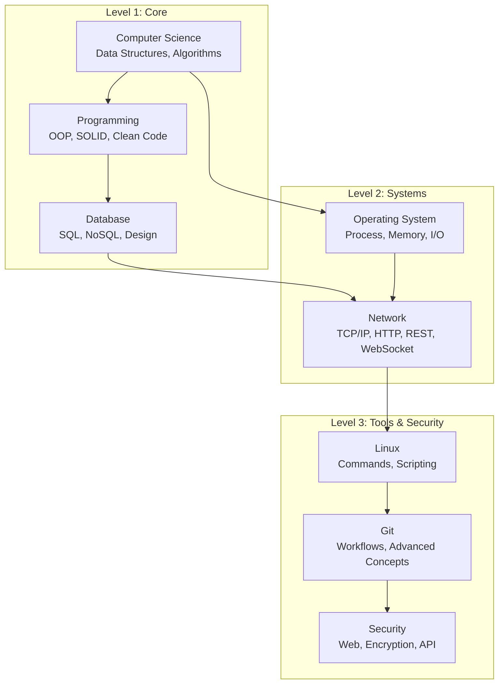

# 01 — Fundamentals (Computer Science Foundations)

> Foundational knowledge mandatory for **every software engineer**, independent of specific technologies or roles. This section serves as a prerequisite for all other learning paths.

---

## Roadmap

---

## Prerequisites

None — this is the foundational introductory section.

---

## Content Directory

### Computer Science

| # | Topic | File | Description |
|---|---|---|---|
| 1 | Data Structures | [data-structures.md](./computer-science/data-structures.md) | Arrays, LinkedLists, Stacks, Queues, Trees, Graphs, HashMaps. |
| 2 | Algorithms | [algorithms.md](./computer-science/algorithms.md) | Sorting, Searching, Dynamic Programming, Greedy Algorithms, Backtracking. |
| 3 | Complexity Analysis | [complexity-analysis.md](./computer-science/complexity-analysis.md) | Big-O notation, Space and Time complexity analysis. |
| 4 | Concurrency | [concurrency.md](./computer-science/concurrency.md) | Threads, Locks, Deadlocks, Race conditions. |

### Programming

| # | Topic | File | Description |
|---|---|---|---|
| 1 | OOP Principles | [oop-principles.md](./programming/oop-principles.md) | Encapsulation, Inheritance, Polymorphism, Abstraction. |
| 2 | SOLID Principles | [solid-principles.md](./programming/solid-principles.md) | The 5 OOP design principles. |
| 3 | Design Patterns | [design-patterns.md](./programming/design-patterns.md) | Gang of Four patterns: Singleton, Factory, Observer, Strategy, etc. |
| 4 | Clean Code | [clean-code.md](./programming/clean-code.md) | Naming conventions, function structures, comments, and formatting. |
| 5 | Functional Programming | [functional-programming.md](./programming/functional-programming.md) | Pure functions, immutability, and higher-order functions. |

### Database

| # | Topic | File | Description |
|---|---|---|---|
| 1 | SQL Fundamentals | [sql-fundamentals.md](./database/sql-fundamentals.md) | Joins, Indexes, Transactions, Normalization. |
| 2 | NoSQL Fundamentals | [nosql-fundamentals.md](./database/nosql-fundamentals.md) | Document, Key-Value, Column-family, and Graph databases. |
| 3 | Database Design | [database-design.md](./database/database-design.md) | Schema design, Entity-Relationship Diagrams (ERD), migrations. |
| 4 | Query Optimization | [query-optimization.md](./database/query-optimization.md) | EXPLAIN plans, indexing strategies. |

### Network

| # | Topic | File | Description |
|---|---|---|---|
| 1 | TCP/IP | [tcp-ip.md](./network/tcp-ip.md) | TCP/IP stack, handshake mechanisms, core protocols. |
| 2 | HTTP/HTTPS | [http-https.md](./network/http-https.md) | Methods, status codes, headers, TLS/SSL encryption. |
| 3 | REST API | [rest-api.md](./network/rest-api.md) | REST constraints, API versioning, HATEOAS. |
| 4 | gRPC | [grpc.md](./network/grpc.md) | Protocol Buffers, bidirectional streaming, comparison with REST. |
| 5 | WebSocket | [websocket.md](./network/websocket.md) | Full-duplex communication, handshakes, frames, and real-time use cases. |

### Operating System

| # | Topic | File | Description |
|---|---|---|---|
| 1 | Process & Thread | [process-thread.md](./operating-system/process-thread.md) | Process vs. Thread differences, context switching overhead. |
| 2 | Memory Management | [memory-management.md](./operating-system/memory-management.md) | Stack vs. Heap allocation, Garbage Collection, mitigating memory leaks. |
| 3 | I/O Models | [io-models.md](./operating-system/io-models.md) | Blocking, Non-blocking, Asynchronous, and Multiplexing I/O. |

### Linux

| # | Topic | File | Description |
|---|---|---|---|
| 1 | Essential Commands | [essential-commands.md](./linux/essential-commands.md) | File manipulation, process control, networking, and permission commands. |
| 2 | Shell Scripting | [shell-scripting.md](./linux/shell-scripting.md) | Bash scripting fundamentals and automation. |
| 3 | System Administration | [system-administration.md](./linux/system-administration.md) | Service management (systemd), scheduled tasks (cron), log management. |

### Git

| # | Topic | File | Description |
|---|---|---|---|
| 1 | Git Fundamentals | [git-fundamentals.md](./git/git-fundamentals.md) | Branching, merging, rebasing, and cherry-picking operations. |
| 2 | Git Workflows | [git-workflows.md](./git/git-workflows.md) | GitFlow, Trunk-based development, Feature flags. |
| 3 | Git Advanced | [git-advanced.md](./git/git-advanced.md) | Binary search (bisect), reference logs (reflog), submodules, and Git hooks. |

### Security

| # | Topic | File | Description |
|---|---|---|---|
| 1 | Web Security | [web-security.md](./security/web-security.md) | OWASP Top 10 vulnerabilities, XSS, CSRF, SQL Injection prevention. |
| 2 | Encryption | [encryption.md](./security/encryption.md) | Symmetric and Asymmetric encryption, Hashing functions, JSON Web Tokens (JWT). |
| 3 | API Security | [api-security.md](./security/api-security.md) | OAuth2 authorization, API Keys management, Rate limiting, CORS policies. |

---

## Learning Objectives

Upon completing this section, you will be able to:
- [ ] Analyze the time and space complexity of algorithms.
- [ ] Design class hierarchies that strictly adhere to SOLID principles.
- [ ] Correctly apply design patterns to appropriate architectural scenarios.
- [ ] Write optimized SQL queries utilizing effective indexing strategies.
- [ ] Demonstrate a deep understanding of TCP/IP, HTTP, REST, and WebSocket protocols.
- [ ] Manage processes and memory utilization effectively within Linux environments.
- [ ] Utilize professional Git workflows for team collaboration.
- [ ] Identify and mitigate common security vulnerabilities.

---

## Related Sections

- [02 — Concepts](../02-concepts/) — Architecture patterns built upon these fundamental principles.
- [03 — Technologies](../03-technologies/) — Deep dives into specific technology stacks.
