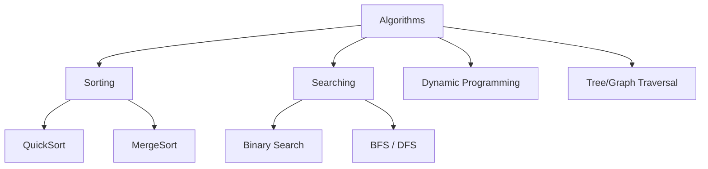

# Algorithms

<details>
<summary>🇻🇳 <b>Hiển thị bản dịch Tiếng Việt</b></summary>
<br>

> **Tóm tắt**: Thuật toán (Algorithms) là một tập hợp các bước hoặc hướng dẫn rõ ràng để giải quyết một bài toán cụ thể. Nếu Data Structure là "Cái tủ đựng đồ", thì Algorithm chính là "Cách sắp xếp và lấy đồ ra khỏi tủ sao cho nhanh nhất".

</details>

> **Summary**: Algorithms are an unambiguous, finite sequence of rigorous instructions used to solve a specific class of problems or perform a computation. If Data Structures represent the "Cabinet to store items", Algorithms represent the "Strategy to organize and retrieve items from that cabinet optimally."

---

## ELI5 (Explain Like I'm 5)

<details>
<summary>🇻🇳 <b>Hiển thị bản dịch Tiếng Việt</b></summary>
<br>

Thuật toán giống hệt như một **Công thức nấu ăn**.
Hãy tưởng tượng bạn cần làm một chiếc bánh:
- **Nguyên liệu (Data)**: Trứng, bột, sữa.
- **Dụng cụ (Data Structures)**: Bát, phới lồng, lò nướng.
- **Công thức (Algorithm)**: Bước 1 đánh trứng, Bước 2 trộn bột, Bước 3 nướng 20 phút.

Cùng là làm bánh, nhưng có công thức giúp bạn làm trong 30 phút, có công thức rườm rà bắt bạn mất 2 tiếng. Lập trình viên giỏi là người biết chọn "công thức" nhanh nhất và tốn ít công sức nhất.

**Ví dụ:** Bạn đang tìm từ "Khủng long" trong từ điển.
- Thuật toán 1 (Tệ): Lật từng trang từ đầu đến cuối cho đến khi thấy. (Linear Search).
- Thuật toán 2 (Tốt): Mở giở cuốn từ điển ra. Nếu vần K nằm ở nửa trước, bỏ qua nửa sau. Cứ tiếp tục chia đôi như vậy cho đến khi tìm thấy. (Binary Search - Tìm kiếm nhị phân). Thuật toán này giúp bạn tìm ra từ trong vài giây thay vì vài giờ!

</details>

An Algorithm is fundamentally analogous to a **Recipe**.
Imagine you are baking a cake:
- **Ingredients (Data)**: Eggs, flour, milk.
- **Kitchenware (Data Structures)**: Bowls, whisks, an oven.
- **The Recipe (Algorithm)**: Step 1: Whisk eggs; Step 2: Fold in flour; Step 3: Bake for 20 minutes.

While multiple recipes yield a cake, one recipe might take 30 minutes, while a convoluted one takes 2 hours. An excellent software engineer selects the fastest and most resource-efficient "recipe".

**Example:** Searching for the word "Dinosaur" in a physical dictionary.
- Algorithm 1 (Inefficient): Flip through every single page starting from page 1 until you find it. (Linear Search).
- Algorithm 2 (Efficient): Open the dictionary exactly in the middle. If 'D' is before the middle letter, discard the entire second half. Repeat this halving process until the word is found. (Binary Search). This algorithm completes the search in seconds rather than hours!

---

## Layer 1: What is it? (What)

<details>
<summary>🇻🇳 <b>Hiển thị bản dịch Tiếng Việt</b></summary>
<br>

**Thuật toán** là một chuỗi các bước thao tác logic trên Cấu trúc dữ liệu để đạt được kết quả mong muốn. Chúng thường được chia thành các chiến lược giải bài toán:
1. **Divide and Conquer (Chia để trị)**: Cắt bài toán lớn thành các bài toán nhỏ (Merge Sort, Quick Sort).
2. **Greedy (Tham lam)**: Luôn chọn giải pháp có lợi nhất ở hiện tại (Tìm đường đi ngắn nhất).
3. **Dynamic Programming (Quy hoạch động)**: Lưu lại kết quả của bài toán nhỏ để không phải tính lại (Tính dãy Fibonacci).
4. **Backtracking (Quay lui)**: Thử đi một đường, nếu thấy sai thì quay lại đi đường khác (Giải Sudoku, Tìm đường trong mê cung).

</details>

**Algorithms** are sequences of logical operations performed on Data Structures to achieve a desired programmatic outcome. They are generally categorized by their problem-solving paradigms:
1. **Divide and Conquer**: Recursively breaks down a problem into two or more sub-problems of the same or related type, until these become simple enough to be solved directly (e.g., Merge Sort, Quick Sort).
2. **Greedy**: Makes the locally optimal choice at each stage with the intent of finding a global optimum (e.g., Dijkstra's Shortest Path).
3. **Dynamic Programming (DP)**: Solves complex problems by breaking them down into simpler subproblems and storing the results of these subproblems to avoid redundant computations (e.g., Fibonacci sequence caching).
4. **Backtracking**: Incrementally builds candidates to the solutions, and abandons a candidate ("backtracks") as soon as it determines that the candidate cannot possibly be completed to a valid solution (e.g., solving Sudoku, Maze traversal).



---

## Layer 2: Why does it exist? (Why)

<details>
<summary>🇻🇳 <b>Hiển thị bản dịch Tiếng Việt</b></summary>
<br>

Hầu hết lập trình viên web/app hiện nay hiếm khi phải tự viết thuật toán sắp xếp (vì thư viện đã làm hộ). Vậy tại sao phải học?
Bởi vì khi hệ thống phát triển, khối lượng dữ liệu phình to lên mức hàng tỷ (Big Data), cách bạn xử lý dữ liệu sẽ quyết định server sống hay chết. 
Nếu dùng sai thuật toán để xử lý 1 triệu hóa đơn, server có thể treo 3 ngày. Dùng đúng thuật toán, mất 0.5 giây. Việc hiểu thuật toán giúp bạn rèn luyện **Tư duy Logic** và khả năng tối ưu hóa mã nguồn.

</details>

Modern application developers rarely implement sorting algorithms from scratch, as standard libraries provide highly optimized functions. Why study them?
Because when a system scales to handle terabytes of data (Big Data), the algorithm utilized dictates whether the servers survive or crash entirely.
Utilizing a brute-force algorithm to process 1,000,000 invoices might freeze the CPU for 3 days. Utilizing an optimized algorithm completes it in 0.5 seconds. Mastering algorithms inherently develops highly rigorous **Logical Thinking** and code-optimization capabilities.

---

## Layer 3: Without vs. With Comparison (Compare)

<details>
<summary>🇻🇳 <b>Hiển thị bản dịch Tiếng Việt</b></summary>
<br>

**Bài toán:** Tìm vị trí của số `7` trong một mảng đã được sắp xếp tăng dần: `[1, 3, 4, 6, 7, 8, 10, 13, 14]`

**❌ Thuật toán tệ (Linear Search):** Dò từng số một. Mất O(N) thời gian.
**✅ Thuật toán tối ưu (Binary Search):** Chia đôi liên tục. Mất O(log N) thời gian.

</details>

**Scenario:** Locate the index of the target number `7` within an already sorted array: `[1, 3, 4, 6, 7, 8, 10, 13, 14]`

### Without Implementation: Linear Search (Brute Force)
Checks every single element sequentially. If the array has 1 billion elements, and the target is at the end, it takes 1 billion operations.
**Python:**
```python
def linear_search(arr, target):
    for i in range(len(arr)):
        if arr[i] == target:
            return i # Found it
    return -1 # Not found

# Execution: O(N) Time Complexity
arr = [1, 3, 4, 6, 7, 8, 10, 13, 14]
linear_search(arr, 7)
```

### With Implementation: Binary Search (Divide and Conquer)
Takes advantage of the fact that the array is sorted. It repeatedly divides the search interval in half. For 1 billion elements, it finds the target in a maximum of 30 operations!
**Java:**
```java
public class SearchAlgorithms {
    public static int binarySearch(int[] arr, int target) {
        int left = 0;
        int right = arr.length - 1;

        while (left <= right) {
            int mid = left + (right - left) / 2; // Prevents integer overflow

            if (arr[mid] == target) {
                return mid; // Found it
            }
            if (arr[mid] < target) {
                left = mid + 1; // Target is in the right half
            } else {
                right = mid - 1; // Target is in the left half
            }
        }
        return -1; // Not found
    }
}
```

### Comparison Table

| Criteria | Linear Search | Binary Search |
|---|---|---|
| **Prerequisite** | None (works on unsorted data) | Data MUST be strictly sorted |
| **Time Complexity** | O(N) - Very Slow for large datasets | O(log N) - Lightning Fast |
| **Logic Paradigm** | Brute Force | Divide and Conquer |

---

## Layer 4: Common Use Cases

<details>
<summary>🇻🇳 <b>Hiển thị bản dịch Tiếng Việt</b></summary>
<br>

- **Thuật toán tìm đường (Dijkstra, A*)**: Ứng dụng trong Google Maps để tìm đường đi ngắn nhất, hoặc AI của quái vật trong Game để tìm đường đuổi theo người chơi.
- **Cây Quyết Định (Decision Trees)**: Ứng dụng trong Machine Learning và AI.
- **Hashing Algorithms (MD5, SHA-256)**: Mã hóa mật khẩu người dùng trong cơ sở dữ liệu. Bitcoin cũng sử dụng thuật toán SHA-256.
- **Dynamic Programming**: Thuật toán so sánh chuỗi (Diff) dùng trong Git để highlight những dòng code bạn vừa sửa.

</details>

- **Pathfinding Algorithms (Dijkstra, A*)**: Powering GPS routing engines like Google Maps, and guiding NPC (Non-Player Character) artificial intelligence in video games.
- **Tree Traversal Algorithms**: Rendering the DOM tree in web browsers and processing hierarchical file systems.
- **Cryptographic Hashing (SHA-256, bcrypt)**: Irreversibly encrypting user passwords in databases and underpinning blockchain technologies like Bitcoin.
- **Dynamic Programming (Longest Common Subsequence)**: Powering the differential logic (`git diff`) in version control systems to highlight exact code additions and deletions.

---

## Layer 5: Deep Practice

### Best Practices

<details>
<summary>🇻🇳 <b>Hiển thị bản dịch Tiếng Việt</b></summary>
<br>

1. **Hiểu rõ Big-O trước khi chọn thuật toán**: Đừng dùng `Nested For Loop` (2 vòng lặp lồng nhau O(N^2)) nếu dữ liệu của bạn có hơn 10.000 phần tử. Hãy cố gắng tối ưu nó xuống O(N) bằng Hash Map.
2. **Sử dụng thư viện chuẩn**: Các hàm như `list.sort()` trong Python hoặc `Arrays.sort()` trong Java sử dụng thuật toán **Timsort** (kết hợp giữa Merge Sort và Insertion Sort) cực kỳ tối ưu. Đừng tự viết lại thuật toán sắp xếp trừ khi đang đi học.

</details>

1. **Prioritize Big-O Analysis**: Never write a `Nested For Loop` ($O(N^2)$ Time Complexity) if your dataset anticipates exceeding 10,000 elements. Endeavor to flatten the nested loops into sequential loops utilizing a Hash Map, reducing the complexity to $O(N)$.
2. **Leverage Standard Libraries**: Functions like `list.sort()` in Python or `Arrays.sort()` in Java utilize **Timsort** (a highly optimized hybrid of Merge Sort and Insertion Sort). Never reinvent sorting algorithms in a production environment unless building specialized low-level systems.

### Common Pitfalls

<details>
<summary>🇻🇳 <b>Hiển thị bản dịch Tiếng Việt</b></summary>
<br>

1. **Tràn bộ nhớ (StackOverflow) do Đệ quy (Recursion)**: Khi dùng Đệ quy, mỗi lần gọi hàm, máy tính phải lưu trạng thái vào RAM. Nếu hàm đệ quy không có "Điểm dừng" (Base Case) rõ ràng, hoặc gọi quá sâu (10.000 lần), chương trình sẽ sụp đổ. Luôn ưu tiên dùng vòng lặp (`while/for`) thay cho đệ quy nếu có thể.
2. **Quên kiểm tra Edge Cases**: Thuật toán chạy đúng với dữ liệu bình thường, nhưng sập khi mảng rỗng `[]`, mảng chỉ có 1 phần tử, hoặc mảng chứa giá trị `null`.

</details>

1. **StackOverflow Errors via Recursion**: Recursive functions push execution contexts onto the Call Stack. Lacking a strict "Base Case", or executing overly deep recursion (e.g., > 10,000 depths), causes catastrophic StackOverflow crashes. Where feasible, favor iterative solutions (`while/for` loops) over recursive ones in environments without Tail Call Optimization (TCO).
2. **Ignoring Edge Cases**: An algorithm might pass standard testing but fail catastrophically in production when fed an empty array `[]`, an array with a single element, or an array containing `null` references. Always validate inputs.

---

## Layer 6: Code Templates & Integration

### Boilerplate: Breadth-First Search (BFS) Traversal
BFS is fundamental for exploring graph/tree structures level by level. It utilizes a `Queue`.

**Python:**
```python
from collections import deque

def bfs_traversal(graph, start_node):
    visited = set()
    queue = deque([start_node])
    visited.add(start_node)

    while queue:
        current_node = queue.popleft() # FIFO behavior
        print(f"Visiting: {current_node}")

        # Explore all adjacent neighbors
        for neighbor in graph[current_node]:
            if neighbor not in visited:
                visited.add(neighbor)
                queue.append(neighbor)

# Example Graph representation (Adjacency List)
graph_data = {
    'A': ['B', 'C'],
    'B': ['A', 'D', 'E'],
    'C': ['A', 'F'],
    'D': ['B'],
    'E': ['B', 'F'],
    'F': ['C', 'E']
}

bfs_traversal(graph_data, 'A')
```

---

## Related Topics
- Master the mathematical language used to evaluate these algorithms in **[Complexity Analysis (Big-O)](./complexity-analysis.md)**.
- Understand the underlying structures these algorithms manipulate in **[Data Structures](./data-structures.md)**.
