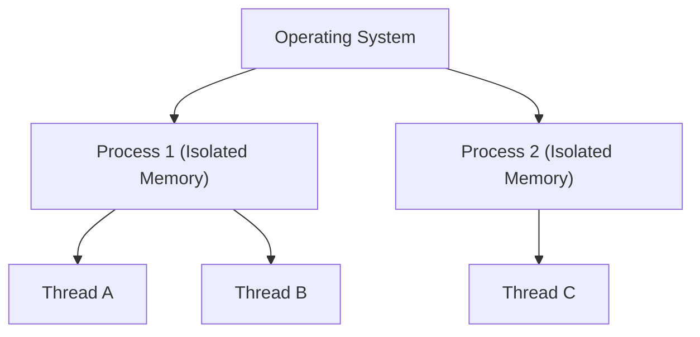

# Concurrency

<details>
<summary>🇻🇳 <b>Hiển thị bản dịch Tiếng Việt</b></summary>
<br>

> **Tóm tắt**: Concurrency (Đồng thời) là kỹ thuật cho phép máy tính xử lý nhiều tác vụ "cùng một lúc" để không bị treo. Nó là nền tảng để làm các ứng dụng web chịu tải cao. Tuy nhiên, nếu không quản lý tốt, nó sẽ gây ra những cái bug kinh khủng nhất trong thế giới lập trình.

</details>

> **Summary**: Concurrency is the execution of multiple instruction sequences "at the same time" to maximize CPU utilization and prevent system freezing. It is the fundamental architecture required to build high-performance, highly scalable web servers. However, if managed poorly, it introduces the most devastating, non-deterministic bugs in software engineering.

---

## ELI5 (Explain Like I'm 5)

<details>
<summary>🇻🇳 <b>Hiển thị bản dịch Tiếng Việt</b></summary>
<br>

Bạn là một đầu bếp duy nhất trong bếp.
- **Synchronous (Đồng bộ - Tuần tự)**: Bạn luộc rau. Chờ 10 phút cho rau chín. Sau đó bạn mới đem thịt ra thái. Nhược điểm: Phí phạm 10 phút chờ đợi vô ích.
- **Concurrency (Đồng thời)**: Bạn bắc nồi rau lên bếp (luộc mất 10 phút). Trong thời gian đó, bạn lôi thịt ra thái. Cứ 1 phút bạn lại đảo mắt qua nồi rau một lần xem nó sôi chưa. Bạn vẫn chỉ có 1 mình, nhưng bạn biết cách **chuyển đổi qua lại (Context Switching)** giữa các công việc để không thời gian nào bị lãng phí.
- **Parallelism (Song song)**: Mẹ bạn đi chợ về và vào bếp nấu phụ bạn. Bạn chuyên thái thịt, mẹ bạn chuyên luộc rau. Phải có 2 người (2 CPU cores) thì mới làm được.

**Tóm lại**: Concurrency là cách quản lý nhiều công việc cùng lúc. Parallelism là cách thực thi nhiều công việc cùng lúc.

</details>

Imagine you are the sole chef operating in a kitchen.
- **Synchronous (Sequential)**: You boil water for vegetables. You stand perfectly still for 10 minutes waiting for the water to boil. Only after it boils do you begin slicing the meat. Disadvantage: 10 minutes of complete, wasted idleness.
- **Concurrency**: You place the pot of water on the stove. While waiting for it to boil, you immediately begin slicing the meat. Every minute, you pause slicing to briefly check if the water is boiling. You are still a single entity (1 CPU Core), but you are executing rapid **Context Switching** between tasks to ensure zero time is wasted.
- **Parallelism**: Your mother enters the kitchen to assist you. You exclusively slice meat while she exclusively boils the vegetables. True parallelism requires at least two independent physical entities (Multiple CPU Cores) operating simultaneously.

**In summary**: Concurrency is the composition and management of independently executing tasks. Parallelism is the simultaneous execution of (possibly related) computations.

---

## Layer 1: What is it? (What)

<details>
<summary>🇻🇳 <b>Hiển thị bản dịch Tiếng Việt</b></summary>
<br>

**Concurrency** trong Khoa học máy tính xoay quanh việc quản lý các Luồng (Threads) và Tiến trình (Processes):
1. **Process (Tiến trình)**: Là một chương trình đang chạy (Ví dụ: Mở 1 tab Chrome). Các tiến trình độc lập với nhau, có bộ nhớ RAM riêng biệt. Cái này chết không làm ảnh hưởng cái kia.
2. **Thread (Luồng)**: Nằm bên trong Process. Một tab Chrome có thể có luồng 1 tải hình ảnh, luồng 2 phát âm thanh. Các luồng dùng chung bộ nhớ RAM của Process chứa nó. Chết 1 luồng là chết cả Process.

</details>

**Concurrency** in Computer Science revolves around the orchestration of OS-level execution units:
1. **Process**: An instance of a computer program that is being executed (e.g., A running instance of a Chrome tab). Processes operate in deeply isolated memory spaces allocated by the Operating System. A crash in Process A does not inherently crash Process B.
2. **Thread**: A thread of execution is the smallest sequence of programmed instructions that can be managed independently by a scheduler. Threads reside *within* a Process and share the exact same memory space and resources. If Thread A causes a fatal segmentation fault, the entire overarching Process dies.



---

## Layer 2: Why does it exist? (Why)

<details>
<summary>🇻🇳 <b>Hiển thị bản dịch Tiếng Việt</b></summary>
<br>

Nếu không có Concurrency, một ứng dụng Web (ví dụ Shopee) mỗi lúc chỉ phục vụ được đúng 1 người. Người thứ 2 vào mua hàng sẽ bị màn hình trắng xóa bắt đứng đợi đến khi người thứ 1 thanh toán xong.
Với Concurrency, khi người thứ 1 nhấn thanh toán (phải chờ 2 giây để ngân hàng xác nhận - Network I/O), CPU của Shopee lập tức vứt người thứ 1 ra một góc để xử lý yêu cầu hiển thị sản phẩm cho người thứ 2. 
Nhờ vậy, 1 CPU yếu ớt có thể phục vụ hàng vạn kết nối cùng lúc mà không ai có cảm giác bị "đứng hình".

</details>

Without Concurrency, a web server (e.g., Amazon) would process HTTP requests strictly sequentially. User 2 would face a frozen browser window waiting for User 1 to finish browsing and checking out.
With Concurrency, when User 1 clicks "Pay" (triggering a 2-second Network I/O wait for the payment gateway), the server's CPU does not sit idle. It immediately executes a Context Switch, setting User 1's thread to a `WAITING` state, and actively serves HTML pages to User 2.
This architectural design enables a single CPU to handle tens of thousands of concurrent connections (e.g., NodeJS Event Loop, Golang Goroutines) without blocking.

---

## Layer 3: Without vs. With Comparison (Compare)

<details>
<summary>🇻🇳 <b>Hiển thị bản dịch Tiếng Việt</b></summary>
<br>

Dùng chung bộ nhớ (Shared Memory) mang lại tốc độ cực nhanh cho Thread, nhưng sinh ra một cơn ác mộng gọi là **Race Condition** (Điều kiện tương tranh).

**Bài toán**: Số dư tài khoản đang có 100$.
Vợ cầm thẻ ATM A, chồng cầm thẻ ATM B. Hai người cùng bấm rút 100$ ở 2 cây ATM khác nhau cùng 1 phần ngàn giây.

**❌ Sai lầm (Không dùng Lock):**
Cây ATM A kiểm tra số dư = 100$ (Đủ tiền). Chưa kịp trừ tiền, CPU chuyển sang xử lý cây ATM B.
Cây ATM B kiểm tra số dư = 100$ (Vẫn đủ tiền).
Thế là cả A và B đều nhả ra 100$. Tài khoản bị âm 100$. Ngân hàng phá sản!

</details>

Sharing memory spaces provides Threads with exceptional execution speed but introduces a catastrophic vulnerability known as a **Race Condition**.

**Scenario**: A shared bank account contains a balance of \$100.
A husband uses ATM A, and his wife uses ATM B. They simultaneously press the "Withdraw \$100" button at the exact same millisecond.

### Without Implementation: The Race Condition Disaster
Without thread synchronization, execution is non-deterministic.
```java
public class BankAccount {
    private int balance = 100; // Shared state!

    // Thread A and Thread B execute this simultaneously
    public void withdraw(int amount) {
        if (balance >= amount) { // Both threads evaluate this as TRUE
            try { Thread.sleep(100); } catch(Exception e) {} // Simulating network latency
            balance -= amount; 
        }
    }
}
// Result: Both ATMs dispense $100. The final balance is abruptly -$100. The bank is bankrupt.
```

### With Implementation: Mutex Locks / Synchronization
We utilize a Lock (Mutex) to establish a Critical Section. When Thread A enters this section, it locks the door. Thread B must wait outside until Thread A unlocks it.

**Java:**
```java
public class BankAccount {
    private int balance = 100;

    // The 'synchronized' keyword enforces a Mutex Lock. 
    // Only ONE thread can execute this block at any given time.
    public synchronized void withdraw(int amount) {
        if (balance >= amount) {
            try { Thread.sleep(100); } catch(Exception e) {}
            balance -= amount;
        } else {
            System.out.println("Insufficient funds.");
        }
    }
}
// Result: Thread A enters and locks. Thread A completes and balance becomes 0. Thread B enters, evaluates balance >= 100 as FALSE, and fails safely.
```

---

## Layer 4: Common Use Cases

<details>
<summary>🇻🇳 <b>Hiển thị bản dịch Tiếng Việt</b></summary>
<br>

- **Xử lý I/O (Input/Output)**: Khi code phải chờ tải file nặng từ ổ cứng, chờ gọi API từ server khác (tốn vài trăm mili-giây), bắt buộc phải dùng Concurrency để CPU rảnh tay đi làm việc khác.
- **Backend Web Server (Tomcat, Gunicorn)**: Mỗi request (yêu cầu) từ client sẽ được giao cho một Thread (hoặc Coroutine) riêng biệt xử lý.
- **Lập trình UI (Giao diện người dùng)**: Không bao giờ được phép dùng Luồng chính (Main UI Thread) để tải dữ liệu, vì giao diện sẽ bị đơ cứng. Bắt buộc phải đẩy tác vụ tải dữ liệu sang Background Thread.

</details>

- **I/O Bound Operations**: When executing heavily latent operations like reading terabytes of hard drive data, executing complex database queries, or polling external APIs via HTTP, Concurrency ensures the CPU executes other logic instead of idly blocking.
- **Web Server Architecture**: Traditional web servers (like Apache Tomcat or Python's WSGI Gunicorn) spawn a distinct OS Thread or Process for every incoming HTTP request to process them concurrently. Modern architectures (Go, NodeJS, Rust) utilize highly optimized virtual threads (Goroutines/Event Loops).
- **UI & Mobile App Development**: The Main UI Thread must absolutely never execute blocking operations (like downloading an image). If it does, the app freezes and the OS displays an "Application Not Responding" (ANR) crash dialogue. Blocking operations must be offloaded to Background Worker Threads.

---

## Layer 5: Deep Practice

### Best Practices

<details>
<summary>🇻🇳 <b>Hiển thị bản dịch Tiếng Việt</b></summary>
<br>

1. **Tránh chia sẻ dữ liệu (Avoid Shared Mutable State)**: Cách tốt nhất để chống lỗi Race Condition không phải là dùng Lock, mà là KHÔNG DÙNG CHUNG biến. Hãy học Functional Programming, chỉ dùng dữ liệu bất biến (Immutability).
2. **Dùng Thread Pool**: Đừng bao giờ gọi `new Thread()` vô tội vạ. Tạo 1 thread tốn rất nhiều RAM và CPU. Hãy dùng Thread Pool (Hồ chứa Luồng), tạo sẵn 10 luồng, xài xong thì cất vào kho để dùng lại.

</details>

1. **Eradicate Shared Mutable State**: The most optimal strategy to defeat Race Conditions is to not fight them with Mutex Locks, but to architect them out of existence. Embrace Functional Programming principles: enforce Immutability. If threads only read data and never modify shared state, locks are entirely unnecessary.
2. **Utilize Thread Pools**: Never execute raw `new Thread()` commands directly in production loops. Spawning OS-level threads consumes massive RAM and OS context-switching overhead. Utilize Thread Pools to maintain a fixed pool of heavily reused, recycled worker threads.

### Common Pitfalls

<details>
<summary>🇻🇳 <b>Hiển thị bản dịch Tiếng Việt</b></summary>
<br>

1. **Deadlock (Bế tắc)**: Thread A giữ chìa khóa khóa phòng 1, đứng đợi chìa khóa phòng 2. Thread B giữ chìa khóa khóa phòng 2, đứng đợi chìa khóa phòng 1. Hai thằng đứng đợi nhau vĩnh viễn, ứng dụng treo cứng hoàn toàn không báo lỗi!
2. **Lạm dụng khóa (Over-synchronization)**: Đặt hàm `Lock` ở mọi nơi để cho an toàn. Hậu quả là làm mất đi tính năng Concurrency, các luồng phải xếp hàng tuần tự y như code đồng bộ, tốc độ ứng dụng chậm đi 10 lần.

</details>

1. **Deadlocks**: The most terrifying Concurrency bug. Thread A acquires Lock X and patiently waits to acquire Lock Y. Thread B acquires Lock Y and patiently waits to acquire Lock X. Both threads pause execution eternally waiting for the other to yield. The application freezes instantly without throwing an explicit stack trace error.
2. **Over-synchronization**: Wrapping overly broad sections of code in Mutex Locks out of paranoia. This serializes execution, forcing threads to queue up synchronously. This entirely defeats the architectural purpose of Concurrency and slaughters application throughput. Lock only the absolute minimum *Critical Section* required.

---

## Related Topics

- Concurrency mechanics are strictly managed by the **[Operating System](./operating-system/process-thread.md)** layer.
- Overcoming Concurrency issues by avoiding state mutation is explored in **[Functional Programming](./programming/functional-programming.md)**.
