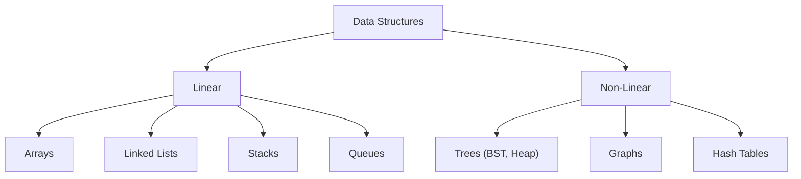

# Data Structures

<details>
<summary>🇻🇳 <b>Hiển thị bản dịch Tiếng Việt</b></summary>
<br>

> **Tóm tắt**: Cấu trúc dữ liệu (Data Structures) là các phương pháp lưu trữ và tổ chức dữ liệu trong máy tính để có thể sử dụng và truy xuất hiệu quả. Tùy thuộc vào yêu cầu bài toán (cần tìm kiếm nhanh, hay cần chèn dữ liệu nhanh), bạn sẽ chọn cấu trúc phù hợp.

</details>

> **Summary**: Data Structures are specialized formats for organizing, processing, retrieving, and storing data. Depending on the specific requirements of a problem (e.g., rapid searching vs. rapid insertion), software engineers must select the most optimal structure.

---

## ELI5 (Explain Like I'm 5)

<details>
<summary>🇻🇳 <b>Hiển thị bản dịch Tiếng Việt</b></summary>
<br>

Hãy tưởng tượng bạn có rất nhiều đồ đạc trong nhà. Để cất giữ chúng, bạn không thể cứ vứt bừa bãi ra sàn được. Bạn cần các "Cấu trúc" để cất đồ:
1. **Array (Mảng)** giống như một cái **khay đựng trứng**. Mỗi quả trứng nằm ở một ô cố định có đánh số. Nếu bạn muốn lấy quả trứng số 5, bạn thò tay vào ô số 5 lấy ra ngay lập tức. Nhưng khay trứng có kích thước cố định (ví dụ 10 ô), bạn không thể nhét quả thứ 11 vào.
2. **Linked List (Danh sách liên kết)** giống như một đoàn tàu hỏa. Các toa móc nối vào nhau. Bạn có thể dễ dàng gắn thêm một toa mới vào đuôi, nhưng nếu muốn tìm người ở toa số 5, bạn phải đi bộ từ toa số 1, qua số 2, số 3, số 4 rồi mới tới nơi.
3. **Stack (Ngăn xếp)** giống như một chồng đĩa ăn. Cái đĩa nào bạn đặt vào cuối cùng sẽ nằm ở trên cùng, và bạn sẽ phải lấy nó ra đầu tiên (LIFO - Last In First Out).
4. **Queue (Hàng đợi)** giống như xếp hàng mua vé xem phim. Ai đến trước mua trước (FIFO - First In First Out).
5. **Hash Map (Bảng băm)** giống như một cái **tủ thuốc có dán nhãn**. Bác sĩ muốn lấy thuốc "Paracetamol", chỉ cần nhìn nhãn tủ và mở đúng ngăn đó lấy ra trong chớp mắt, không cần phải lục tung từng ngăn.

</details>

Imagine you possess numerous items in your house. You cannot simply scatter them on the floor; you require specific "Structures" to store them efficiently:
1. **Array**: Similar to an **egg carton**. Each egg resides in a fixed, numbered slot. To retrieve the 5th egg, you reach directly into slot 5 instantly. However, the carton has a fixed capacity (e.g., 10 slots); you cannot simply force an 11th egg into it.
2. **Linked List**: Similar to a **freight train**. Each car is hooked to the next. It is trivial to attach a new car to the end, but if you need to find a passenger in the 5th car, you must walk through cars 1, 2, 3, and 4 sequentially to reach them.
3. **Stack**: Similar to a **stack of plates** at a buffet. The last plate you place on top is the very first one you will remove (LIFO - Last In, First Out).
4. **Queue**: Similar to a **line at a movie theater**. The first person to arrive is the first person to purchase a ticket (FIFO - First In, First Out).
5. **Hash Map**: Similar to a **labeled medicine cabinet**. If a doctor requires "Paracetamol", they scan the alphabetical labels and open the exact drawer instantly, bypassing the need to search every single drawer.

---

## Layer 1: What is it? (What)

<details>
<summary>🇻🇳 <b>Hiển thị bản dịch Tiếng Việt</b></summary>
<br>

**Data Structures (Cấu trúc dữ liệu)** là cách máy tính cấp phát bộ nhớ (RAM) và tổ chức các byte dữ liệu để phần mềm có thể tương tác với chúng một cách tối ưu. Chúng được chia làm hai loại chính:

1. **Linear (Tuyến tính)**: Dữ liệu xếp thành hàng ngang (Array, LinkedList, Stack, Queue).
2. **Non-Linear (Phi tuyến tính)**: Dữ liệu phân nhánh hoặc kết nối chéo (Trees, Graphs).

</details>

**Data Structures** represent how a computer allocates memory (RAM) and organizes bytes of data so that software applications can interact with them optimally. They are categorized into two primary paradigms:

1. **Linear Data Structures**: Data elements are arranged sequentially or linearly (e.g., Arrays, Linked Lists, Stacks, Queues).
2. **Non-Linear Data Structures**: Data elements are not placed sequentially but form branches or hierarchical relationships (e.g., Trees, Graphs).



---

## Layer 2: Why does it exist? (Why)

<details>
<summary>🇻🇳 <b>Hiển thị bản dịch Tiếng Việt</b></summary>
<br>

Tại sao không dùng Array (Mảng) cho tất cả mọi thứ? Bởi vì không có cấu trúc nào là hoàn hảo trong mọi tình huống. Bộ nhớ máy tính có hạn, và tốc độ xử lý CPU cũng có hạn.

- Nếu bạn dùng Array để lưu trữ 1 tỷ user, việc **tìm kiếm** rất nhanh (dùng index), nhưng nếu bạn muốn **xóa** user đứng ở đầu mảng, máy tính sẽ phải dịch chuyển 999,999,999 user còn lại lên trên một bước. Việc này tốn tài nguyên khổng lồ!
- Nếu bạn đổi sang Linked List, việc xóa phần tử đầu tiên cực kỳ nhanh (chỉ cần tháo móc nối). Nhưng bù lại, muốn tìm user thứ 500,000, máy tính phải duyệt qua 499,999 người đầu tiên.

Khoa học máy tính đẻ ra vô số cấu trúc dữ liệu để chúng ta có thể **đánh đổi (Trade-off)** giữa Tốc độ Đọc (Read) và Tốc độ Ghi/Xóa (Write/Delete).

</details>

Why not utilize an Array for every programmatic requirement? Because the "silver bullet" data structure does not exist. Computer memory and CPU cycles are finite resources.

- If you utilize an Array to store one billion user records, **retrieval by index** is instantaneous. However, if you attempt to **delete** the very first user, the CPU must physically shift the remaining 999,999,999 records down by one memory address. This operation is catastrophically expensive.
- If you switch to a Linked List, deleting the first element is instantaneous (you simply reassign a memory pointer). However, if you wish to **retrieve** the 500,000th user, the CPU must traverse through the preceding 499,999 nodes sequentially.

Computer Science engineered various data structures to allow software engineers to make calculated **Trade-offs** between Read velocity, Write/Delete velocity, and Memory footprint.

---

## Layer 3: Without vs. With Comparison (Compare)

<details>
<summary>🇻🇳 <b>Hiển thị bản dịch Tiếng Việt</b></summary>
<br>

Dưới đây là một bài toán minh họa: Bạn muốn thiết kế tính năng "Undo" (Hoàn tác) trên Microsoft Word.

**❌ Sai lầm (Dùng Array):**
Mảng không phù hợp cho thao tác "Last In, First Out" (Vào sau, ra trước). Nếu bạn dùng mảng, bạn sẽ phải dùng biến đếm tay để theo dõi đâu là hành động cuối cùng, rất dễ sinh bug.

**✅ Tối ưu (Dùng Stack):**
Stack (Ngăn xếp) sinh ra chính xác là để làm việc này. Các ngôn ngữ lập trình đều cung cấp sẵn thư viện Stack cực kỳ an toàn.

</details>

Consider the following scenario: You must architect the "Undo" feature for a text editor like Microsoft Word.

### Suboptimal Implementation: Using an Array
Arrays are not natively designed for "Last In, First Out" (LIFO) operations. Attempting to use an array requires manual pointer management, which is error-prone.
```java
// Managing state via an Array is clunky and dangerous
String[] actions = new String[100];
int currentIndex = 0;

public void doAction(String action) {
    if (currentIndex < 100) {
        actions[currentIndex] = action;
        currentIndex++;
    } else {
        // Must manually shift elements or throw an error
    }
}

public void undo() {
    if (currentIndex > 0) {
        currentIndex--; // The action isn't actually deleted, it just moves the pointer
    }
}
```

### Optimal Implementation: Using a Stack
A Stack is fundamentally designed for LIFO logic. It eliminates the need for manual index management.
**Java:**
```java
import java.util.Stack;

public class TextEditor {
    private Stack<String> history = new Stack<>();

    public void type(String text) {
        history.push(text); // Automatically places at the top of the stack
    }

    public void undo() {
        if (!history.isEmpty()) {
            String lastAction = history.pop(); // Automatically removes and returns the top element
            System.out.println("Undoing: " + lastAction);
        }
    }
}
```

**Python:**
```python
# In Python, lists natively function as highly optimized Stacks using .append() and .pop()
history = []

def type_text(text):
    history.append(text)

def undo():
    if history:
        last_action = history.pop()
        print(f"Undoing: {last_action}")
```

### Quick Reference Comparison Table

| Structure | Access (Read) | Insertion (Write) | Deletion | Use Case |
|---|---|---|---|---|
| **Array** | Very Fast | Slow | Slow | Static lists, math matrices. |
| **Linked List** | Slow | Very Fast | Very Fast | Queues, Dynamic structures. |
| **Stack** | Top only | Top only | Top only | Undo features, Browser history. |
| **Hash Map** | Very Fast | Very Fast | Very Fast | Caching, Dictionary lookups. |
| **Tree (BST)** | Fast | Fast | Fast | Hierarchical data, Databases. |

---

## Layer 4: Common Use Cases

<details>
<summary>🇻🇳 <b>Hiển thị bản dịch Tiếng Việt</b></summary>
<br>

- **Hash Map**: Sử dụng cực kỳ phổ biến trong Redis (Cache), đếm số lần xuất hiện của từ khóa, hệ thống login (tương ứng Username -> Password).
- **Graph (Đồ thị)**: Google Maps (Tìm đường ngắn nhất), Facebook (Thuật toán gợi ý kết bạn: Bạn của bạn của bạn).
- **Tree (Cây)**: Cấu trúc thư mục máy tính, DOM (Document Object Model) trong HTML/React, cơ sở dữ liệu Indexing (B-Tree).
- **Queue (Hàng đợi)**: Hệ thống xử lý hàng ngàn tin nhắn cùng lúc (RabbitMQ, Kafka), hàng đợi in tài liệu của máy in.

</details>

- **Hash Map**: The backbone of distributed caching systems (Redis, Memcached), JSON parsing, and rapid user-credential lookups.
- **Graph**: Routing algorithms in Google Maps (Dijkstra's Algorithm), social network analysis (Facebook's "People you may know" feature).
- **Tree**: Computer file systems, the HTML DOM (Document Object Model) utilized by web browsers and React, and Database indexing architectures (B-Trees).
- **Queue**: Message brokering systems handling millions of asynchronous tasks (RabbitMQ, Apache Kafka), and thread-pool execution scheduling.

---

## Layer 5: Deep Practice

### Best Practices

<details>
<summary>🇻🇳 <b>Hiển thị bản dịch Tiếng Việt</b></summary>
<br>

1. **Biết khi nào không nên dùng Hash Map**: Mặc dù Hash Map có tốc độ siêu phàm O(1), nhưng nó cực kỳ tốn RAM và không thể lấy dữ liệu theo thứ tự (Sorting). Nếu bạn cần danh sách có thứ tự, hãy dùng Array hoặc TreeMap.
2. **Kích thước mảng (Array Capacity)**: Trong Java hay C++, khi khởi tạo mảng, hãy tính toán trước kích thước để tránh máy tính phải liên tục tạo mảng mới và copy dữ liệu cũ sang (gây nghẽn CPU).

</details>

1. **Understand Hash Map Limitations**: While Hash Maps boast theoretically $O(1)$ constant time for operations, they consume substantial memory overhead due to hash collision management, and they inherently destroy data sorting/ordering. If sequential ordering is required, utilize an Array or a `TreeMap`/`OrderedDict`.
2. **Pre-allocate Array Capacity**: When utilizing dynamic arrays (`ArrayList` in Java or `list` in Python), if you anticipate inserting 10,000 elements, pre-allocate the capacity during initialization. This prevents the CPU from performing expensive array resizing and memory reallocation cycles underneath the hood.

### Common Pitfalls

<details>
<summary>🇻🇳 <b>Hiển thị bản dịch Tiếng Việt</b></summary>
<br>

1. **Chọn sai cấu trúc do thói quen**: Lập trình viên mới thường dùng Array (List) cho mọi bài toán. Nếu bạn cần liên tục kiểm tra xem phần tử X có nằm trong danh sách 1 triệu phần tử hay không, dùng Array sẽ làm sập server vì quá chậm. Hãy chuyển sang dùng `Set` (Hash Set).
2. **Quên mất Memory Leak với Stack/Queue**: Khi pop/dequeue, nếu bạn dùng mảng tĩnh tự thiết kế mà không xóa tham chiếu (reference) tới object, Garbage Collector sẽ không thể dọn dẹp RAM, gây ra lỗi tràn bộ nhớ (Memory Leak).

</details>

1. **Defaulting to Arrays Ignorantly**: Junior developers habitually utilize Arrays (Lists) for every scenario. If a business logic requires constantly verifying if an item exists within a one-million-item collection (`if item in array`), utilizing an Array causes severe CPU blocking (O(N) time). Transition immediately to a `Set` (Hash Set) for O(1) lookups.
2. **Manual Implementation Memory Leaks**: When manually implementing Stacks or Queues using fixed arrays (especially in garbage-collected languages like Java), merely decrementing the top pointer does not free memory. The array still holds a reference to the popped object, preventing the Garbage Collector from claiming it. Always set the array index to `null` after popping.

---

## Layer 6: Code Templates & Integration

### Boilerplate: Implementing a Safe Stack in Java
When implementing custom data structures, always utilize generics and handle boundary conditions correctly to prevent `NullPointerException` or `ArrayIndexOutOfBoundsException`.

**Java:**
```java
public class SafeStack<T> {
    private Object[] elements;
    private int size = 0;
    private static final int DEFAULT_CAPACITY = 10;

    public SafeStack() {
        elements = new Object[DEFAULT_CAPACITY];
    }

    public void push(T e) {
        if (size == elements.length) {
            ensureCapacity(); // Dynamically resize if full
        }
        elements[size++] = e;
    }

    @SuppressWarnings("unchecked")
    public T pop() {
        if (size == 0) throw new IllegalStateException("Stack is empty");
        T result = (T) elements[--size];
        
        // CRITICAL: Prevent memory leak by nulling out the obsolete reference
        elements[size] = null; 
        
        return result;
    }

    private void ensureCapacity() {
        int newSize = elements.length * 2;
        elements = java.util.Arrays.copyOf(elements, newSize);
    }
}
```

---

## Related Topics
- Understand how we measure the speed of these data structures in **[Complexity Analysis (Big-O)](./complexity-analysis.md)**.
- See how these structures are manipulated using logic in **[Algorithms](./algorithms.md)**.
