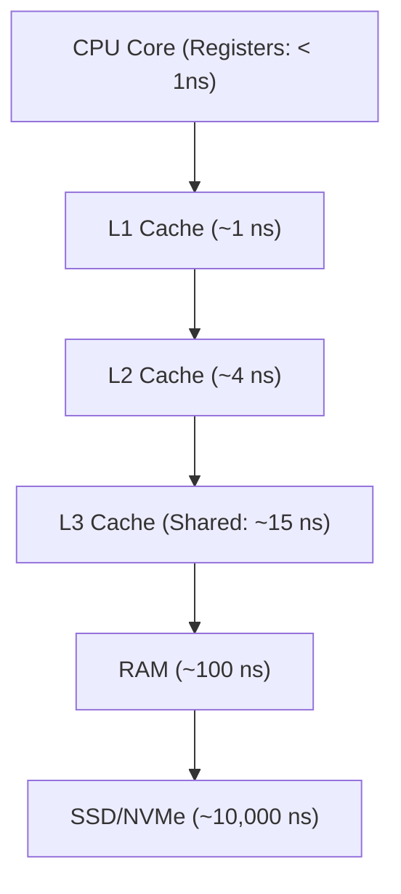

# CPU, Cache, and RAM Architecture

<details>
<summary>🇻🇳 <b>Hiển thị bản dịch Tiếng Việt</b></summary>
<br>

> **Tóm tắt**: Để code chạy được, nó phải đi một quãng đường từ Ổ cứng (Chậm nhất) $\rightarrow$ RAM $\rightarrow$ Cache $\rightarrow$ CPU (Nhanh nhất). Hiểu cách dữ liệu di chuyển giữa CPU, Cache (L1/L2/L3) và RAM giúp kỹ sư giải thích được tại sao cùng thuật toán Big-O $O(N)$ nhưng hai cách viết code lại cho ra tốc độ chênh lệch nhau hàng chục lần.

</details>

> **Summary**: For any software to execute, instructions and data must travel from Storage (Slowest) $\rightarrow$ RAM $\rightarrow$ CPU Cache $\rightarrow$ CPU Registers (Fastest). Understanding the physical memory hierarchy (L1/L2/L3 Cache) and CPU mechanics empowers engineers to comprehend why two implementations with identical $O(N)$ Big-O complexity can have drastically different real-world execution speeds.

---

## ELI5 (Explain Like I'm 5)

<details>
<summary>🇻🇳 <b>Hiển thị bản dịch Tiếng Việt</b></summary>
<br>

Tưởng tượng CPU là **bạn (Người đầu bếp)** đang nấu ăn.
1. **Registers (Lòng bàn tay)**: Cực kỳ nhanh. Là củ hành bạn đang cầm trên tay để thái. Sức chứa rất nhỏ.
2. **L1 Cache (Cái thớt ngay trước mặt)**: Chứa những đồ bạn đang làm dở. Với tay lấy mất 1 giây.
3. **L2/L3 Cache (Tủ lạnh trong bếp)**: Chứa nhiều nguyên liệu hơn, nhưng phải đi bộ ra mở tủ mất 5 giây.
4. **RAM (Siêu thị ở đầu ngõ)**: Chứa được cực nhiều đồ, nhưng mỗi lần hết đồ phải đạp xe đi mua mất 5 phút (Rất chậm so với CPU).
5. **SSD/HDD (Nông trại ở tỉnh khác)**: Kho chứa vô hạn, nhưng đi lấy hàng mất cả tuần.

Nếu bạn viết code dở, CPU sẽ liên tục phải "đạp xe ra siêu thị" (RAM) thay vì lấy đồ ngay trên "thớt" (Cache).

</details>

Imagine the CPU as a **Master Chef** cooking in a kitchen.
1. **Registers (In your hands)**: Extremely fast. The ingredients currently in your hands being chopped. Tiny capacity.
2. **L1 Cache (The cutting board)**: Items immediately in front of you. Takes 1 second to grab.
3. **L2/L3 Cache (The kitchen fridge)**: Holds more ingredients, but requires walking across the kitchen (5 seconds).
4. **RAM (The neighborhood grocery store)**: Massive capacity, but when you need something, you must bike there (5 minutes).
5. **SSD/HDD (A farm in another state)**: Infinite storage, but requires a week-long truck delivery.

If your code is unoptimized, the CPU is forced to constantly "bike to the grocery store" (fetch from RAM) instead of grabbing data from the "cutting board" (Cache).

---

## Layer 1: What is it? (What)

<details>
<summary>🇻🇳 <b>Hiển thị bản dịch Tiếng Việt</b></summary>
<br>

Hệ thống phân cấp bộ nhớ (Memory Hierarchy) là cách thiết kế vật lý để cân bằng giữa Tốc độ và Giá thành.
- **CPU Registers**: Vùng nhớ nhỏ nhất, nằm sát lõi CPU nhất. 
- **L1 Cache**: Nhỏ (thường 64KB), tốc độ truy xuất siêu tốc (~1 ns). Nằm ngay trên lõi CPU.
- **L2 Cache**: Lớn hơn L1 (~512KB), tốc độ chậm hơn (~4 ns). 
- **L3 Cache**: Bộ nhớ dùng chung cho tất cả các lõi (Cores) của CPU (2MB - 32MB). Tốc độ ~15 ns.
- **RAM (Main Memory)**: Bộ nhớ chính. Rộng lớn (16GB - 128GB) nhưng cực kỳ chậm so với CPU (~100 ns).

</details>

The **Memory Hierarchy** is a physical hardware design pattern bridging the gap between processor speed and memory capacity constraints.
- **CPU Registers**: The absolute smallest, fastest memory locations physically etched into the CPU core.
- **L1 Cache**: Extremely small (~64KB per core) and blazingly fast (~1 nanosecond). Dedicated to a single core.
- **L2 Cache**: Larger than L1 (~512KB) but slightly slower (~4 ns). Usually dedicated to a single core.
- **L3 Cache**: A shared cache accessible by all CPU cores on the chip (2MB - 32MB+). Slower (~15 ns).
- **RAM (Random Access Memory)**: The primary operational memory (16GB - 128GB+). Very slow relative to the CPU (~100 ns).



---

## Layer 2: Why does it exist? (Why)

<details>
<summary>🇻🇳 <b>Hiển thị bản dịch Tiếng Việt</b></summary>
<br>

**Vấn đề (Von Neumann Bottleneck)**: Tốc độ xử lý của CPU tăng nhanh hơn rất nhiều so với tốc độ đọc/ghi của RAM. CPU hiện đại có thể xử lý hàng tỷ phép tính mỗi giây, nhưng RAM thì không kịp mớm dữ liệu cho nó. Kết quả là CPU bị "chết đói" dữ liệu và phải đứng chờ RAM (Stall).

**Giải pháp**: Sinh ra Cache. CPU sẽ gom một cụm dữ liệu từ RAM nhét vào Cache để dùng dần. Nếu dữ liệu CPU cần nằm sẵn trong Cache, gọi là **Cache Hit** (Tốc độ bàn thờ). Nếu không có, gọi là **Cache Miss** (CPU phải khóc thét đứng chờ lấy từ RAM).

</details>

**The Problem (The Von Neumann Bottleneck)**: Over the decades, CPU processing speeds have scaled exponentially faster than RAM access speeds. A modern CPU operates at 5GHz (billions of cycles per second), while RAM takes hundreds of CPU cycles to respond. Without intervention, the CPU would spend 99% of its life idling, starved for data.

**The Solution**: The Cache architecture. The CPU aggressively pre-fetches contiguous blocks of data from RAM into the Cache (Cache Lines). 
- If the CPU finds the required data in the Cache, it's a **Cache Hit** (Execution continues instantly). 
- If it fails, it's a **Cache Miss** (The CPU stalls, wasting hundreds of cycles waiting for RAM).

---

## Layer 3: Without vs. With Comparison (Compare)

<details>
<summary>🇻🇳 <b>Hiển thị bản dịch Tiếng Việt</b></summary>
<br>
Hai đoạn code dưới đây đều duyệt qua mảng 2 chiều bằng 2 vòng lặp lồng nhau (Big-O là $O(N^2)$). Nhưng một cái chạy cực nhanh, một cái chạy cực chậm. Vì sao?
</details>

Consider two implementations traversing a 2D matrix. Both possess the exact same theoretical Big-O Time Complexity: $O(N \times M)$. However, the physical hardware executes them drastically differently.

### Without Cache Awareness (Column-Major Traversal)
Memory in RAM is stored sequentially (Row by Row). Jumping vertically column by column causes a **Cache Miss** on almost every single iteration. The CPU fetches a row into Cache, reads one element, discards the Cache, and fetches the next row.
**Java:**
```java
// BAD: Column-Major traversal destroys Cache Hit Rate
public int sumBad(int[][] matrix) {
    int sum = 0;
    for (int col = 0; col < matrix[0].length; col++) {
        for (int row = 0; row < matrix.length; row++) {
            sum += matrix[row][col]; // MASSIVE CACHE MISSES
        }
    }
    return sum;
}
```

### With Cache Awareness (Row-Major Traversal)
Traversing row by row matches the physical sequential layout of RAM. When the CPU fetches `matrix[0][0]`, it pulls the entire row `matrix[0][0]` to `matrix[0][15]` into the L1 Cache. The next 15 iterations are guaranteed **Cache Hits**.
**Java:**
```java
// GOOD: Row-Major traversal maximizes Cache Hit Rate
public int sumGood(int[][] matrix) {
    int sum = 0;
    for (int row = 0; row < matrix.length; row++) {
        for (int col = 0; col < matrix[0].length; col++) {
            sum += matrix[row][col]; // 99% CACHE HITS
        }
    }
    return sum;
}
```

---

## Layer 4: Common Use Cases

<details>
<summary>🇻🇳 <b>Hiển thị bản dịch Tiếng Việt</b></summary>
<br>

1. **High-Frequency Trading (HFT)**: Các hệ thống giao dịch chứng khoán tính bằng micro-giây. Kỹ sư phải viết code bằng C++ và căn chỉnh cấu trúc dữ liệu sao cho vừa khít với kích thước của L1 Cache (thường là 64 bytes) để tốc độ đạt mức tuyệt đối.
2. **Game Engines (Unity/Unreal)**: Sử dụng Data-Oriented Design (DOD) thay vì OOP (Object-Oriented Programming). Các Entity được lưu sát nhau trong mảng (Arrays) để GPU/CPU càn quét một lúc, tránh tạo các Object nằm rải rác trên RAM làm Cache Miss.

</details>

1. **High-Frequency Trading (HFT)**: Wall Street algorithms executing trades in microseconds. Engineers write C/C++ code where structs are strictly padded and aligned to fit perfectly within a 64-byte L1 Cache Line to guarantee zero Cache Misses.
2. **Game Engine Architecture (ECS)**: Modern engines (Unity, Unreal) shift from traditional Object-Oriented Programming (OOP) to Data-Oriented Design (Entity-Component-System). Instead of objects scattered randomly across the Heap (causing Cache Misses), component data is tightly packed in continuous Arrays. The CPU sweeps through them linearly, maintaining a near 100% Cache Hit rate to render 120 FPS.

---

## Layer 5: Deep Practice

### Best Practices

<details>
<summary>🇻🇳 <b>Hiển thị bản dịch Tiếng Việt</b></summary>
<br>

1. **Dùng Array thay vì Linked List**: Nếu số lượng phần tử cố định và cần duyệt nhiều, luôn chọn Array. Array nằm liền kề nhau trên RAM $\rightarrow$ Cache Hit cao. Linked List nằm phân tán $\rightarrow$ Cache Miss liên tục.
2. **Nguyên tắc "Locality of Reference" (Tính cục bộ)**: Có 2 loại:
   - *Spatial Locality* (Không gian): Nếu biến X vừa được dùng, những biến nằm cạnh X có khả năng cao sẽ được dùng tiếp.
   - *Temporal Locality* (Thời gian): Nếu biến X vừa được dùng, nó có khả năng cao sẽ được dùng lại trong tương lai gần. Hãy giữ nó lại trong biến local.

</details>

1. **Favor Arrays over Linked Lists (for iteration)**: Arrays guarantee contiguous physical memory allocation. Iterating an Array triggers massive Spatial Locality benefits (high Cache Hits). Linked List nodes are scattered unpredictably across the Heap, causing constant pointer chasing and Cache Misses.
2. **Exploit Locality of Reference**:
   - **Spatial Locality**: If an address is accessed, nearby addresses will likely be accessed soon. Pack related data closely together.
   - **Temporal Locality**: If an address is accessed, it will likely be accessed again soon. Keep frequently used computations cached in local variables (Registers) rather than re-fetching them.

### Common Pitfalls

<details>
<summary>🇻🇳 <b>Hiển thị bản dịch Tiếng Việt</b></summary>
<br>

1. **False Sharing (Chia sẻ giả)**: Một mảng có 2 phần tử `[A, B]` nằm chung trên 1 Cache Line (64 bytes). Luồng 1 chạy trên Core 1 sửa `A`. Luồng 2 chạy trên Core 2 sửa `B`. Dù 2 biến khác nhau, nhưng vì nằm chung 1 khối, Core 1 sửa sẽ làm khối Cache của Core 2 bị "vô hiệu hóa", bắt nó tải lại từ RAM. Làm tốc độ đa luồng chậm hơn cả đơn luồng!
2. **Lạm dụng Object quá mức trong OOP**: Khởi tạo hàng triệu Object nhỏ giọt (ví dụ `new Integer(1)`) khiến Heap bị băm nát. Dữ liệu rời rạc giết chết hiệu năng Cache.

</details>

1. **False Sharing in Concurrency**: A 64-byte Cache Line holds variables `A` and `B`. Thread 1 (on Core 1) violently updates `A`. Thread 2 (on Core 2) violently updates `B`. Even though they are mutating independent variables, they share the physical Cache Line. Every time Core 1 updates `A`, it invalidates Core 2's cache, forcing a RAM fetch. This hidden contention makes multi-threaded code execute *slower* than single-threaded code.
2. **OOP Object Bloat (Heap Fragmentation)**: Instantiating millions of tiny wrapper objects (e.g., `Integer` instead of `int` in Java) fragments the Heap. Following millions of object pointers destroys Spatial Locality and eviscerates CPU Cache performance.

---

## Layer 6: Code Templates & Integration

### Benchmarking Cache Misses (Linux)

You can physically measure CPU Cache Misses on a Linux environment using the `perf` profiling tool.

```bash
# Compile your code
gcc -O3 matrix_math.c -o matrix_math

# Run the performance profiler to track cache misses
perf stat -e cache-references,cache-misses ./matrix_math

# Output Example:
# 10,234,500      cache-references
#  8,500,000      cache-misses        # 83% Miss Rate -> BAD CODE!
```

---

## Related Topics
- See how memory layouts affect structures in **[Data Structures](../computer-science/data-structures.md)**.
- Deep dive into OS memory allocation in **[Memory Management](../operating-system/memory-management.md)**.
