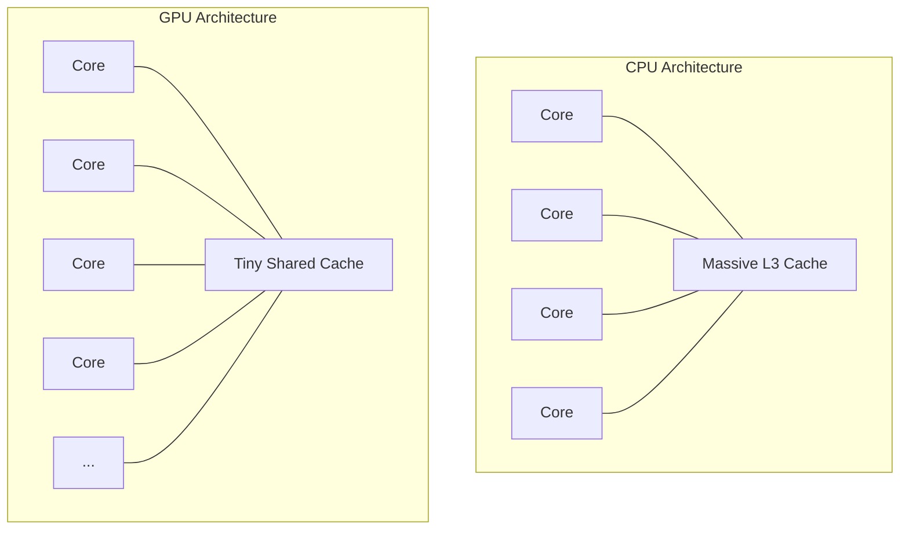

# CPU vs GPU Architecture

<details>
<summary>🇻🇳 <b>Hiển thị bản dịch Tiếng Việt</b></summary>
<br>

> **Tóm tắt**: CPU (Central Processing Unit) là một thiên tài toán học có thể giải quyết những bài toán logic phức tạp nhất, nhưng nó chỉ có vài "bộ não" (Cores). GPU (Graphics Processing Unit) giống như một đội quân gồm hàng nghìn học sinh cấp 1, không biết giải toán phức tạp, nhưng có thể cùng nhau làm phép cộng siêu nhanh. Đó là lý do GPU thống trị thế giới Đồ họa 3D và Trí tuệ Nhân tạo (AI).

</details>

> **Summary**: The CPU is a versatile, high-latency-optimized genius capable of executing complex sequential logic with a handful of extremely powerful cores. The GPU is a high-throughput-optimized army composed of thousands of weaker cores, designed to execute simple mathematical operations massively in parallel. This architectural divergence is why GPUs monopolize 3D Rendering and Artificial Intelligence (Machine Learning) workloads.

---

## ELI5 (Explain Like I'm 5)

<details>
<summary>🇻🇳 <b>Hiển thị bản dịch Tiếng Việt</b></summary>
<br>

Hãy tưởng tượng bạn cần vận chuyển 10,000 viên gạch.
- **CPU** là một chiếc xe siêu xe Ferrari. Chạy cực nhanh (500km/h), nhưng mỗi lần chỉ chở được 2 viên gạch. Phải chạy đi chạy lại 5,000 lần.
- **GPU** là một chiếc sà lan chở hàng khổng lồ. Chạy rất chậm (20km/h), nhưng chở một phát hết luôn 10,000 viên gạch.

Nếu bạn cần đi giao pizza cho 1 người khách VIP ở xa $\rightarrow$ Dùng CPU (Ferrari).
Nếu bạn cần chở đất đá xây nhà $\rightarrow$ Dùng GPU (Sà lan).

</details>

Imagine you are tasked with transporting 10,000 bricks across town.
- **The CPU** is a Ferrari. It is incredibly fast (low latency), but it only has two seats. It can only carry a few bricks at a time, requiring thousands of round trips.
- **The GPU** is a massive Cargo Ship. It moves very slowly (high latency per operation), but it can carry all 10,000 bricks in a single trip (massive throughput).

If you need to deliver a single urgent document to a CEO $\rightarrow$ Use the CPU (Ferrari).
If you need to transport construction materials to build a skyscraper $\rightarrow$ Use the GPU (Cargo Ship).

---

## Layer 1: What is it? (What)

<details>
<summary>🇻🇳 <b>Hiển thị bản dịch Tiếng Việt</b></summary>
<br>

**1. CPU (Bộ vi xử lý trung tâm)**: Được thiết kế cho **Độ trễ thấp (Low Latency)**. Nó có vài lõi (Ví dụ: 8 đến 24 Cores). Phần lớn diện tích chip CPU dành cho Bộ nhớ đệm (Cache) và Bộ điều khiển Logic (Control Unit) để xử lý các câu lệnh `if/else`, vòng lặp phức tạp.
**2. GPU (Bộ vi xử lý đồ họa)**: Được thiết kế cho **Băng thông cao (High Throughput)**. Nó có hàng nghìn lõi nhỏ (Ví dụ: NVIDIA RTX 4090 có hơn 16,000 Cores). Nó hy sinh Cache và Logic để nhét thật nhiều lõi tính toán ALU (Arithmetic Logic Unit).

</details>

**1. CPU (Central Processing Unit)**: Architected for **Low Latency** and complex sequential processing. A modern CPU has a small number of cores (e.g., 8 to 24). The vast majority of its silicon real estate is dedicated to massive Caches (L1/L2/L3) and complex Control Units designed to perfectly predict branching logic (`if/else` statements).
**2. GPU (Graphics Processing Unit)**: Architected for **High Throughput** and massive parallelism. A modern GPU packs thousands of miniaturized, simplified cores (e.g., an NVIDIA RTX 4090 contains over 16,000 CUDA cores). It sacrifices large caches and complex control logic to physically fit more ALUs (Arithmetic Logic Units) onto the die.



---

## Layer 2: Why does it exist? (Why)

<details>
<summary>🇻🇳 <b>Hiển thị bản dịch Tiếng Việt</b></summary>
<br>

Màn hình máy tính 4K của bạn có khoảng 8 triệu điểm ảnh (Pixels). Để chơi game 60 FPS (khung hình/giây), máy tính phải tính toán màu sắc cho 8 triệu điểm ảnh đó 60 lần MỖI GIÂY (Gần nửa tỷ phép tính/giây).
Nếu giao cho CPU (có 8 Cores), mỗi Core phải gánh 1 triệu điểm ảnh $\rightarrow$ Chết nghẽn.
Nhưng GPU có 8000 Cores. Nó chia mỗi Core gánh 1000 điểm ảnh. Và vì màu sắc điểm ảnh này không phụ thuộc vào điểm ảnh kia, chúng có thể được tính toán **Song song cùng một lúc**. Thế là GPU sinh ra để giải quyết bài toán "Tính toán ma trận độc lập".

</details>

A standard 4K monitor contains roughly 8.3 million pixels. To render a video game at 60 FPS (Frames Per Second), the computer must calculate the exact color and lighting for all 8.3 million pixels 60 times *every single second* (Nearly 500 million operations/second).
If assigned to an 8-Core CPU, each core sequentially iterates through 1 million pixels. It chokes.
A GPU has 8,000 cores. It distributes the workload so each core only processes 1,000 pixels. Because calculating the color of Pixel A is entirely independent of Pixel B, the operations are executed **Simultaneously in Parallel**. GPUs were literally born to perform Independent Matrix Multiplications.

---

## Layer 3: Without vs. With Comparison (Compare)

<details>
<summary>🇻🇳 <b>Hiển thị bản dịch Tiếng Việt</b></summary>
<br>
Sự khác biệt rõ nhất là trong Tính toán Ma trận (Matrix Multiplication), trái tim của Machine Learning.
</details>

The architectural divergence is most visibly demonstrated in Matrix Multiplication—the foundational mathematics powering modern Machine Learning and AI.

### CPU Implementation (Sequential Loop)
The CPU loops through elements sequentially. Complex branching (`if/else`) inside the loop is handled flawlessly due to advanced branch prediction.
**Python:**
```python
# CPU handles this gracefully
def process_data(data):
    for item in data:
        if item.is_valid():      # Branch prediction excels here
            complex_logic(item)  # Low latency sequential execution
```

### GPU Implementation (SIMD - Single Instruction, Multiple Data)
The GPU applies the exact same instruction to thousands of data points simultaneously. It lacks advanced branch prediction; if you put complex `if/else` logic in a GPU shader, the entire GPU will stall (Thread Divergence).
**CUDA (Conceptual):**
```cuda
// GPU handles this blazingly fast (No branching)
__global__ void multiply_matrices(float* A, float* B, float* C) {
    int id = threadIdx.x; 
    // Thousands of threads execute this single line at the exact same time
    C[id] = A[id] * B[id]; 
}
```

---

## Layer 4: Common Use Cases

<details>
<summary>🇻🇳 <b>Hiển thị bản dịch Tiếng Việt</b></summary>
<br>

- **Khi nào BẮT BUỘC dùng CPU**: Chạy Hệ điều hành, Web Server (NodeJS, Spring Boot), Database (PostgreSQL). Đây là các tác vụ nặng về logic rẽ nhánh `if/else`, không thể chạy song song.
- **Khi nào BẮT BUỘC dùng GPU**: Đào Bitcoin (Mã hóa SHA-256), Training mô hình AI (Deep Learning / LLM như ChatGPT), Render Video 3D. 

</details>

- **CPU Monopolies**: Operating Systems kernel execution, traditional Web Servers (NodeJS, Spring Boot, Nginx), Relational Databases (PostgreSQL, MySQL). These systems are dominated by non-linear, highly sequential logic, complex `if/else` branching, and context switching. A GPU would crash or run horrifyingly slow here.
- **GPU Monopolies**: Cryptocurrency Mining (performing billions of identical SHA-256 hashes), Training Artificial Intelligence (Deep Learning, Neural Networks, Large Language Models like ChatGPT), and 3D Video Rendering. These workloads are pure, unadulterated Linear Algebra and Matrix Multiplication.

---

## Layer 5: Deep Practice

### Best Practices

<details>
<summary>🇻🇳 <b>Hiển thị bản dịch Tiếng Việt</b></summary>
<br>

1. **AI/ML - Tối ưu hóa việc chuyển dữ liệu (Data Transfer)**: Chép dữ liệu từ RAM của máy tính (Host) sang RAM của GPU (VRAM - Device) cực kỳ chậm. Bí quyết để train AI nhanh là "Chép dữ liệu sang GPU một lần (Batch), tính toán thật nhiều, rồi mới chép kết quả về".
2. **Tránh rẽ nhánh trên GPU**: Không bao giờ viết quá nhiều `if/else` trong code chạy trên GPU (CUDA/OpenCL). Nếu các luồng trong cùng một Warp chạy vào 2 nhánh `if` khác nhau, GPU sẽ bị khựng lại (Warp Divergence).

</details>

1. **Minimize Host-to-Device Memory Transfers**: The PCIe bus connecting the CPU's RAM (Host) to the GPU's VRAM (Device) is the biggest bottleneck in AI engineering. Transferring data is painfully slow. The golden rule of Machine Learning is: Send massive *Batches* of data to the GPU once, let the GPU perform millions of calculations, and only transfer the final result back to the CPU.
2. **Eradicate Branching in GPU Code**: Never write complex `if/else` statements in GPU code (CUDA Kernels/Shaders). GPUs operate in "Warps" (groups of 32 threads). If threads in a warp diverge (some evaluate `if` as true, others `false`), the GPU must execute both paths sequentially, destroying your parallelism. This is known as **Warp Divergence**.

### Common Pitfalls

<details>
<summary>🇻🇳 <b>Hiển thị bản dịch Tiếng Việt</b></summary>
<br>

1. **Mua GPU xịn để chạy Web Server**: Rất nhiều người lầm tưởng "Lắp RTX 4090 vào Server thì chạy web sẽ nhanh hơn". Hoàn toàn sai! GPU không sinh ra để xử lý các HTTP request nhỏ lẻ rẽ nhánh liên tục.
2. **Tràn VRAM (Out of Memory) trong AI**: Mô hình ngôn ngữ lớn (LLM) cần dung lượng VRAM khổng lồ. Nếu bạn có RTX 4090 (24GB VRAM) nhưng mô hình nặng 30GB, việc train mô hình sẽ sụp đổ. Lúc này phải dùng kỹ thuật Quantization (Ép nén) để giảm dung lượng mô hình.

</details>

1. **Misunderstanding Workloads**: Assuming that purchasing an expensive NVIDIA A100 GPU will speed up your standard Java/NodeJS backend web server. GPUs cannot execute standard OS processes or web server logic. They sit completely idle unless specifically instructed by libraries (like TensorFlow/PyTorch) to perform math.
2. **VRAM Exhaustion (OOM)**: Training Large Language Models (LLMs) requires massive GPU Memory (VRAM) to hold the Neural Network weights. If your model requires 40GB of VRAM and your GPU only has 24GB, the operation immediately crashes with an `Out Of Memory` error. Engineers must utilize techniques like **Quantization** (reducing 32-bit floats to 8-bit integers) to compress the model to fit into VRAM.

---

## Related Topics

- To understand how the Operating System orchestrates CPU cores, see **[Process vs Thread](../operating-system/process-thread.md)**.
- To understand how the GPU/CPU physically fetch data, review **[CPU, Cache, and RAM](./cpu-cache-ram.md)**.
