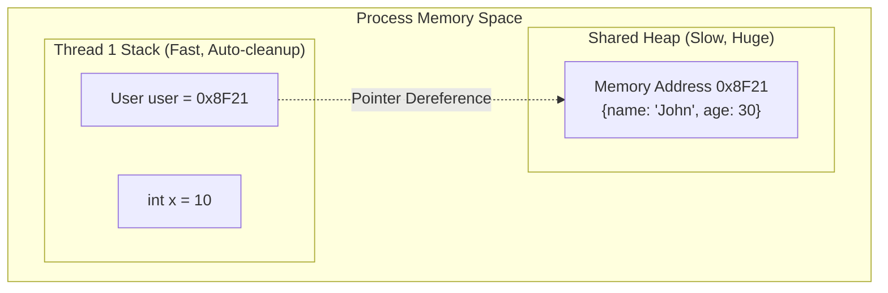

# Memory Management: Stack vs Heap & Garbage Collection

<details>
<summary>🇻🇳 <b>Hiển thị bản dịch Tiếng Việt</b></summary>
<br>

> **Tóm tắt**: Bất kỳ biến (variable) hay đối tượng (object) nào bạn tạo ra trong code đều phải tốn dung lượng RAM vật lý. Trình quản lý bộ nhớ chia RAM của một ứng dụng làm 2 phần chính: **Stack** (Ngăn xếp - cực nhanh, tự động dọn dẹp, nhưng bé tí) và **Heap** (Đống - khổng lồ, chậm hơn, và dễ bị rác). Không hiểu bộ nhớ là nguyên nhân số 1 gây ra lỗi `OutOfMemory` làm sập server.

</details>

> **Summary**: Every variable or object instantiated in your code consumes physical RAM. The Operating System allocates memory to a process in two primary segments: the **Stack** (blazingly fast, auto-cleaned, but strictly limited in size) and the **Heap** (massive capacity, slower, and prone to memory leaks). Misunderstanding memory allocation is the #1 root cause of `OutOfMemoryError` crashes in production servers.

---

## ELI5 (Explain Like I'm 5)

<details>
<summary>🇻🇳 <b>Hiển thị bản dịch Tiếng Việt</b></summary>
<br>

Hãy tưởng tượng bạn đang làm việc trong một văn phòng:
- **Stack (Cái bàn làm việc của bạn)**: Bạn để giấy nhớ, bút, máy tính cầm tay. Rất nhanh để lấy dùng. Nhưng bàn rất nhỏ, bạn không thể để một chiếc xe đạp lên đó. Làm xong việc, bạn gom hết giấy nháp ném vào thùng rác ngay lập tức (Tự động dọn dẹp).
- **Heap (Cái nhà kho ở tầng hầm)**: Bạn mua một cái máy in khổng lồ, không để vừa trên bàn, bạn phải vứt nó xuống nhà kho. Nhưng trên bàn làm việc của bạn (Stack) sẽ ghi một tờ giấy note: *"Cái máy in nằm ở góc trái nhà kho nhé"* (Con trỏ - Pointer). Lấy đồ ở kho chậm hơn nhiều. Nếu bạn không chịu dọn nhà kho, một ngày nào đó nó sẽ đầy ứ và sập (Memory Leak).

</details>

Imagine you are working in an office building:
- **The Stack (Your immediate desktop)**: You place your pen, sticky notes, and calculator here. It's incredibly fast to access. However, the desk is small; you cannot park a bicycle on it. The moment you finish your task and leave the desk, the janitor instantly wipes everything off the table (Automatic cleanup).
- **The Heap (The basement warehouse)**: You order a massive industrial printer. It won't fit on your desk, so you store it in the basement. However, you leave a small sticky note on your desk (The Stack) that reads: *"The printer is located in Aisle 4"* (A Memory Pointer). Fetching it is slow. If nobody ever cleans the warehouse, it will eventually fill up and explode (A Memory Leak).

---

## Layer 1: What is it? (What)

<details>
<summary>🇻🇳 <b>Hiển thị bản dịch Tiếng Việt</b></summary>
<br>

**1. Stack Memory**: Lưu trữ các biến cục bộ (Local variables), các kiểu dữ liệu nguyên thủy (int, float, boolean) và các con trỏ (Reference pointers). Cơ chế LIFO (Vào sau Ra trước). Hoàn toàn tự động cấp phát và giải phóng khi một hàm (function) chạy xong. Tốc độ cực nhanh.
**2. Heap Memory**: Lưu trữ các Object lớn, phức tạp (VD: Một object `User` có 50 thuộc tính, mảng 1 triệu phần tử). Lập trình viên phải tự xin cấp phát (`new Object()`). Không tự động giải phóng (trừ khi có Garbage Collector). Tốc độ truy cập chậm hơn vì phải tìm địa chỉ thông qua Pointer nằm trên Stack.

</details>

**1. Stack Memory**: A contiguous block of memory allocated strictly for thread execution. It stores primitive data types (e.g., `int`, `boolean`), local variables, and object reference pointers. It operates strictly on a LIFO (Last-In, First-Out) push/pop architecture. Allocation and deallocation are instantaneous and automatically managed when a function enters and exits. 
**2. Heap Memory**: A massive, unorganized pool of memory used for dynamic allocation. It stores complex, heavy Objects (e.g., A `User` object with strings, nested lists, etc.). Memory must be explicitly requested (`new Object()`). Accessing heap data is slower because it requires dereferencing a pointer located on the Stack.



---

## Layer 2: Why does it exist? (Why)

<details>
<summary>🇻🇳 <b>Hiển thị bản dịch Tiếng Việt</b></summary>
<br>

**Tại sao không gộp chung lại làm 1?**
Nếu vứt mọi thứ vào Stack: Stack được thiết kế để chạy LIFO (ngăn xếp), tức là hàm chạy xong phải xóa hết biến đi. Nhưng đôi khi ta muốn tạo một Object `User` trong hàm A, rồi truyền nó cho hàm B dùng tiếp. Nếu dùng Stack, Object `User` sẽ bị xóa cmnr khi hàm A kết thúc! 
Vì vậy, ta vứt Object `User` vào Heap (sống lâu dài), và chỉ ném cái Địa Chỉ (Pointer) qua lại giữa các hàm trên Stack.

</details>

**Why bifurcate memory into two distinct zones?**
If everything was forced onto the Stack: The Stack strictly enforces its LIFO pop mechanic upon function exit. If Function A instantiates a massive `DatabaseConnection` object and returns it to Function B, a purely stack-based architecture would instantly destroy the object the millisecond Function A finishes executing. 
The Heap was invented to provide **Dynamic Lifespans**. You instantiate the `DatabaseConnection` on the Heap (where it survives indefinitely), and functions merely pass around lightweight 64-bit Pointers on their Stacks to reference it.

---

## Layer 3: Without vs. With Comparison (Compare)

### Manual Memory Management vs. Garbage Collection

<details>
<summary>🇻🇳 <b>Hiển thị bản dịch Tiếng Việt</b></summary>
<br>
Ở các ngôn ngữ cổ (C/C++), bạn phải tự tay dọn dẹp Heap. Nếu quên, RAM của máy chủ sẽ đầy dần và sập. Ở các ngôn ngữ hiện đại (Java, C#, Go), một con robot tên là Garbage Collector (GC) sẽ tự đi dọn rác.
</details>

In unmanaged languages (C/C++), the engineer is entirely responsible for the Heap. In managed languages (Java, C#, Go, Python), an automated subsystem called the **Garbage Collector (GC)** scans the Heap and destroys objects that are no longer referenced by any Stack pointers.

#### Without GC (C++)
The engineer must explicitly call `delete`. If they forget, a Memory Leak occurs.
```cpp
void createUser() {
    // 1. Allocate User on the Heap. 'userPtr' is on the Stack.
    User* userPtr = new User("John"); 
    
    // ... do something ...
    
    // 2. DANGER: If you forget to write this line, the Heap leaks!
    delete userPtr; 
} // Stack pops 'userPtr'. If 'delete' was forgotten, the User object is orphaned forever.
```

#### With GC (Java / C#)
The JVM completely abstracts away deallocation.
```java
public void createUser() {
    // 1. Allocate on Heap. Pointer on Stack.
    User userPtr = new User("John"); 
    
    // ... do something ...
    
} // 2. Function ends. Stack pops 'userPtr'. 
  // 3. The Garbage Collector wakes up, sees the User object on the Heap has 0 pointers looking at it, and safely destroys it.
```

---

## Layer 4: Common Use Cases

<details>
<summary>🇻🇳 <b>Hiển thị bản dịch Tiếng Việt</b></summary>
<br>

- **Lỗi `StackOverflowError`**: Xảy ra khi bạn viết một hàm đệ quy (hàm gọi chính nó) vô tận. Chiếc bàn làm việc (Stack) bị nhồi nhét hàng triệu tờ giấy (variables) cho đến khi sập bàn.
- **Lỗi `OutOfMemoryError` (OOM)**: Xảy ra khi bạn load 1 triệu tấm ảnh từ Database lên RAM (Heap), vượt quá sức chứa của nhà kho. Server chết đứng.

</details>

- **`StackOverflowError` Diagnostics**: This crash almost exclusively occurs due to infinite recursion. If a function calls itself indefinitely, the OS continuously pushes new execution frames onto the limited Stack memory (typically ~1MB per thread) until the physical boundary is breached, causing a violent process termination.
- **`OutOfMemoryError` (OOM) / Heap Exhaustion**: Occurs when the application attempts to load massive datasets (e.g., executing a SQL `SELECT *` on a table with 50 million rows) into memory. The OS refuses to expand the Heap any further, and the JVM/Node engine panics and crashes the container.

---

## Layer 5: Deep Practice

### Best Practices

<details>
<summary>🇻🇳 <b>Hiển thị bản dịch Tiếng Việt</b></summary>
<br>

1. **Phân trang Database (Pagination)**: Đừng bao giờ lôi toàn bộ dữ liệu từ DB lên RAM cùng một lúc. Hãy dùng `LIMIT` và `OFFSET` để lôi từng cục nhỏ lên xử lý rồi vứt đi, để GC dọn dẹp Heap kịp thời.
2. **Streaming Files**: Nếu user upload một file Video 10GB, đừng tải mảng `byte[]` 10GB lên RAM. Hãy dùng `Streams` (đọc 1 MB, ghi 1 MB, lặp lại). Bằng cách này, dung lượng RAM (Heap) sử dụng luôn chỉ là 1MB dù file có to cỡ nào.

</details>

1. **Enforce Database Pagination**: Never fetch massive collections into Application memory. A seemingly harmless `SELECT * FROM audit_logs` will drag 5GB of text into the Heap, instantly triggering an OOM crash. Force the Database layer to chunk the data using `LIMIT/OFFSET` (or Cursors), allowing the Garbage Collector to destroy the old chunk before the new chunk arrives.
2. **Stream I/O Operations**: When processing massive files (e.g., parsing a 50GB CSV log or handling a 10GB video upload), never load the file into a memory buffer (e.g., `byte[]`). Utilize I/O **Streams**. Streams read chunks of data (e.g., 8KB at a time), process them, and discard them. This caps Heap memory consumption at 8KB permanently, guaranteeing immunity to payload-based OOM crashes.

### Common Pitfalls

<details>
<summary>🇻🇳 <b>Hiển thị bản dịch Tiếng Việt</b></summary>
<br>

1. **Memory Leak trong Java/NodeJS (Dù có GC)**: GC rất thông minh, nhưng nếu bạn nhét 1 tỷ Object `User` vào một biến static `List<User> users_cache` (Biến toàn cục), thì con trỏ sẽ luôn trỏ vào đó. GC không dám xóa vì tưởng bạn vẫn đang dùng! RAM sẽ rò rỉ đến khi sập server.
2. **Stop-The-World (STW) Pauses**: Khi GC đi thu gom rác trên Heap, nó bắt toàn bộ ứng dụng (kể cả các luồng đang phục vụ API) phải DỪNG HÌNH (Stop-the-world) để nó dọn. Nếu Heap chứa quá nhiều rác, ứng dụng có thể bị treo (đơ) mất 2-3 giây.

</details>

1. **The Managed Memory Leak Illusion**: Developers falsely believe Garbage Collected languages cannot leak memory. If you append Objects into a global static scope (e.g., a static `HashMap` used as a naive local cache) and forget to remove them, the GC will observe active references pointing to those objects. It will refuse to clean them. Over weeks, the HashMap grows until it devours 100% of the server's RAM.
2. **GC Stop-The-World (STW) Latency Spikes**: Garbage Collection isn't magic; it requires massive CPU calculations to traverse the object graph. During Major GC cycles, the JVM/Node V8 engine must execute a "Stop-The-World" pause, entirely freezing all Application Threads to safely relocate memory. If you rapidly instantiate millions of useless objects, you trigger constant STW pauses, causing your API response times to randomly spike from 50ms to 5,000ms.

---

## Related Topics

- Memory isolation between OS processes is explained in **[Process vs Thread](./process-thread.md)**.
- See how hardware caches accelerate memory access in **[CPU, Cache, and RAM](../hardware-architecture/cpu-cache-ram.md)**.
