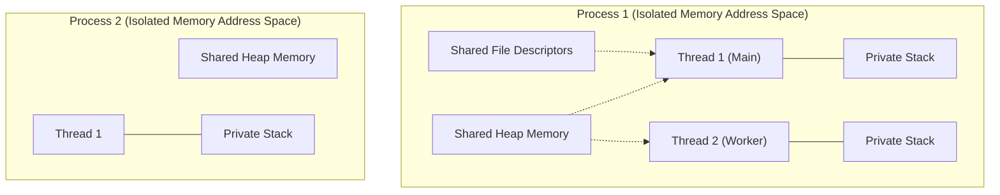

# Process vs. Thread

🇻🇳 <b>Hiển thị bản dịch Tiếng Việt</b>

 

> **Tóm tắt**: Hệ điều hành là vị "tổng tư lệnh" quản lý tài nguyên của máy tính (CPU, RAM). Để chạy một phần mềm, hệ điều hành tạo ra các **Process** (Tiến trình - giống như một công ty độc lập), và bên trong mỗi Process có các **Thread** (Luồng - giống như các nhân viên làm việc trong công ty đó). Hiểu rõ vòng đời và sự khác biệt giữa Process và Thread là chìa khóa để viết code đa luồng không bị sập.

> **Summary**: The Operating System (OS) is the ultimate orchestrator of hardware resources (CPU, Memory). To execute an application, the OS spawns **Processes** (isolated execution environments, akin to independent companies), and within each Process, it spawns **Threads** (the actual workers executing code). Mastering the boundaries and lifecycle of Processes and Threads is the prerequisite for designing robust concurrent systems.

---

## ELI5 (Explain Like I'm 5)

🇻🇳 <b>Hiển thị bản dịch Tiếng Việt</b>

 

Hãy tưởng tượng bạn đang mở trình duyệt Chrome.
- **Process (Tiến trình)**: Trình duyệt Chrome chính là một Process. Mỗi tab bạn mở (YouTube, Facebook) cũng có thể là một Process con.
- **Tính cô lập (Isolation)**: Nếu tab Facebook bị treo (crash), tab YouTube vẫn chạy bình thường. Đó là vì các Process có không gian bộ nhớ hoàn toàn cách ly. "Công ty A phá sản không làm công ty B phá sản".
- **Thread (Luồng)**: Trong tab YouTube, có một "nhân viên" (Thread 1) chuyên tải video từ mạng, một "nhân viên" (Thread 2) chuyên vẽ hình ảnh lên màn hình, và "nhân viên" (Thread 3) phát âm thanh.
- **Dùng chung (Shared Memory)**: Các nhân viên này dùng chung tài nguyên của công ty (Ví dụ: Dùng chung cục RAM tải video về để vẽ lên màn hình). Rất nhanh và tiện, nhưng nếu 2 nhân viên cãi nhau giành đồ, công ty sẽ sụp đổ (App Crash).

Imagine launching the Google Chrome browser.
- **The Process**: The Chrome application instance is a Process. Modern browsers often create a separate Process for every single tab you open (e.g., Tab 1: YouTube, Tab 2: Facebook).
- **Isolation**: If the Facebook tab suffers a catastrophic memory leak and crashes, the YouTube tab continues playing perfectly. This is because Processes operate in strictly isolated memory spaces. "Company A going bankrupt doesn't affect Company B."
- **The Thread**: Inside the YouTube tab, there is a Thread (Worker 1) constantly downloading network video chunks, another Thread (Worker 2) decoding the video frames, and another Thread (Worker 3) playing the audio.
- **Shared Memory**: All Threads within a single Process share the exact same memory space. Worker 2 reads the exact same RAM that Worker 1 just downloaded into. It's incredibly fast, but if two workers try to modify the exact same memory simultaneously without coordination, the entire application crashes.

---

## Layer 1: What is it? (What)

🇻🇳 <b>Hiển thị bản dịch Tiếng Việt</b>

 

**1. Process (Tiến trình)**: 
Là một chương trình đang được thực thi. Khi bạn nhấn đúp chuột vào file `.exe`, OS sẽ cấp phát cho nó một vùng không gian địa chỉ bộ nhớ (Address Space) độc lập. Các Process giao tiếp với nhau rất khó khăn (phải dùng IPC - Inter-Process Communication như Sockets hay Pipes).

**2. Thread (Luồng)**:
Là đơn vị thực thi nhỏ nhất được OS lập lịch chạy trên CPU. Một Process bắt buộc phải có ít nhất 1 Thread (gọi là Main Thread). Các Thread trong cùng một Process chia sẻ chung Heap Memory, nhưng mỗi Thread có một Stack Memory riêng.

**1. Process**: 
An active instance of a computer program that is being executed. Upon launching an executable, the OS allocates a deeply protected, independent virtual memory address space. Processes are hostile to one another; they cannot directly read each other's memory. To communicate, they must utilize slow, OS-mediated **IPC** (Inter-Process Communication) mechanisms like Sockets, Pipes, or Shared Memory segments.

**2. Thread**:
The smallest sequence of programmed instructions that can be managed independently by the OS Scheduler. A Process inherently contains at least one thread of execution (the "Main Thread"). Threads residing within the same Process share the exact same Heap memory and file descriptors, but each Thread maintains its own strictly private Execution Stack (Stack Memory) and CPU Register state.

---

## Layer 2: Why does it exist? (Why)

🇻🇳 <b>Hiển thị bản dịch Tiếng Việt</b>

 

**Vì sao không dùng toàn Process?**
Tạo ra một Process cực kỳ tốn kém (OS phải setup bộ nhớ mới, bảng phân trang mới). Hơn nữa, việc chuyển đổi qua lại giữa các Process (Process Context Switch) làm CPU phải xóa toàn bộ L1/L2 Cache, dẫn đến máy chạy chậm rì.

**Giải pháp: Thread ra đời**
Tạo Thread rất nhẹ, vì nó "ké" bộ nhớ của Process có sẵn. Chuyển đổi giữa các Thread trong cùng một Process (Thread Context Switch) rất nhanh, vì chúng dùng chung địa chỉ bộ nhớ, không cần phải xóa bỏ Cache. Điều này giúp các server xử lý được hàng chục nghìn kết nối cùng lúc.

**Why not just spawn Processes for everything?**
Spawning a completely new OS Process is extraordinarily heavy. The OS must halt, allocate new physical memory, construct new Page Tables for virtual memory, and setup security boundaries. Furthermore, a **Process Context Switch** (the CPU jumping from Process A to Process B) flushes the TLB (Translation Lookaside Buffer) and CPU Caches, inflicting massive latency penalties.

**The Solution: The invention of Threads**
Threads are lightweight. Because they exist within an already established Process memory space, spawning a Thread avoids the OS memory allocation overhead. More importantly, a **Thread Context Switch** (jumping between Thread 1 and Thread 2 of the same Process) is blazing fast; the CPU does not need to flush the virtual memory mappings. This allows modern Web Servers to handle 10,000 concurrent HTTP requests by spawning 10,000 Threads, which would be impossible with 10,000 Processes.

---

## Layer 3: Without vs. With Comparison (Compare)

### Architectural Comparison Matrix

| Feature | Process | Thread |
|---|---|---|
| **Memory Isolation** | Fully isolated. Safe but slow. | Shared Heap. Fast but dangerous (Race Conditions). |
| **Creation Overhead** | Very High (OS memory allocation). | Low (Piggybacks on existing Process). |
| **Context Switch Time** | Very Slow (TLB Flush required). | Fast (Shares virtual memory mappings). |
| **Crash Impact** | Process crashes alone. Others survive. | Thread crash (e.g. SegFault) kills the ENTIRE Process. |
| **Communication** | Difficult (IPC: Sockets, Pipes). | Easy (Direct memory variable access). |

---

## Layer 4: Common Use Cases

🇻🇳 <b>Hiển thị bản dịch Tiếng Việt</b>

 

- **Multi-Process (Đa tiến trình)**: 
  - **Node.js PM2 / Gunicorn (Python)**: Vì Node.js và Python bị vướng khóa GIL (Global Interpreter Lock), chúng chỉ chạy mượt trên 1 Core. Để tận dụng CPU 8 Cores, ta phải chạy 8 Processes độc lập.
  - **Google Chrome**: Dùng kiến trúc Multi-Process để cô lập lỗi. Tab này nhiễm mã độc cũng không thể soi được bộ nhớ (mật khẩu) của Tab ngân hàng bên cạnh.
  
- **Multi-Thread (Đa luồng)**:
  - **Java Spring Boot / Go Web Servers**: Sinh ra hàng nghìn luồng (Thread / Goroutine) để xử lý hàng nghìn request HTTP song song trên một vùng nhớ dùng chung, tốc độ cực nhanh.

- **Multi-Process Architectures**:
  - **Python (Gunicorn/Celery) & Node.js (PM2)**: Due to the Global Interpreter Lock (GIL) in Python and the Single-Threaded Event Loop in NodeJS, a single Process can only ever utilize exactly 1 CPU Core. To scale across an 8-Core server, engineers MUST spawn 8 independent Worker Processes.
  - **Google Chrome**: Architected explicitly as a Multi-Process application for security sandboxing. If Tab A runs malicious JavaScript, it is physically impossible for it to read the memory of Tab B (your banking site) because OS-level Process isolation blocks it.
  
- **Multi-Thread Architectures**:
  - **Java Spring Boot / Golang (Goroutines)**: Designed for raw throughput. These servers maintain a single massive Process and handle 10,000 concurrent HTTP requests by spinning up thousands of lightweight Threads sharing a single Database Connection Pool in the Heap.

---

## Layer 5: Deep Practice

### Best Practices

🇻🇳 <b>Hiển thị bản dịch Tiếng Việt</b>

 

1. **Thread Pool (Hồ chứa Luồng)**: Tạo Thread nhẹ hơn Process, nhưng tạo 10,000 Thread liên tục vẫn làm sập hệ thống (mỗi Thread tốn khoảng 1MB RAM cho Stack). Hãy luôn dùng Thread Pool: Khởi tạo sẵn một số lượng Thread cố định (VD: 200), dùng xong thì tái sử dụng thay vì vứt đi.
2. **Stateless (Phi trạng thái)**: Khi viết code cho server, đừng bao giờ lưu dữ liệu user vào biến Global trên RAM (vì các Thread sẽ đâm chém nhau để giành giật). Hãy lưu xuống Database hoặc Redis. Đảm bảo mọi Thread đều Stateless.

1. **Mandatory Thread Pools**: While Threads are lightweight compared to Processes, they are not free (A standard Java Thread consumes ~1MB of RAM just for its Stack). Creating 10,000 threads per second for incoming web requests will instantly crash the server via `OutOfMemoryError`. Always utilize a **Thread Pool**. Pre-allocate a fixed number of threads (e.g., 200) at startup, and recycle them indefinitely for incoming tasks.
2. **Stateless Architecture**: Because Threads share the Heap, maintaining stateful variables (e.g., storing a logged-in user's cart in a global `List` variable) is a death sentence. It guarantees Race Conditions. All Web Server threads must be strictly **Stateless**. Push all state persistence down into a Database or Redis cache.

### Common Pitfalls

🇻🇳 <b>Hiển thị bản dịch Tiếng Việt</b>

 

1. **Hiểu lầm về Multi-Threading ở Python/NodeJS**: Rất nhiều lập trình viên Cố gắng dùng thư viện Thread trong Python để tăng tốc độ tính toán. Kết quả là nó còn chạy C HẬM hơn đơn luồng. Vì cơ chế GIL chỉ cho phép 1 Thread chạy tại 1 thời điểm. Phải dùng `multiprocessing` (Process) mới tận dụng được nhiều Core.
2. **Context Switching Overhead**: Mở quá nhiều Thread (Ví dụ 5000 Thread trên máy chỉ có 4 Cores). CPU sẽ dành 99% thời gian để "đổi ca làm việc" cho 5000 Thread đó thay vì thực sự xử lý công việc. (Trừ khi bạn dùng Virtual Threads ở Java 21 hoặc Goroutine ở Go).

1. **The Python/NodeJS Threading Illusion**: Junior engineers often attempt to utilize multi-threading libraries in Python to speed up heavy CPU computations (like image processing). It actually runs *slower*. The Python GIL (Global Interpreter Lock) ensures that only one thread can execute Python byte-code at any given moment, effectively serializing execution. CPU-bound tasks in Python mandate `multiprocessing`.
2. **Context Switching Death Spiral**: Spawning 10,000 OS Threads on a 4-Core CPU. Because only 4 threads can physically run at a time, the OS scheduler forcefully pauses and swaps threads millions of times a second. The CPU spends 90% of its processing power just executing Context Switches rather than doing actual application work. (Note: This is solved by Modern Virtual Threads / Goroutines).

---

## Related Topics

- For a deep dive into how Threads lock shared resources, see **[Concurrency](../computer-science/concurrency.md)**.
- Understand how OS Memory works in **[Memory Management](./memory-management.md)**.
