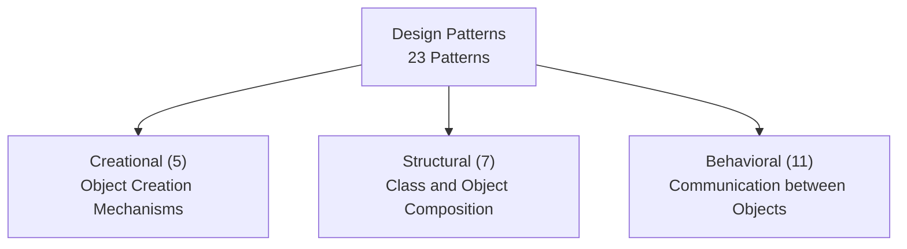

# Design Patterns

<details>
<summary>🇻🇳 <b>Hiển thị bản dịch Tiếng Việt</b></summary>
<br>

> **Tóm tắt**: Design Patterns là các giải pháp đã được chứng minh cho các vấn đề thiết kế phần mềm lặp đi lặp lại. Gồm 23 patterns chia thành 3 nhóm: Creational, Structural, Behavioral. Biết khi nào dùng pattern nào quan trọng hơn biết cách code pattern đó.

</details>

> **Summary**: Design Patterns are proven, repeatable solutions to commonly occurring software design problems. They consist of 23 patterns categorized into three groups: Creational, Structural, and Behavioral. Knowing when to apply a specific pattern is more critical than memorizing its implementation syntax.

---

## ELI5 (Explain Like I'm 5)

<details>
<summary>🇻🇳 <b>Hiển thị bản dịch Tiếng Việt</b></summary>
<br>

Hãy tưởng tượng bạn làm nghề thợ mộc. Khi khách hàng đặt làm một cái ghế, bạn sẽ làm gì?
Bạn không cần phải tự nghĩ ra cách đo đạc, cách nối gỗ từ đầu. Bạn đã có sẵn một **"Bản vẽ thiết kế ghế"** (Pattern). Bản vẽ này đã được hàng ngàn người thợ mộc đi trước đúc kết lại, nó giải quyết được các vấn đề như: ghế làm sao để không bị cập kênh, làm sao để chịu lực tốt.

**Design Pattern trong lập trình y hệt như vậy!**
Khi bạn gặp một vấn đề khó trong code (ví dụ: "Làm sao để đảm bảo chỉ có duy nhất một kết nối tới database?"), bạn không cần tự vắt óc suy nghĩ từ con số 0. Những lập trình viên đi trước đã gặp vấn đề này hàng triệu lần, và họ tạo ra một "bản vẽ" gọi là **Singleton Pattern** để giải quyết nó. 

Bạn chỉ cần mang "bản vẽ" đó ra và áp dụng vào code của bạn.

</details>

Imagine you are a professional carpenter. When a client commissions a chair, what do you do?
You do not need to invent new measurement techniques or discover new ways to join wood from scratch. You already possess a **"Chair Blueprint"** (Pattern). This blueprint has been refined by thousands of master carpenters before you, solving universal problems such as: how to prevent the chair from wobbling, and how to maximize its load-bearing capacity.

**Design Patterns in programming serve the exact same purpose.**
When you encounter a complex architectural problem (e.g., "How do I ensure there is only one, globally accessible connection to the database?"), you do not need to brainstorm a solution from zero. Veteran software engineers have encountered this exact problem millions of times, and they formulated a "blueprint" called the **Singleton Pattern** to resolve it.

You simply take that "blueprint" and apply it to your specific codebase.

---

## Layer 1: What is it? (What)

<details>
<summary>🇻🇳 <b>Hiển thị bản dịch Tiếng Việt</b></summary>
<br>

**Design Patterns** là các **template giải pháp** (không phải là đoạn code cụ thể để copy-paste) cho các vấn đề thiết kế thường gặp trong Lập trình Hướng đối tượng (OOP). Được hệ thống hoá bởi nhóm **Gang of Four (GoF)** trong cuốn sách kinh điển năm 1994.

### 3 Nhóm chính và Danh sách 23 Patterns

Design Patterns được chia làm 3 nhóm, tuỳ thuộc vào mục đích của chúng. Dưới đây là danh sách toàn bộ 23 patterns kèm giải thích siêu ngắn:

#### 🛠️ Nhóm 1: Creational Patterns (Nhóm Khởi tạo)
Giải quyết vấn đề: **Làm sao để tạo ra các Object một cách an toàn và linh hoạt?**
1. **Singleton**: Đảm bảo một class chỉ có DUY NHẤT 1 instance (thực thể). *(Ví dụ: Tổng thống của một quốc gia).*
2. **Factory Method**: Giao việc tạo Object cho class con quyết định. *(Ví dụ: Xưởng làm bánh giao việc làm bánh vị dâu cho phân xưởng A).*
3. **Abstract Factory**: Tạo ra một "gia đình" các object liên quan nhau. *(Ví dụ: Xưởng nội thất tạo ra cả bộ bàn + ghế phong cách Hiện đại hoặc Cổ điển).*
4. **Builder**: Tạo một object siêu phức tạp theo từng bước nhỏ. *(Ví dụ: Lắp ráp một cái bánh kẹp: thêm bánh, thêm thịt, thêm rau).*
5. **Prototype**: Copy/Clone một object có sẵn thay vì tạo mới từ đầu. *(Ví dụ: Động vật phân bào).*

#### 🏗️ Nhóm 2: Structural Patterns (Nhóm Cấu trúc)
Giải quyết vấn đề: **Làm sao để lắp ráp các class/object lại với nhau thành một cấu trúc lớn hơn?**
6. **Adapter**: Làm cầu nối cho 2 thứ không tương thích. *(Ví dụ: Cục sạc chuyển điện 220V thành 5V cho điện thoại).*
7. **Bridge**: Tách phần Abstraction (trừu tượng) và Implementation (cài đặt) ra để chúng phát triển độc lập. *(Ví dụ: Điều khiển TV và cái TV là 2 thứ tách biệt).*
8. **Composite**: Gộp các object thành cấu trúc cây. *(Ví dụ: Cấu trúc thư mục máy tính: Thư mục chứa thư mục con và file).*
9. **Decorator**: Khoác thêm "áo mới" (tính năng mới) cho object mà không làm thay đổi code cũ. *(Ví dụ: Trà sữa + thêm trân châu + thêm pudding).*
10. **Facade**: Cung cấp 1 nút bấm duy nhất để che giấu một đống hệ thống phức tạp bên trong. *(Ví dụ: Nút "Bật máy tính" sẽ tự kích hoạt nguồn, quạt, CPU).*
11. **Flyweight**: Dùng chung các phần giống nhau để tiết kiệm RAM. *(Ví dụ: Vẽ 1000 cái cây trong game, dùng chung 1 model 3D cái cây, chỉ đổi toạ độ).*
12. **Proxy**: Đứng làm trung gian, kiểm soát truy cập vào một object thật. *(Ví dụ: Thẻ tín dụng là proxy của tài khoản ngân hàng).*

#### 🎭 Nhóm 3: Behavioral Patterns (Nhóm Hành vi)
Giải quyết vấn đề: **Làm sao để các objects giao tiếp, nói chuyện và phân chia trách nhiệm với nhau?**
13. **Observer**: Đăng ký nhận thông báo. 1 người nói, vạn người nghe. *(Ví dụ: Subscribe kênh YouTube, có video mới là có thông báo).*
14. **Strategy**: Cho phép đổi thuật toán, chiến lược ngay lúc đang chạy. *(Ví dụ: Đi từ A đến B có thể chọn chiến lược: Đi xe máy, Đi bộ, Đi bus).*
15. **Command**: Biến một yêu cầu thành 1 object độc lập. *(Ví dụ: Nút gọi món trong nhà hàng).*
16. **State**: Đổi hành vi của object dựa vào trạng thái hiện tại của nó. *(Ví dụ: Máy bán nước: trạng thái "Chưa bỏ tiền" -> bấm nút không ra nước).*
17. **Template Method**: Định nghĩa bộ khung thuật toán, cho phép class con định nghĩa lại vài bước. *(Ví dụ: Công thức xây nhà: Xây móng -> Xây tường -> Lợp mái. Khách có thể đổi màu ngói lợp).*
18. **Iterator**: Cách để duyệt qua 1 mảng/danh sách mà không cần biết cấu trúc bên trong nó. *(Ví dụ: Nút "Next" trên máy nghe nhạc).*
19. **Chain of Responsibility**: Chuyền cục khoai lang nóng qua một chuỗi người xử lý. *(Ví dụ: Quy trình duyệt nghỉ phép: Trưởng nhóm -> Trưởng phòng -> Giám đốc).*
20. **Mediator**: Làm người trung gian hoà giải, tránh việc các object liên kết chéo ngoe với nhau. *(Ví dụ: Tháp điều khiển không lưu ở sân bay).*
21. **Memento**: Chụp ảnh lại trạng thái hiện tại để có thể "Undo" sau này. *(Ví dụ: Nút Ctrl + Z).*
22. **Visitor**: Thêm chức năng mới cho object mà không cần sửa code của nó. *(Ví dụ: Thanh tra y tế đến kiểm tra nhà hàng).*
23. **Interpreter**: Viết một ngôn ngữ hoặc cú pháp riêng và tạo người dịch cho nó. *(Ví dụ: Dịch nốt nhạc thành âm thanh).*

</details>

**Design Patterns** are **solution templates** (not specific blocks of code to be copied and pasted) for common design challenges in Object-Oriented Programming (OOP). They were systematically categorized by the **Gang of Four (GoF)** in their classic 1994 book.

### The 3 Categories and 23 Patterns

Design Patterns are divided into three groups based on their core intent. Below is the complete list of the 23 patterns with concise explanations:



#### Category 1: Creational Patterns
Objective: **How to create objects safely and flexibly?**
1. **Singleton**: Ensures a class has ONLY ONE instance and provides a global point of access to it. *(Example: The President of a country).*
2. **Factory Method**: Delegates object creation to subclasses. *(Example: A bakery delegates the creation of strawberry cakes to a specific production line).*
3. **Abstract Factory**: Produces families of related objects without specifying their concrete classes. *(Example: A furniture factory producing a cohesive set of Modern or Victorian chairs and tables).*
4. **Builder**: Constructs complex objects step by step. *(Example: Assembling a custom hamburger: add bun, add patty, add lettuce).*
5. **Prototype**: Creates new objects by cloning an existing instance rather than instantiating from scratch. *(Example: Cellular mitosis).*

#### Category 2: Structural Patterns
Objective: **How to assemble classes and objects into larger, robust structures?**
6. **Adapter**: Allows incompatible interfaces to collaborate. *(Example: A power adapter converting 220V wall current to 5V for a smartphone).*
7. **Bridge**: Decouples an abstraction from its implementation so the two can vary independently. *(Example: A remote control and the television are developed and function independently).*
8. **Composite**: Composes objects into tree structures to represent part-whole hierarchies. *(Example: A computer file system: folders containing subfolders and files).*
9. **Decorator**: Dynamically attaches new behaviors to an object without altering its underlying code. *(Example: A base milk tea + add boba + add pudding).*
10. **Facade**: Provides a simplified, unified interface to a complex subsystem. *(Example: A "Power On" button automatically initializes the power supply, CPU, and cooling fans).*
11. **Flyweight**: Minimizes memory usage by sharing as much data as possible with similar objects. *(Example: Rendering 10,000 trees in a video game using a single 3D model, only varying the coordinates).*
12. **Proxy**: Provides a surrogate or placeholder for another object to control access to it. *(Example: A credit card acting as a proxy for a bank account).*

#### Category 3: Behavioral Patterns
Objective: **How do objects communicate, interact, and distribute responsibilities?**
13. **Observer**: Defines a subscription mechanism to notify multiple objects about events. *(Example: Subscribing to a YouTube channel to receive notifications for new videos).*
14. **Strategy**: Encapsulates interchangeable algorithms inside a class and makes them swappable at runtime. *(Example: Choosing a navigation strategy: Driving, Walking, or Public Transit).*
15. **Command**: Turns a request into a stand-alone object containing all information about the request. *(Example: A waiter writing down an order ticket and passing it to the kitchen).*
16. **State**: Allows an object to alter its behavior when its internal state changes. *(Example: A vending machine: pressing the dispense button while in the "No Coin" state yields no product).*
17. **Template Method**: Defines the skeleton of an algorithm in the superclass, letting subclasses override specific steps. *(Example: A housing construction plan: Lay foundation -> Build walls -> Install roof. The client can customize the roof material).*
18. **Iterator**: Provides a way to traverse elements of a collection without exposing its underlying representation. *(Example: The "Next Song" button on a media player).*
19. **Chain of Responsibility**: Passes requests along a chain of handlers until one handles it. *(Example: Leave request approval: Team Lead -> Manager -> Director).*
20. **Mediator**: Reduces chaotic dependencies between objects by forcing them to collaborate via a mediator object. *(Example: An Air Traffic Control tower coordinating airplanes).*
21. **Memento**: Captures and restores an object's internal state without violating encapsulation. *(Example: The Undo (Ctrl+Z) functionality).*
22. **Visitor**: Separates algorithms from the objects on which they operate. *(Example: A health inspector evaluating various restaurants).*
23. **Interpreter**: Implements a specialized computer language to rapidly solve a specific set of problems. *(Example: Translating musical notation into audio output).*

---

## Layer 2: Why does it exist? (Why)

<details>
<summary>🇻🇳 <b>Hiển thị bản dịch Tiếng Việt</b></summary>
<br>

Nếu không có Design Patterns, code của bạn sẽ trở thành một mớ bòng bong (Spaghetti code) khi dự án lớn lên.

| Vấn đề khi không dùng Pattern | Áp dụng Pattern | Kết quả |
|---|---|---|
| Khởi tạo Class quá rườm rà (Constructor 10 tham số) | **Builder** | Code dễ đọc, linh hoạt, giống như xếp Lego. |
| Hàm chứa 100 cái `if-else` dài thò lò | **Strategy** / **State** | Code tách biệt, dễ bảo trì, thêm tính năng không sợ lỗi tính năng cũ. |
| Gọi code mới từ hệ thống cũ báo lỗi lệch Interface | **Adapter** | Không cần đập bỏ hệ thống cũ, chỉ cần cắm thêm "Cục chuyển đổi". |
| Phải viết tính năng kiểm tra quyền trước mọi hàm | **Proxy** / **Decorator** | Tách phần kiểm tra ra một chỗ riêng, áp dụng linh hoạt. |

</details>

Without Design Patterns, software systems rapidly degenerate into unmaintainable spaghetti code as business requirements scale.

| Problem Without Patterns | Applied Pattern | Result |
|---|---|---|
| Class initialization is overly complex (A constructor with 10+ parameters). | **Builder** | Code is readable and flexible, resembling Lego assembly. |
| Functions contain monolithic, hundred-line `if-else` blocks. | **Strategy** / **State** | Logic is decoupled; maintaining and extending features becomes safe and trivial. |
| Integrating a legacy system throws interface mismatch errors. | **Adapter** | The legacy system remains untouched; a simple "adapter layer" bridges the gap. |
| Security authorization checks are duplicated across every function. | **Proxy** / **Decorator** | Cross-cutting concerns are isolated and applied dynamically. |

---

## Layer 3: Without vs. With Comparison (Compare)

Below are detailed analyses of the most frequently encountered patterns in enterprise environments.

### 1. SINGLETON (Creational)

<details>
<summary>🇻🇳 <b>Hiển thị bản dịch Tiếng Việt</b></summary>
<br>

**Vấn đề:** Bạn muốn đảm bảo trong toàn bộ hệ thống chỉ có đúng 1 cái Database Connection.
**Giải pháp:** Ẩn hàm khởi tạo, cung cấp 1 hàm `getInstance()` trả về chính nó.

</details>

**Problem:** You must ensure that the entire application shares exactly one database connection to prevent resource exhaustion.
**Solution:** Hide the constructor and provide a static `getInstance()` method that returns the sole instance.

**Python:**
```python
class DatabaseConnection:
    _instance = None # Static variable to hold the single instance

    def __new__(cls):
        # Create a new instance only if one does not already exist
        if cls._instance is None:
            cls._instance = super(DatabaseConnection, cls).__new__(cls)
            cls._instance.connected = True
            print("Established new database connection.")
        return cls._instance

# Execution:
db1 = DatabaseConnection() # Outputs: Established new database connection.
db2 = DatabaseConnection() # No output, instance already exists.
print(db1 is db2) # True -> db1 and db2 are the exact same object in memory.
```

**Java:**
```java
public class DatabaseConnection {
    // 1. Store the single instance
    private static DatabaseConnection instance;

    // 2. Prevent instantiation via the 'new' keyword
    private DatabaseConnection() {}

    // 3. Provide a global point of access
    public static DatabaseConnection getInstance() {
        if (instance == null) {
            instance = new DatabaseConnection();
            System.out.println("Established new database connection.");
        }
        return instance;
    }
}
```

---

### 2. STRATEGY (Behavioral)

<details>
<summary>🇻🇳 <b>Hiển thị bản dịch Tiếng Việt</b></summary>
<br>

**Vấn đề:** Tính tiền cho khách. Nếu khách VIP giảm 20%, khách thường không giảm, dịp Lễ giảm 50%. Quá nhiều `if-else`!
**Giải pháp:** Tách mỗi cách tính tiền ra thành 1 class riêng (1 chiến lược riêng). Lúc cần dùng chiến lược nào thì cắm chiến lược đó vào.

</details>

**Problem:** An e-commerce checkout system requires complex pricing logic. VIPs receive a 20% discount, normal users pay full price, and holiday sales offer a 50% discount. Relying on `if-else` statements violates the Open/Closed Principle.
**Solution:** Encapsulate each pricing algorithm into a separate strategy class, plugging them into the shopping cart at runtime.

**Python:**
```python
from typing import Callable

# Pricing strategies defined as pure functions
def normal_pricing(price: float) -> float:
    return price

def vip_pricing(price: float) -> float:
    return price * 0.8 # 20% discount

def holiday_pricing(price: float) -> float:
    return price * 0.5 # 50% discount

class ShoppingCart:
    # Inject the strategy during initialization
    def __init__(self, strategy: Callable[[float], float]):
        self.strategy = strategy
    
    def checkout(self, amount: float):
        final_price = self.strategy(amount)
        print(f"Final Checkout Price: ${final_price}")

# Execution: Strategy swapping is seamless and isolated.
cart1 = ShoppingCart(vip_pricing)
cart1.checkout(100) # $80.0

cart2 = ShoppingCart(holiday_pricing)
cart2.checkout(100) # $50.0
```

**Java:**
```java
// Common interface for all pricing algorithms
public interface PricingStrategy {
    double calculate(double price);
}

public class VipPricing implements PricingStrategy {
    public double calculate(double price) { return price * 0.8; }
}

public class HolidayPricing implements PricingStrategy {
    public double calculate(double price) { return price * 0.5; }
}

public class ShoppingCart {
    private PricingStrategy strategy;

    // Inject strategy at runtime
    public void setStrategy(PricingStrategy strategy) {
        this.strategy = strategy;
    }

    public double checkout(double amount) {
        return strategy.calculate(amount);
    }
}
```

---

### 3. OBSERVER (Behavioral)

<details>
<summary>🇻🇳 <b>Hiển thị bản dịch Tiếng Việt</b></summary>
<br>

**Vấn đề:** Làm sao để khi một video mới ra mắt trên YouTube, tất cả những người bấm "Subscribe" đều nhận được thông báo? Không lẽ người dùng cứ 1 giây phải hỏi YouTube 1 lần xem có video mới chưa (Polling)?
**Giải pháp:** Đăng ký (Subscribe). Khi nào có kênh up video, kênh đó sẽ hét lên "CÓ VIDEO MỚI NÈ" và tự động gửi tới cho tất cả những ai đã đăng ký.

</details>

**Problem:** When a YouTube channel uploads a new video, all subscribers must be notified immediately. Clients constantly polling the server (asking "Is there a new video yet?") wastes immense bandwidth.
**Solution:** Implement a Pub/Sub mechanism. The channel maintains a list of subscribers and broadcasts a notification to them exclusively when a new video is published.

**Python:**
```python
class YouTubeChannel:
    def __init__(self):
        self.subscribers = [] # List of observers
        
    def subscribe(self, user):
        self.subscribers.append(user)
        
    def upload_video(self, title):
        print(f"\n[Channel] Video Uploaded: {title}")
        # Broadcast the event
        self.notify_all(title)
        
    def notify_all(self, title):
        for user in self.subscribers:
            user.receive_notification(title)

class User:
    def __init__(self, name):
        self.name = name
        
    def receive_notification(self, video_title):
        print(f" -> [{self.name}] Notification: Watch the new video - {video_title}")

# Execution
channel = YouTubeChannel()
alice = User("Alice")
bob = User("Bob")

channel.subscribe(alice)
channel.subscribe(bob)

channel.upload_video("Mastering Design Patterns")
# Output:
# [Channel] Video Uploaded: Mastering Design Patterns
# -> [Alice] Notification: Watch the new video - Mastering Design Patterns
# -> [Bob] Notification: Watch the new video - Mastering Design Patterns
```

---

## Layer 4: Common Use Cases

<details>
<summary>🇻🇳 <b>Hiển thị bản dịch Tiếng Việt</b></summary>
<br>

| Tình huống | Nên dùng Pattern | Ví dụ |
|---|---|---|
| Khởi tạo Object mà cần truyền quá nhiều tham số. | **Builder** | Xây dựng 1 query SQL phức tạp, hoặc setup 1 HTTP Request. |
| Bạn muốn viết thêm tính năng mà không muốn sửa code cũ. | **Decorator** | Tính năng Ghi log (Logging) hoặc Caching cho database. |
| Làm việc với một thư viện cũ rích, hàm của nó không khớp với chuẩn code của bạn. | **Adapter** | Code của bạn dùng XML, nhưng thư viện yêu cầu JSON. Bạn viết Adapter để chuyển XML sang JSON. |
| Bạn có nhiều cách để làm 1 việc (ví dụ nhiều thuật toán nén ZIP, RAR, TAR). | **Strategy** | Nút đổi phương pháp nén trên màn hình. |
| Một sự kiện xảy ra cần bắn tín hiệu cho rất nhiều nơi khác. | **Observer** | Nút "Thanh toán thành công" -> Gửi email báo cáo, Trừ kho, Cộng điểm thành viên. |

</details>

| Scenario | Recommended Pattern | Practical Example |
|---|---|---|
| Object instantiation requires assembling multiple, complex parameters. | **Builder** | Constructing a complex SQL query or configuring an HTTP Request. |
| Adding functionality to an object dynamically without altering its structure. | **Decorator** | Attaching logging, caching, or security checks to database operations. |
| Integrating a third-party library whose interface is incompatible with your system. | **Adapter** | Your system uses XML, but the payment gateway requires JSON. |
| An application needs to switch between different algorithms at runtime. | **Strategy** | A file archiver allowing users to switch between ZIP, RAR, or TAR compression. |
| A single state change requires cascading updates across multiple disparate systems. | **Observer** | A "Payment Successful" event triggering inventory deduction, email confirmation, and loyalty points accrual. |

---

## Layer 5: Deep Practice

### Critical Guidelines for Applying Patterns

<details>
<summary>🇻🇳 <b>Hiển thị bản dịch Tiếng Việt</b></summary>
<br>

1. **Hiểu VẤN ĐỀ trước khi dùng Pattern:** 
   Tuyệt đối KHÔNG học xong pattern rồi cố tình "nhét" nó vào code. Nếu code đang dùng lệnh `if-else` rất ngắn gọn và dễ hiểu, hãy cứ dùng `if-else`. Chỉ xài Strategy khi đống `if-else` đó dài hàng trăm dòng và thường xuyên phải sửa đổi.
   
2. **KISS (Keep It Simple, Stupid):**
   Design pattern làm code chuyên nghiệp hơn, nhưng cũng làm hệ thống **phức tạp hơn** (vì phải sinh ra nhiều class, nhiều interface). Đừng biến lợn lành thành lợn què.

3. **Pattern là bộ khung, không phải thư viện:**
   Pattern là khái niệm. Bạn không thể import kiểu `import Singleton` được. Bạn phải tự code nó theo logic của dự án.

4. **Biết cách gọi tên:**
   Đặt tên class có chứa tên Pattern giúp đồng nghiệp đọc là hiểu ngay. Ví dụ: `PaymentStrategy`, `OrderBuilder`, `DatabaseFactory`. Đừng đặt là `PaymentMethod` hay `MakeOrder`.

</details>

1. **Understand the PROBLEM before applying the Pattern:** 
   Never learn a pattern and forcefully wedge it into your code. If a simple `if-else` statement is clean and readable, retain it. Only introduce a Strategy pattern when that `if-else` block becomes unmanageable and violates the Open/Closed Principle.
   
2. **KISS (Keep It Simple, Stupid):**
   While patterns enforce professional architecture, they inherently increase system complexity by introducing new classes and interfaces. Avoid over-engineering simple solutions.

3. **Patterns are Blueprints, not Libraries:**
   A pattern is an architectural concept. You cannot simply `import Singleton`. You must implement the logic tailored to your specific domain constraints.

4. **Nomenclature Matters:**
   Appending the pattern name to the class clarifies its architectural role to other engineers. For example: `PaymentStrategy`, `OrderBuilder`, or `DatabaseFactory`.

### Common Pitfalls

<details>
<summary>🇻🇳 <b>Hiển thị bản dịch Tiếng Việt</b></summary>
<br>

1. **Singleton lạm dụng (Singleton Abuse):** Dùng Singleton thay cho Biến toàn cục (Global Variable) dẫn đến bug cực khó fix khi làm việc với Multi-threading.
2. **Factory lạm dụng:** Lớp nào cũng tạo Factory dù chỉ có đúng 1 con (Over-engineering).
3. **Cố chấp tự viết tay:** Các Framework hiện tại (Spring, Django, React) đều đã tích hợp sẵn cực nhiều Pattern. Đừng "phát minh lại bánh xe".

</details>

1. **Singleton Abuse:** Utilizing Singletons as a substitute for Global Variables leads to severe, difficult-to-trace bugs in multi-threaded environments.
2. **Factory Overuse:** Implementing Factories for classes that only ever have a single implementation (Over-engineering).
3. **Reinventing the Wheel:** Modern enterprise frameworks (Spring, Django, React) inherently implement dozens of patterns. Utilize the framework's native solutions.
   - Example: In Spring Boot, components annotated with `@Component` are **Singletons** by default. `@EventListener` is a native implementation of the **Observer** pattern.

---

## Layer 6: Code Templates & Integration

<details>
<summary>🇻🇳 <b>Hiển thị bản dịch Tiếng Việt</b></summary>
<br>

Nếu bạn dùng các Framework hiện đại, bạn đang dùng Pattern hàng ngày mà không nhận ra:

| Tên Framework/Thư viện | Pattern đang dùng | Giải thích |
|---|---|---|
| **Spring Boot (Java)** | **Singleton** | Các class đánh dấu `@Service`, `@Repository` mặc định là Singleton. |
| **Spring Boot (Java)** | **Observer** | Cơ chế ApplicationEvent và `@EventListener`. |
| **ReactJS (JS/TS)** | **Observer** | Cơ chế State và Component re-render. |
| **Django (Python)** | **Template Method** | Các Class-Based Views (CBV) định nghĩa khung sẵn, bạn chỉ việc override hàm `get()`, `post()`. |
| **Lombok (Java)** | **Builder** | Thẻ `@Builder` tự động sinh ra toàn bộ code Builder Pattern. |

</details>

If you utilize modern frameworks, you interact with Design Patterns daily:

| Framework / Library | Utilized Pattern | Implementation Detail |
|---|---|---|
| **Spring Boot (Java)** | **Singleton** | Classes annotated with `@Service` or `@Repository` are managed as singletons in the Application Context. |
| **Spring Boot (Java)** | **Observer** | ApplicationEvent publication and `@EventListener` annotations. |
| **ReactJS (JS/TS)** | **Observer** | State management and the component re-rendering lifecycle. |
| **Django (Python)** | **Template Method** | Class-Based Views (CBVs) define the core request processing skeleton, allowing developers to override specific methods like `get()` or `post()`. |
| **Lombok (Java)** | **Builder** | The `@Builder` annotation automatically generates robust Builder pattern boilerplate code. |

---

## Related Topics
- Next, explore how Design Patterns heavily rely on the **[SOLID Principles](./solid-principles.md)** to achieve optimal decoupling.
- Review foundational object-oriented concepts at **[OOP Principles](./oop-principles.md)**.
