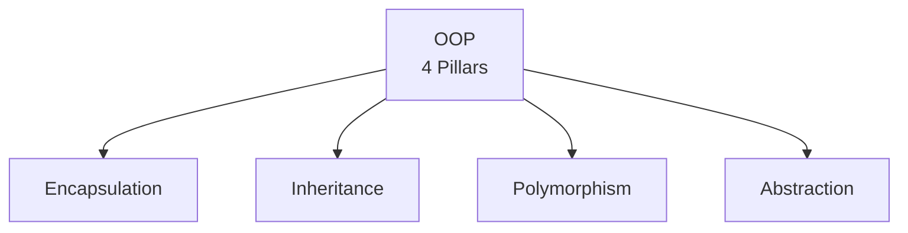

# Object-Oriented Programming (OOP) Principles

<details>
<summary>🇻🇳 <b>Hiển thị bản dịch Tiếng Việt</b></summary>
<br>

> **Tóm tắt**: OOP là một "phong cách" lập trình dựa trên 4 trụ cột: Đóng gói (Encapsulation), Kế thừa (Inheritance), Đa hình (Polymorphism), và Trừu tượng (Abstraction). Đây là nền tảng bắt buộc trước khi học bất cứ thứ gì khác.

</details>

> **Summary**: OOP is a programming paradigm founded on four main pillars: Encapsulation, Inheritance, Polymorphism, and Abstraction. Understanding these principles is a mandatory prerequisite for software engineering.

---

## ELI5 (Explain Like I'm 5)

<details>
<summary>🇻🇳 <b>Hiển thị bản dịch Tiếng Việt</b></summary>
<br>

Để hiểu OOP, trước tiên bạn cần phân biệt 2 khái niệm cốt lõi: **Class (Lớp)** và **Object (Đối tượng)**.
Hãy tưởng tượng bạn đang nướng bánh quy:
- **Class** chính là cái **khuôn đúc bánh**. Nó định nghĩa hình dáng con gấu, kích thước 5cm. Bản thân cái khuôn không ăn được.
- **Object** chính là **từng chiếc bánh** được đổ ra từ cái khuôn đó. Bạn có thể đổ ra cái bánh màu xanh, bánh màu đỏ, bánh vị chocolate. Những cái bánh này ăn được, và mỗi cái là một thực thể độc lập.

Lập trình hướng đối tượng (OOP) là cách chúng ta coi mọi thứ trong code là các chiếc bánh (Object), và chúng ta đi thiết kế các cái khuôn (Class) cho chúng.

**4 Trụ cột của OOP giải thích siêu dễ:**
1. **Đóng gói (Encapsulation)**: Giống như viên thuốc con nhộng. Bột thuốc đắng bên trong bị bọc lại, bạn không được tự ý moi móc bột ra uống. Chế tạo thuốc thế nào là việc của dược sĩ, bạn chỉ việc nuốt nguyên viên. Trong code: Giấu dữ liệu nhạy cảm đi, chỉ cho phép chỉnh sửa qua các cổng kiểm duyệt.
2. **Kế thừa (Inheritance)**: Giống như bạn được thừa hưởng đôi mắt từ bố và nụ cười từ mẹ. Trong code: Class con nhận lại toàn bộ tính năng của Class cha, không cần phải viết lại từ đầu.
3. **Đa hình (Polymorphism)**: Cùng là một hành động "Sủa", nhưng Chó ta sủa "Gâu gâu", Chó tây sủa "Woof woof". Trong code: Cùng một tên hàm, nhưng mỗi object sẽ thực hiện theo một cách riêng.
4. **Trừu tượng (Abstraction)**: Khi bạn lái xe máy, bạn chỉ cần biết vặn ga là xe chạy. Bạn không cần biết bên trong bugi đánh lửa ra sao, xăng bơm thế nào. Trong code: Che giấu toàn bộ sự phức tạp bên trong, chỉ chìa ra vài nút bấm đơn giản cho người dùng.

</details>

To comprehend OOP, you must first distinguish between two core concepts: **Class** and **Object**.
Imagine you are baking cookies:
- The **Class** is the **cookie cutter**. It defines the shape (e.g., a bear) and size (e.g., 5cm). The cutter itself is not edible.
- The **Object** is each **individual cookie** produced using the cutter. You can have a blue cookie, a red cookie, or a chocolate-flavored cookie. These cookies are edible, and each is an independent entity.

Object-Oriented Programming (OOP) is a methodology where we treat components in code as "cookies" (Objects), and we design the "cutters" (Classes) for them.

**The 4 Pillars of OOP Explained Simply:**
1. **Encapsulation**: Similar to a medicinal capsule. The bitter powder inside is concealed, and you are not supposed to extract the powder to consume it. How the medicine is formulated is the pharmacist's concern; you merely swallow the capsule whole. In code: Hide sensitive data and only permit modifications through strictly controlled access points.
2. **Inheritance**: Similar to inheriting your father's eyes and your mother's smile. In code: A child class inherits all the functionalities of a parent class, eliminating the need to rewrite code from scratch.
3. **Polymorphism**: The action is "Speak", but a dog says "Woof", and a cat says "Meow". In code: Utilizing the same function name, but allowing each object to execute it in its own specific manner.
4. **Abstraction**: When you drive a motorcycle, you only need to know how to use the throttle to accelerate. You do not need to understand how the spark plug ignites or how the fuel pump operates. In code: Conceal all internal complexity and expose only simple, necessary interfaces to the user.

---

## Layer 1: What is it? (What)

<details>
<summary>🇻🇳 <b>Hiển thị bản dịch Tiếng Việt</b></summary>
<br>

**Object-Oriented Programming (OOP)** là một paradigm (hệ tư tưởng) lập trình tổ chức code thành các **objects** — đơn vị kết hợp **dữ liệu (data)** và **hành động (behavior)** thành một khối thống nhất.

</details>

**Object-Oriented Programming (OOP)** is a programming paradigm that organizes code into **objects** — units that combine **data** and **behavior** into a cohesive structure.



---

## Layer 2: Why does it exist? (Why)

<details>
<summary>🇻🇳 <b>Hiển thị bản dịch Tiếng Việt</b></summary>
<br>

Trước khi có OOP, người ta code bằng **Procedural Programming (Lập trình hướng thủ tục)** - tức là viết từ trên xuống dưới, tạo các hàm rời rạc và dùng chung các biến toàn cục (global variables).

| Vấn đề của cách code cũ | OOP giải quyết như thế nào? |
|---|---|
| **Dữ liệu bị sửa bừa bãi**: Hàm A vô tình sửa biến của Hàm B, gây ra bug cực khó tìm. | **Đóng gói**: Mỗi Object tự giữ dữ liệu của riêng mình. Người khác muốn sửa phải xin phép. |
| **Code lặp lại**: Muốn tạo Quái vật Nước và Quái vật Lửa, phải copy/paste lại nguyên một đống code máu, mana... | **Kế thừa**: Viết một class Quái vật chung, Lửa và Nước chỉ cần kế thừa lại. |
| **Quá nhiều `if-else`**: Nếu là mèo thì kêu meo, nếu là chó thì kêu gâu, nếu là gà thì kêu cục tác. | **Đa hình**: Gọi hàm `keu()` chung, tự con vật sẽ biết cách kêu. |

</details>

Prior to OOP, developers primarily used **Procedural Programming** - writing code sequentially, creating disconnected functions, and heavily utilizing global variables.

| Procedural Programming Problems | OOP Solutions |
|---|---|
| **Uncontrolled Data Modification**: Function A accidentally modifies a variable used by Function B, causing elusive bugs. | **Encapsulation**: Each Object encapsulates its own data. External entities must request permission to modify it. |
| **Code Duplication**: Creating a Water Monster and a Fire Monster requires copying and pasting identical code for health, mana, etc. | **Inheritance**: Write a common Monster class; Fire and Water monsters simply inherit from it. |
| **Excessive `if-else` Logic**: If it is a cat, say "meow"; if it is a dog, say "woof"; if it is a chicken, say "cluck". | **Polymorphism**: Call a generic `speak()` function, and the animal object inherently knows how to execute it. |

---

## Layer 3: Without vs. With Comparison (Compare)

### 1. Inheritance - Code Reusability

### Without Implementation
```python
# The 'name' and 'age' attributes are repeated unnecessarily!
class Dog:
    def __init__(self, name, age):
        self.name = name
        self.age = age
    def eat(self): print(f"{self.name} is eating")
    def bark(self): print("Woof woof!")

class Cat:
    def __init__(self, name, age):
        self.name = name
        self.age = age
    def eat(self): print(f"{self.name} is eating") # Code duplication!
    def meow(self): print("Meow meow!")
```

### With Implementation

**Python:**
```python
class Animal: # Parent class
    def __init__(self, name, age):
        self.name = name
        self.age = age
    def eat(self):
        print(f"{self.name} is eating")

class Dog(Animal): # Dog inherits from Animal
    def bark(self):
        print("Woof woof!")

class Cat(Animal): # Cat inherits from Animal
    def meow(self):
        print("Meow meow!")

# Execution
dog1 = Dog("Rex", 3)
dog1.eat()  # "Rex is eating" (No need to rewrite the eat function in the Dog class)
dog1.bark() # "Woof woof!"
```

**Java:**
```java
class Animal {
    protected String name;
    public Animal(String name) { this.name = name; }
    public void eat() { System.out.println(name + " is eating"); }
}

class Dog extends Animal {
    public Dog(String name) { super(name); }
    public void bark() { System.out.println("Woof woof!"); }
}
```

---

### 2. Encapsulation - Data Protection

### Without Implementation
```python
class BankAccount:
    def __init__(self):
        self.balance = 0

acc = BankAccount()
acc.balance = -1000000 # Balance becomes negative with no validation!
```

### With Implementation

**Python:**
```python
class BankAccount:
    def __init__(self):
        self.__balance = 0 # Double underscore makes the attribute Private

    def deposit(self, amount):
        if amount > 0:
            self.__balance += amount
        else:
            print("Error: Deposit amount must be greater than 0")

    def withdraw(self, amount):
        if 0 < amount <= self.__balance:
            self.__balance -= amount
        else:
            print("Error: Insufficient balance or invalid amount")

    def get_balance(self): # Provide read-only access via a getter method
        return self.__balance

# Execution
acc = BankAccount()
acc.deposit(100)
# acc.__balance = 99999 -> This will throw an error because __balance is hidden!
```

**Java:**
```java
public class BankAccount {
    private double balance = 0; // Private modifier hides the variable

    public void deposit(double amount) {
        if (amount > 0) this.balance += amount;
    }

    public double getBalance() {
        return this.balance; // Provide a getter method for read access
    }
}
```

---

### 3. Polymorphism - One Interface, Multiple Implementations

### Without Implementation
```python
def process_payment(payment_type, amount):
    if payment_type == "CREDIT_CARD":
        print(f"Swiping card: {amount}")
    elif payment_type == "PAYPAL":
        print(f"Transferring via PayPal: {amount}")
    elif payment_type == "CASH":
        print(f"Paying with cash: {amount}")
    # Adding a new payment method requires modifying this core function!
```

### With Implementation

**Python:**
```python
class PaymentMethod:
    def process(self, amount): pass

class CreditCardPayment(PaymentMethod):
    def process(self, amount):
        print(f"Swiping card: ${amount}")

class PayPalPayment(PaymentMethod):
    def process(self, amount):
        print(f"Transferring via PayPal: ${amount}")

def checkout(payment: PaymentMethod, amount: float):
    # Regardless of the payment type, we simply invoke .process()
    payment.process(amount) 

# Execution
card = CreditCardPayment()
paypal = PayPalPayment()

checkout(card, 100)   # Automatically prints: Swiping card: $100
checkout(paypal, 50)  # Automatically prints: Transferring via PayPal: $50
```

**Java:**
```java
interface PaymentMethod {
    void process(double amount);
}

class CreditCard implements PaymentMethod {
    public void process(double amount) { System.out.println("Swiping card: " + amount); }
}

class PayPal implements PaymentMethod {
    public void process(double amount) { System.out.println("PayPal: " + amount); }
}

public void checkout(PaymentMethod method, double amount) {
    method.process(amount); // Polymorphism is demonstrated here!
}
```

---

### 4. Abstraction - Exposing Only What Is Necessary

### With Implementation
Interfaces or Abstract Classes mandate that child classes adhere to a specific framework, while completely concealing internal complexity from the end user.

**Java:**
```java
// Blueprint (Mandates that a send mechanism exists, regardless of network implementation)
abstract class EmailService {
    abstract void sendEmail(String to, String content);
}

class GmailService extends EmailService {
    @Override
    void sendEmail(String to, String content) {
        System.out.println("Connecting to Google SMTP...");
        System.out.println("Authenticating via TLS...");
        System.out.println("Sending email to " + to);
    }
}

// The user only needs to interact with this abstraction:
EmailService email = new GmailService();
email.sendEmail("manager", "Requesting sick leave"); // Simple to use; SMTP complexities are hidden!
```

---

## Layer 4: Common Use Cases

<details>
<summary>🇻🇳 <b>Hiển thị bản dịch Tiếng Việt</b></summary>
<br>

- **Phát triển Game**: Mọi thứ đều là Object. Người chơi (Player), Quái vật (Monster), Vũ khí (Weapon).
- **Lập trình UI/UX (Giao diện)**: Các nút bấm (Button), Khung chữ (TextField) đều kế thừa từ một class giao diện chung (View/Component).
- **Hệ thống lớn (Enterprise)**: Quản lý ngân hàng, trường học, bệnh viện... Nơi mỗi thực thể trong đời thực được ánh xạ thành một Object trong code.

</details>

- **Game Development**: Everything is modeled as an Object. Players, Monsters, and Weapons are all distinct objects with encapsulated state and behavior.
- **UI/UX Programming**: Interface elements like Buttons and TextFields inherit common properties from a base View or Component class.
- **Enterprise Systems**: Managing banks, schools, and hospitals, where every real-world entity is accurately mapped to an Object in the codebase.

---

## Layer 5: Deep Practice

### Best Practices

<details>
<summary>🇻🇳 <b>Hiển thị bản dịch Tiếng Việt</b></summary>
<br>

1. **Prefer Composition over Inheritance**: Đừng lạm dụng Kế thừa. Nếu Mèo và Chó đều biết "Thở", thay vì cho kế thừa từ `Animal`, hãy tạo một `class BreathingEngine` và gắn nó vào Mèo, Chó.
2. **Tell, Don't Ask**: Đừng lấy dữ liệu từ Object ra để tính toán, hãy bảo Object tự tính.
   - ❌ Sai: `if (player.health < 10) player.health = 10`
   - ✅ Đúng: `player.heal_up_to(10)`

</details>

1. **Prefer Composition over Inheritance**: Avoid overusing Inheritance. If both a Cat and a Dog "Breathe", instead of having them inherit from an `Animal` superclass solely for that trait, create a `BreathingEngine` class and compose the Cat and Dog objects with it.
2. **Tell, Don't Ask**: Do not retrieve data from an Object to perform calculations externally; instruct the Object to perform the calculation itself.
   - Incorrect: `if (player.health < 10) player.health = 10`
   - Correct: `player.heal_up_to(10)`

### Common Pitfalls

<details>
<summary>🇻🇳 <b>Hiển thị bản dịch Tiếng Việt</b></summary>
<br>

1. **Anemic Domain Model**: Tạo ra Class có đủ Getter/Setter nhưng KHÔNG CÓ một tí logic nào bên trong (như một cái túi rỗng đựng data). Đây là code Procedural đội lốt OOP.
2. **God Object**: Tạo ra một Class to chà bá (như `SystemManager`) chứa hàng nghìn hàm quản lý mọi thứ trên đời.

</details>

1. **Anemic Domain Model**: Creating a Class with only Getters and Setters and absolutely no internal business logic. This is essentially Procedural programming masquerading as OOP.
2. **God Object**: Creating a massive, monolithic Class (e.g., `SystemManager`) that contains thousands of functions and attempts to manage everything within the application.

---

## Related Topics

- Proceed to **[SOLID Principles](./solid-principles.md)** to learn how to design Classes that are robust and maintainable.
- Explore **[Design Patterns](./design-patterns.md)** to discover standardized solutions to complex OOP architectural challenges.
