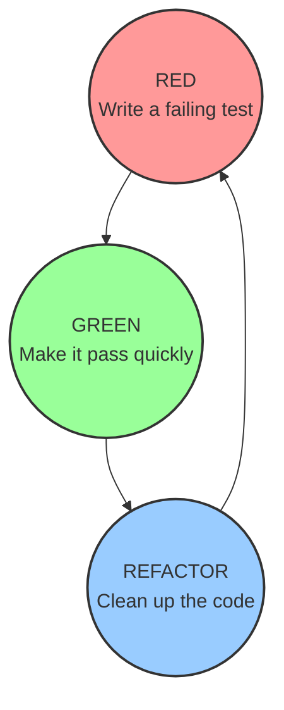

# TDD & BDD (Test-Driven & Behavior-Driven Development)

<details>
<summary>🇻🇳 <b>Hiển thị bản dịch Tiếng Việt</b></summary>
<br>

> **Tóm tắt**: TDD (Test-Driven Development) là một triết lý code ngược đời: Viết Test trước khi viết Code. Nó ép lập trình viên phải suy nghĩ cực kỳ thấu đáo về Input/Output của hàm trước khi bắt tay vào gõ logic. BDD (Behavior-Driven Development) là bản nâng cấp của TDD, sử dụng ngôn ngữ con người (Given-When-Then) để cả team BA (Nghiệp vụ), Tester và Developer đều hiểu được kịch bản test.

</details>

> **Summary**: TDD (Test-Driven Development) is a counter-intuitive software engineering methodology where automated tests are written *before* the actual production code. It forces engineers to meticulously architect interfaces and define Input/Output contracts before implementation. BDD (Behavior-Driven Development) evolves TDD by utilizing human-readable Domain-Specific Languages (Given/When/Then) so that non-technical stakeholders (Business Analysts, PMs) can collaborate on test scenarios.

---

## ELI5 (Explain Like I'm 5)

<details>
<summary>🇻🇳 <b>Hiển thị bản dịch Tiếng Việt</b></summary>
<br>

Hãy tưởng tượng bạn đang lắp một đường ống nước.
- **Code bình thường**: Bạn hì hục hàn ống, vặn ốc, nối dây mất 3 ngày. Xong xuôi, bạn xả nước vào thử (Viết Test). Ống vỡ, nước lênh láng. Bạn phải tháo ra làm lại từ đầu.
- **TDD (Làm ngược lại)**: Bạn đặt một cái xô ở đầu ra và tuyên bố: "Nước phải chảy vào xô này" (Viết Test). Dĩ nhiên lúc này chả có giọt nước nào vì chưa có ống (Test báo Đỏ - Fails). Sau đó, bạn bắt đầu lắp từng đoạn ống nhỏ sao cho vừa khít với cái xô (Viết Code). Ngay khi nước chảy vào xô (Test báo Xanh - Passes), bạn dừng lại.

</details>

Imagine you are hired to construct a complex plumbing system.
- **Traditional Development**: You spend 3 days welding pipes, gluing joints, and attaching valves. When finished, you finally turn on the water main (Writing the Test). The pipes immediately burst. You must tear down the entire system to find the leak.
- **TDD (Test-Driven Development)**: You place an empty bucket at the target destination and declare: "Water must land exactly here" (Writing the Test). Currently, no water flows because no pipes exist (The Test Fails - Red). You then construct the absolute minimum amount of piping required to reach the bucket (Writing the Code). The moment water hits the bucket (The Test Passes - Green), you stop building.

---

## Layer 1: What is it? (What)

<details>
<summary>🇻🇳 <b>Hiển thị bản dịch Tiếng Việt</b></summary>
<br>

**1. TDD (Test-Driven Development)**: Vòng lặp Đỏ-Xanh-Tái cấu trúc (Red-Green-Refactor).
- **RED**: Viết một Unit Test cho tính năng chưa tồn tại. Chạy test, chắc chắn sẽ báo lỗi (Màu Đỏ).
- **GREEN**: Viết đoạn code "ngu ngốc" nhất, nhanh nhất có thể chỉ để cái Test kia Pass (Màu Xanh).
- **REFACTOR**: Cấu trúc lại đoạn code vừa viết cho gọn gàng, tối ưu hơn, mà vẫn đảm bảo Test báo Xanh.

**2. BDD (Behavior-Driven Development)**: Thay vì viết test bằng code khó hiểu (`assert(x == 5)`), ta viết test bằng tiếng Anh thông qua cấu trúc **Given - When - Then**. Các file này (gọi là file Feature) được cả Team Business và Dev dùng chung.

</details>

**1. TDD (Test-Driven Development)**: An iterative workflow governed by the strict **Red-Green-Refactor** micro-cycle.
- **RED**: Write a failing Unit Test for a feature that has not been implemented yet.
- **GREEN**: Write the absolute minimal, ugliest production code necessary solely to make that specific test pass.
- **REFACTOR**: Clean up, optimize, and apply design patterns to the code, confident that the passing test acts as a safety net against regressions.

**2. BDD (Behavior-Driven Development)**: An agile methodology extending TDD. Instead of writing tests asserting obscure internal variables (`assertEquals(5, list.size())`), tests are written emphasizing user behavior using a ubiquitous Domain-Specific Language (DSL) structured as **Given / When / Then**.



---

## Layer 2: Why does it exist? (Why)

<details>
<summary>🇻🇳 <b>Hiển thị bản dịch Tiếng Việt</b></summary>
<br>

**Vấn đề của việc Code trước, Test sau**:
Dev thường lười viết test. Cứ hứa "Làm xong tính năng rồi em viết test sau bù vào". Kết quả: Tính năng ra mắt, dính một đống bug, thời gian đâu mà viết test nữa? Hơn nữa, khi code đã viết xong, nó thường dính chặt chẽ với nhau (Coupling), khiến việc chèn Unit Test vào sau là vô cùng đau khổ.

**TDD giải quyết**:
TDD ép bạn phải tư duy thiết kế trước. Nếu một hàm quá khó để viết test trước, nghĩa là thiết kế của bạn đang có vấn đề (Coupling quá cao). TDD sinh ra những đoạn code "Dễ test từ trong trứng nước".

</details>

**The Tragedy of "Code First, Test Later"**:
Developers are inherently pressured by deadlines. The industry standard excuse is: "I'll implement the feature first, and write the tests later." The reality: Deadlines hit, code ships without tests, bugs emerge, and the technical debt becomes insurmountable. Furthermore, code written without tests in mind is often highly coupled; attempting to retrofit Unit Tests onto monolithic legacy code is agonizing.

**The TDD Solution**:
TDD is not just a testing strategy; it is a **Software Design Strategy**. By forcing the engineer to write the test first, TDD guarantees 100% test coverage. More importantly, if a function is difficult to write a test for, it immediately exposes a design flaw (Tight Coupling / Lack of Dependency Injection). TDD enforces decoupled, highly cohesive architectural designs organically.

---

## Layer 3: Without vs. With Comparison (Compare)

<details>
<summary>🇻🇳 <b>Hiển thị bản dịch Tiếng Việt</b></summary>
<br>
Dưới đây là sự khác biệt giữa Test thông thường (TDD) và BDD (Cucumber).
</details>

Comparing a standard TDD approach (using JUnit/Jest) versus a BDD approach (using Cucumber/Gherkin).

### Standard Unit Test (TDD Developer Focus)
Highly technical. A Business Analyst (BA) cannot read or verify this.
**JavaScript (Jest):**
```javascript
test('should apply 10% discount for VIP users', () => {
    const user = new User({ role: 'VIP' });
    const cart = new Cart({ items: [{price: 100}] });
    const checkout = new CheckoutService();
    
    const total = checkout.calculate(user, cart);
    expect(total).toBe(90); // Technical assertion
});
```

### BDD Feature File (Stakeholder Focus)
Written in a `.feature` file using Gherkin syntax. BAs, Product Managers, and QA write this. Developers then map this plain English text to execution code.
**Gherkin:**
```gherkin
Feature: VIP Discount Checkout
  Scenario: Applying standard VIP discount
    Given a user has the "VIP" role
    And their shopping cart contains an item worth $100
    When the user proceeds to checkout
    Then the final calculated total should be $90
```

---

## Layer 4: Common Use Cases

<details>
<summary>🇻🇳 <b>Hiển thị bản dịch Tiếng Việt</b></summary>
<br>

- **Bắt buộc dùng TDD**: Các hệ thống liên quan đến Tiền bạc, Ngân hàng, Giao dịch (Payments), Tính toán thuế, Thuật toán mã hóa. Bạn không thể "code bừa rồi sửa" với tiền của khách hàng.
- **Không nên dùng TDD**: Các dự án Startup làm MVP (Minimum Viable Product) cần tốc độ ra mắt cực nhanh để gọi vốn. Hoặc code phần Giao diện (UI/UX) Frontend thường thay đổi mỗi ngày theo ý khách hàng.
- **Dùng BDD**: Các dự án Outsource lớn, nơi có rào cản ngôn ngữ và kỹ thuật giữa Đội kỹ sư và Khách hàng nghiệp vụ. BDD làm cầu nối để hai bên ký kết kịch bản.

</details>

- **Mandatory TDD Scenarios**: Core business logic domains. Payment gateways, financial tax calculators, cryptographical algorithms, and medical software. You cannot "move fast and break things" when handling banking ledgers. TDD guarantees mathematically precise behavior before deployment.
- **Anti-Pattern (When to avoid TDD)**: Early-stage Startup MVPs (Minimum Viable Products) where the goal is extreme velocity to find Product-Market Fit. Prototyping UI/UX components in Frontend frameworks; if the CSS and layout change daily based on A/B testing, maintaining rigid UI tests via TDD is a catastrophic waste of engineering hours.
- **BDD Sweet Spot**: Large Enterprise outsourcing projects. When there is a massive communication gap between the non-technical Client/Domain Experts and the Software Engineers, BDD `Given/When/Then` files act as a living, executable contract signed by both parties.

---

## Layer 5: Deep Practice

### Best Practices

<details>
<summary>🇻🇳 <b>Hiển thị bản dịch Tiếng Việt</b></summary>
<br>

1. **Test Behavior, Not Implementation**: Đừng viết test ép code bên trong hàm phải chạy thế nào. Chỉ cần quan tâm Input A thì Output phải ra B. Nếu bạn refactor code bên trong mà Test bị tịt, tức là bạn đang test sai cách.
2. **Luôn thấy màu Đỏ trước**: Rất nhiều dev lười, viết code trước, rồi mới viết test, chạy lên Xanh luôn. Cực kỳ nguy hiểm! Bạn không chứng minh được cái Test đó thực sự bắt được lỗi nếu code sai. Phải viết Test, thấy nó fail (Đỏ), rồi mới sửa code.

</details>

1. **Test Behavior, Not Implementation Details**: A TDD test should never fail just because a developer refactored an internal loop into a map/reduce stream. Do not heavily mock internal private methods. Treat the class under test as a Black Box: Supply an Input, assert the Output.
2. **Never Skip the RED Phase**: Developers faking TDD will write the production code first, then write a test that immediately passes (Green). This is fatal. A test that has never failed has not proven that it can actually catch a bug. You must witness the test turn RED to validate its structural integrity.

### Common Pitfalls

<details>
<summary>🇻🇳 <b>Hiển thị bản dịch Tiếng Việt</b></summary>
<br>

1. **TDD Cuồng tín (TDD Dogmatism)**: Ép buộc team phải dùng TDD cho MỌI dòng code (kể cả hàm `get/set` đơn giản). Làm tiến độ dự án chậm lại 300%. TDD là công cụ, không phải tôn giáo. Chỉ áp dụng cho Core Business Logic.
2. **Chi phí bảo trì BDD khổng lồ**: Đội BA viết ra hàng nghìn file BDD Gherkin, nhưng dev không có sức để map code (Step Definitions) cho ngần đó câu tiếng Anh. Cuối cùng, file BDD bị bỏ hoang, không ai thèm cập nhật, gây sai lệch với code thực tế.

</details>

1. **TDD Dogmatism**: Enforcing a militant rule that 100% of all commits must follow strict Red-Green-Refactor, even for simple configuration files, DTOs, or GUI boilerplate. This dogma cripples development velocity by 300% and leads to developer burnout. Apply TDD pragmatically to critical Domain Logic.
2. **The BDD Maintenance Nightmare**: Non-technical Product Owners aggressively write thousands of Gherkin `.feature` scenarios. Developers fall behind and cannot write the underlying Regular Expressions (Step Definitions) to automate them. The Feature files rot, becoming completely desynchronized from the actual production code, turning into useless text files.

---

## Related Topics

- Understand where TDD tests sit physically in the **[Testing Pyramid](./testing-pyramid.md)**.
- To execute TDD smoothly, you must isolate components using **[Mocking & Stubbing](./mocking-stubbing.md)**.
