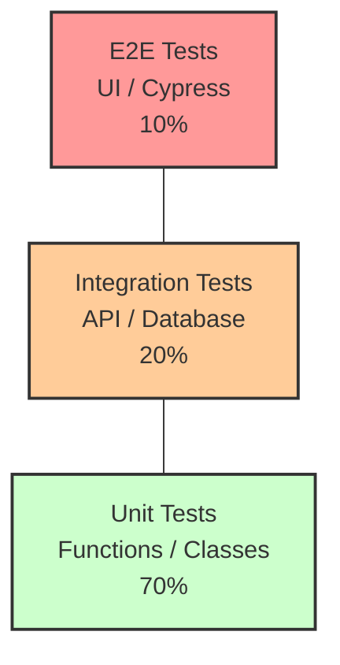

# The Testing Pyramid: Unit, Integration, and E2E Tests

🇻🇳 <b>Hiển thị bản dịch Tiếng Việt</b>

 

> **Tóm tắt**: Testing Pyramid (Kim tự tháp kiểm thử) là một chiến lược cốt lõi để xây dựng phần mềm không có lỗi (bug-free). Nó khuyên bạn nên viết thật nhiều Unit Test (Kiểm thử mức hàm - siêu nhanh, siêu rẻ), một lượng vừa phải Integration Test (Kiểm thử tích hợp các module), và rất ít E2E Test (Kiểm thử toàn bộ hệ thống như người dùng thật - siêu chậm, siêu đắt).

> **Summary**: The Testing Pyramid is a foundational quality assurance strategy that dictates the proportion of different test types in a healthy software project. It advocates for a massive base of extremely fast, isolated **Unit Tests**, a moderate layer of **Integration Tests**, and a tiny peak of slow, brittle **End-to-End (E2E) Tests**. 

---

## ELI5 (Explain Like I'm 5)

🇻🇳 <b>Hiển thị bản dịch Tiếng Việt</b>

 

Hãy tưởng tượng bạn đang lắp ráp một chiếc Ô tô.
1. **Unit Test (Kiểm tra từng con ốc)**: Bạn lấy từng chiếc bu-lông, từng cái bánh răng ra đo xem có đúng kích thước không trước khi lắp. Thử rất nhanh, hỏng cái nào vứt cái đó.
2. **Integration Test (Kiểm tra tích hợp)**: Bạn lắp động cơ vào trục bánh xe xem chúng có quay trơn tru cùng nhau không. Tốn thời gian hơn một chút.
3. **E2E Test (Lái thử xe)**: Lắp xong cả cái ô tô, bạn nổ máy và lái thử ra đường cao tốc. Đánh giá được trải nghiệm thực tế, nhưng rất tốn xăng, tốn thời gian, và nếu xe chết máy giữa đường, bạn không biết ngay lỗi nằm ở con ốc nào!

Imagine you are manufacturing a Car.
1. **Unit Test (Testing individual bolts)**: You measure every single gear and bolt independently before assembling anything. It's incredibly fast to test one bolt. If it fails, you know exactly which bolt is defective.
2. **Integration Test (Testing the engine + transmission)**: You connect the engine to the transmission to verify if they rotate together smoothly. It takes more time to set up.
3. **E2E Test (Test driving the finished car)**: You assemble the entire car, turn the key, and drive it on the highway. This guarantees the car actually works for a human, but it's very expensive, time-consuming, and if the car breaks down, you have absolutely no idea which specific bolt caused the failure!

---

## Layer 1: What is it? (What)

🇻🇳 <b>Hiển thị bản dịch Tiếng Việt</b>

 

Testing Pyramid (do Mike Cohn đề xuất) là một mô hình phân bổ nguồn lực kiểm thử phần mềm.
- **Unit Tests (Đáy tháp)**: Chiếm 70% tổng số lượng test. Cô lập một Class hoặc một Function duy nhất. Mọi phụ thuộc bên ngoài (Database, Network) đều bị làm giả (Mocked). Tốc độ chạy tính bằng mili-giây.
- **Integration Tests (Thân tháp)**: Chiếm 20%. Kiểm tra sự giao tiếp giữa 2 hoặc nhiều thành phần. (Ví dụ: Service có thực sự lưu được dữ liệu xuống Database thật hay không). Chạy chậm hơn (vài giây).
- **End-to-End Tests (E2E - Đỉnh tháp)**: Chiếm 10%. Mở hẳn một trình duyệt (Browser) thật bằng Selenium/Cypress, tự động click chuột như một người dùng thực tế. Cực kỳ chậm (vài phút) và rất dễ "gãy" (Brittle) do UI thay đổi.

The **Testing Pyramid** (popularized by Mike Cohn) is a portfolio strategy for automated software testing.
- **Unit Tests (The Base)**: Should constitute ~70% of your test suite. They verify a single Class or Function in absolute isolation. All external dependencies (Databases, Network APIs) are simulated (Mocked). Execution time is measured in milliseconds.
- **Integration Tests (The Middle)**: Should constitute ~20%. They verify the communication pathways between 2 or more isolated units (e.g., verifying if the `UserService` can successfully execute a SQL query against a real PostgreSQL instance). Execution time is slower (seconds).
- **End-to-End Tests (The Peak)**: Should constitute ~10%. They verify the system from the user's perspective, exactly as deployed. This involves launching a real headless browser (via Cypress/Playwright), clicking DOM elements, and validating rendering. They are excruciatingly slow (minutes) and notoriously brittle.

---

## Layer 2: Why does it exist? (Why)

🇻🇳 <b>Hiển thị bản dịch Tiếng Việt</b>

 

Trước đây, QA Team chủ yếu test bằng tay (Manual Testing) hoặc viết kịch bản E2E Test cho mọi tính năng (Ice-cream Cone Anti-pattern - Cây kem úp ngược). Hậu quả là:
- Mỗi lần dev push code, phải đợi 4 tiếng để hệ thống E2E chạy xong. (Phá vỡ quy trình CI/CD).
- Khi E2E báo lỗi `Đăng nhập thất bại`, dev không biết là do lỗi giao diện nút bấm, lỗi mạng, lỗi Database, hay lỗi thuật toán băm mật khẩu.

Kim tự tháp ra đời để dời việc phát hiện lỗi xuống càng thấp càng tốt (**Shift-Left Testing**). Lỗi ở đâu phát hiện ngay ở đó, và phát hiện trong chưa tới 1 giây!

Historically, software testing relied heavily on Manual QA or monolithic automated UI scripts for every single feature. This resulted in the **Ice-Cream Cone Anti-pattern** (top-heavy testing). The catastrophic consequences were:
- **CI/CD Paralysis**: Running a suite of 2,000 E2E tests took 4 hours. Developers could not merge code dynamically.
- **Lack of Determinism**: When an E2E test flagged `Login Failed`, the developer had no idea if the failure was caused by a CSS class name changing, a network timeout, a Database connection pool exhaustion, or a bug in the password hashing algorithm.

The Pyramid exists to enforce **Shift-Left Testing**. Bugs must be caught as deeply and as early in the execution stack as physically possible, with pinpoint accuracy, executing in under 1 second.

---

## Layer 3: Without vs. With Comparison (Compare)

### Anti-pattern (The Ice-Cream Cone) vs. The Pyramid

| Metric | The Ice-Cream Cone (Heavy E2E) | The Testing Pyramid (Heavy Unit) |
|---|---|---|
| **Execution Time (1000 tests)** | 2 Hours | 5 Seconds |
| **Feedback Loop** | Very Slow (Developers lose context) | Instantaneous (TDD friendly) |
| **Bug Localization** | Horrible (Requires massive debugging) | Pinpoint (Line number of failure is known) |
| **Maintenance Cost** | Extremely High (Tests break when UI changes) | Low (Tests only break when business logic fails) |

---

## Layer 4: Common Use Cases

🇻🇳 <b>Hiển thị bản dịch Tiếng Việt</b>

 

- **Unit Test**: Test các hàm tính toán thuật toán, test Logic giảm giá của giỏ hàng, test hàm Format ngày tháng.
- **Integration Test**: Test câu lệnh SQL xem có lôi đúng dữ liệu lên không (dùng Testcontainers để dựng DB ảo), test hàm gọi API sang một hệ thống thanh toán bên thứ 3.
- **E2E Test**: Test trọn vẹn Luồng Đăng nhập (Mở trang web $\rightarrow$ Điền User/Pass $\rightarrow$ Click $\rightarrow$ Nhảy sang trang Dashboard).

- **Unit Test Domain**: Validating complex algorithms, tax calculation logic in a shopping cart, string manipulation, and state reducers in React/Redux.
- **Integration Test Domain**: Verifying Repository patterns (executing raw SQL queries against a spun-up Docker `Testcontainer`), testing REST API endpoint routing, and validating HTTP clients fetching data from external microservices.
- **E2E Test Domain**: Verifying critical user journeys (Golden Paths). Example: Booting the React Frontend + Node Backend + Database $\rightarrow$ Using Playwright to physically type a username/password into the `<input>` DOM elements $\rightarrow$ Clicking Login $\rightarrow$ Validating the UI redirects to the `/dashboard`.

---

## Layer 5: Deep Practice

### Best Practices

🇻🇳 <b>Hiển thị bản dịch Tiếng Việt</b>

 

1. **FIRST Principle cho Unit Test**: 
   - **F**ast: Chạy cực nhanh.
   - **I**ndependent: Test A không được phụ thuộc vào Test B.
   - **R**epeatable: Chạy 100 lần kết quả phải y như nhau (Không phụ thuộc mạng/giờ hệ thống).
   - **S**elf-validating: Trả về Pass/Fail rõ ràng (Không in log ra bắt người nhìn).
   - **T**imely: Viết test cùng lúc với lúc viết code.
2. **Dùng Testcontainers cho Integration Test**: Đừng dùng In-memory DB (như H2) để test logic của PostgreSQL. Cú pháp SQL khác nhau sẽ làm test Pass ở máy nhưng Fail ở server thật. Hãy dùng thư viện Testcontainers để dựng một Docker DB thật lên lúc chạy test.

1. **Strictly adhere to FIRST Principles for Unit Tests**:
   - **Fast**: Execution must be in milliseconds.
   - **Independent**: Test A must never depend on the state mutated by Test B.
   - **Repeatable**: Flaky tests are toxic. Tests must yield the exact same result offline, on any OS, regardless of the current system timestamp.
   - **Self-validating**: The assertion must explicitly pass or fail. Do not rely on `console.log` for human verification.
   - **Timely**: Written concurrently with production code (or before it, via TDD).
2. **Utilize `Testcontainers` for Integration Tests**: Never use an In-Memory Database (like H2 or SQLite) to test queries destined for PostgreSQL in production. SQL dialects differ; tests will pass locally but crash in production. Use `Testcontainers` to dynamically spin up an actual PostgreSQL Docker image during the test phase.

### Common Pitfalls

🇻🇳 <b>Hiển thị bản dịch Tiếng Việt</b>

 

1. **Đuổi theo Code Coverage (Độ phủ code) một cách mù quáng**: Ép dev phải đạt 100% Coverage. Dev sẽ viết ra những cái Unit Test vô tri (như test hàm `get/set` cơ bản) chỉ để cho đủ số lượng, không mang lại giá trị bắt bug.
2. **Test Implementation thay vì Behavior**: Code Unit test đi kiểm tra nội bộ hàm A đang gọi hàm B mấy lần. Khi dev refactor code (viết lại cho đẹp nhưng kết quả không đổi), test bị gãy. Chỉ nên test: "Với Input này, Output phải là thế này".

1. **The 100% Code Coverage Fallacy**: Mandating 100% test coverage as a corporate metric. Developers will gamify the system by writing useless, assertion-less tests targeting simple Getters/Setters just to pacify the CI pipeline, providing zero actual software reliability. Aim for 70-80% coverage on critical business logic paths.
2. **Testing Implementation Details**: Writing a Unit Test that aggressively mocks internal functions and asserts that `InternalService.doX()` was called exactly twice. When a developer refactors the code to be more efficient (changing the internal structure but keeping the output identical), the test shatters. **Test Behavior, not Implementation**. Assert the final Output based on the Input.

---

## Related Topics
- Understand how to write tests before code in **[TDD & BDD](./tdd-bdd.md)**.
- Learn how to isolate units perfectly in **[Mocking & Stubbing](./mocking-stubbing.md)**.
- See how automated tests fit into the deployment pipeline in **[CI/CD Concepts](../sdlc/ci-cd-concepts.md)**.
