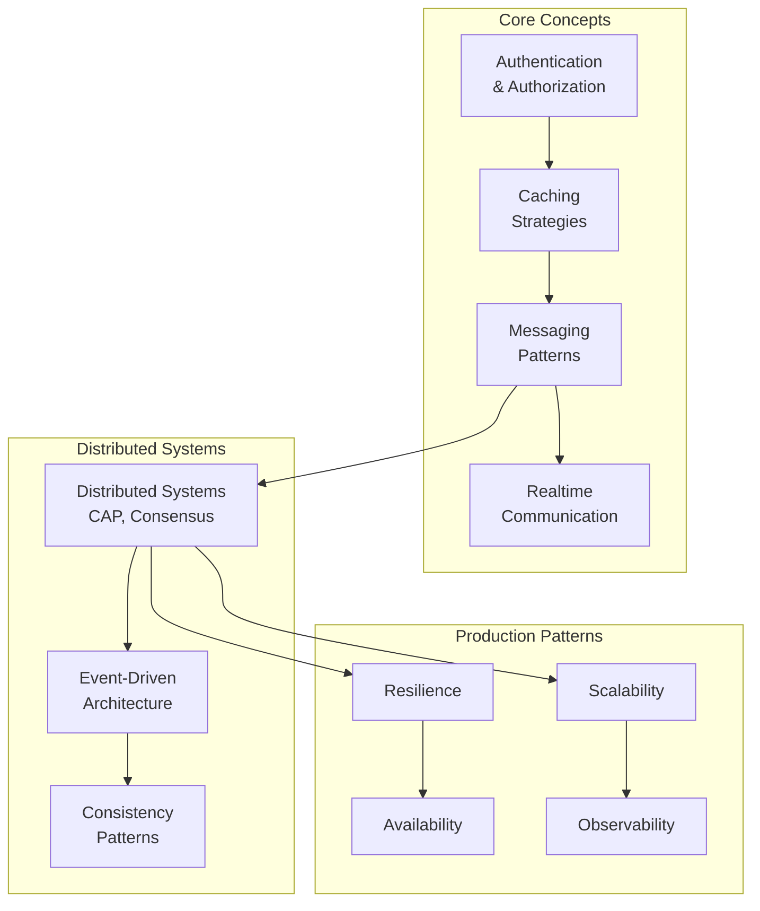

# 02 — Concepts (Architecture Patterns & Concepts)

> Architectural patterns and concepts that are universally applicable across multiple systems, independent of any specific technology.

---

## Roadmap

---

## Prerequisites

- [01 — Fundamentals](../01-fundamentals/) — OOP, SOLID, Networking, Database basics.

---

## Content Directory

| Subsection | Files | Description |
|---|---|---|
| [Authentication](./authentication/) | overview, JWT, OAuth2/OIDC | Verification: Sessions, Tokens, SSO, OAuth2 |
| [Authorization](./authorization/) | overview, implementation patterns | Access Control: RBAC, ABAC, ACL |
| [Caching](./caching/) | overview, strategies, invalidation, distributed | Caching patterns: Cache-Aside, Write-Through, TTL |
| [Messaging](./messaging/) | overview, patterns, delivery guarantees, error handling | Message Queues: Pub/Sub, DLQ, Idempotency |
| [Realtime](./realtime/) | overview, WebSocket, SSE, long-polling | Realtime communication protocols |
| [Distributed Systems](./distributed-system/) | overview, consensus, transactions, discovery | CAP theorem, Saga, Service Discovery |
| [Event-Driven](./event-driven/) | overview, event sourcing, CQRS, saga | Event-driven architectural patterns |
| [Scalability](./scalability/) | overview, load balancing, DB scaling, rate limiting | Horizontal and Vertical scaling strategies |
| [Resilience](./resilience/) | overview, circuit breaker, bulkhead, retry, timeout | Fault tolerance and system stability patterns |
| [Consistency](./consistency/) | overview, patterns | Strong, Eventual, and Causal consistency models |
| [Availability](./availability/) | overview, failover, disaster recovery | High Availability (HA) patterns, RPO/RTO |
| [Observability](./observability/) | overview, logging, metrics, tracing | The Three Pillars: Logs, Metrics, Traces |

---

## Learning Objectives

Upon completing this section, you will be able to:
- [ ] Design comprehensive authentication and authorization systems.
- [ ] Select optimal caching strategies tailored to specific use cases.
- [ ] Evaluate the trade-offs between various messaging patterns.
- [ ] Implement resilience patterns to safeguard production systems.
- [ ] Monitor applications effectively utilizing the three pillars of observability.

---

## Related Sections

- [01 — Fundamentals](../01-fundamentals/) — Prerequisites for these concepts.
- [03 — Technologies](../03-technologies/) — Concrete implementations (e.g., Redis, Kafka).
- [04 — Backend Engineering](../04-backend-engineering/) — Practical application of these concepts in backend systems.
