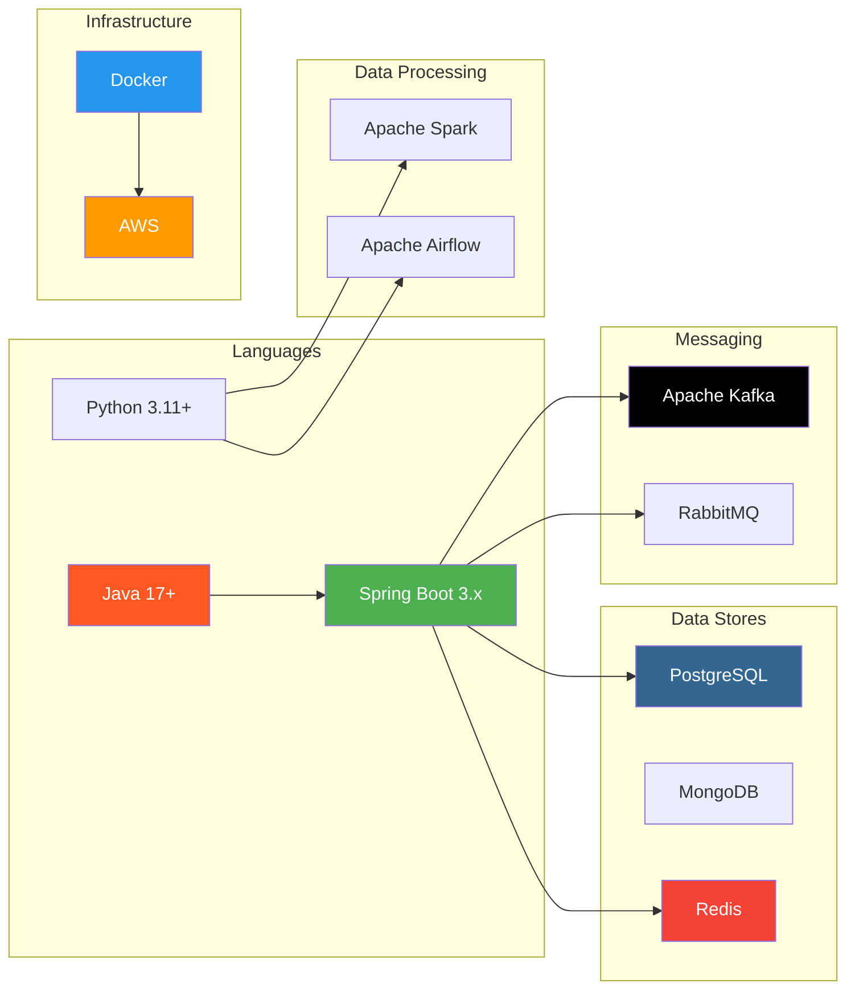

# 03 — Technologies (Deep Dive)

> Deep dive vào từng công nghệ cụ thể — từ fundamentals đến production best practices.

---

##  Roadmap

---

##  Prerequisites

- [01 — Fundamentals](../01-fundamentals/) — CS basics, OOP, SOLID
- [02 — Concepts](../02-concepts/) — Architecture patterns (recommended)

---

##  Nội dung

| Technology | Files | Focus |
|---|---|---|
| [Java](./java/) | Core, Multithreading, Modern Java, Testing | JVM, Collections, Streams, Virtual Threads |
| [Spring](./spring/) | Core, Boot, Data, Security, WebFlux, Cloud, WebSocket, Kafka, Redis, Testing | Full Spring ecosystem deep dive |
| [Redis](./redis/) | Fundamentals, Advanced, Data modeling, Clustering, Performance, Use cases | In-memory data store mastery |
| [Kafka](./kafka/) | Fundamentals, Architecture, Producer, Consumer, Streams, Schema Registry, Operations | Event streaming platform |
| [RabbitMQ](./rabbitmq/) | Fundamentals, Patterns, Reliability, Clustering, Spring AMQP | Message broker |
| [PostgreSQL](./postgresql/) | Fundamentals, Advanced queries, Indexing, Performance, Replication | Relational database |
| [MongoDB](./mongodb/) | Fundamentals, Indexing, Replication/Sharding, Spring Data MongoDB | Document database |
| [Docker](./docker/) | Fundamentals, Dockerfile best practices, Compose, Production | Containerization |
| [Python](./python/) | Core, Async, Data libraries | Python for data/AI |
| [AWS](./aws/) | Core services, Compute, Messaging, Storage/DB, Networking/Security | Cloud platform |
| [Airflow](./airflow/) | Fundamentals, Best practices, Production | Workflow orchestration |
| [Spark](./spark/) | Fundamentals, Streaming, Optimization | Data processing engine |

---

##  Sections liên quan

- [04 — Backend Engineering](../04-backend-engineering/) — Áp dụng technologies cho backend
- [05 — Data Engineering](../05-data-engineering/) — Kafka, Spark, Airflow in context
- [11 — Code Templates](../11-code-templates/) — Runnable boilerplate code
