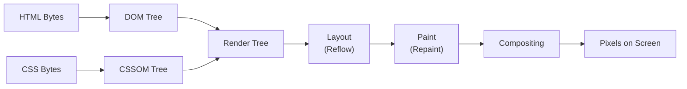

# Browser Rendering Pipeline

> A detailed explanation of how browsers transform raw HTML, CSS, and JavaScript into rendered pixels, covering the Critical Rendering Path, Reflow/Repaint mechanics, and GPU hardware acceleration. Mastering this pipeline is essential for optimizing Web Performance.

---

## 1. What is it? (What)

The **Browser Rendering Pipeline** (also called the Critical Rendering Path) is the sequence of steps a browser executes to convert HTML, CSS, and JavaScript source code into a visual display on screen.

### Classification
- **Type**: Browser subsystem / rendering engine.
- **Key implementations**: Blink (Chrome), Gecko (Firefox), WebKit (Safari).

### Pipeline Stages



---

## 2. Why does it exist? (Why)

Browsers must translate declarative markup (HTML/CSS) into a pixel-perfect visual representation. This pipeline exists because:

- **HTML and CSS are separate languages** that must be merged into a unified structure (Render Tree) before any visual output is possible.
- **Layout is computationally expensive** — the browser must calculate the exact position and size of every element relative to the viewport and its siblings.
- **Compositing enables hardware acceleration** — by separating content into GPU-managed layers, the browser can animate and scroll content without re-executing the entire pipeline.

Before modern compositing, any visual change required a full relayout and repaint, causing severe jank in animations and scrolling.

---

## 3. Without vs. With Comparison (Compare)

### Without understanding the rendering pipeline

```javascript
// Layout thrashing: alternating reads and writes forces synchronous reflow
const elements = document.querySelectorAll(".item");
elements.forEach((el) => {
  const height = el.offsetHeight; // READ — triggers layout calculation
  el.style.height = height * 2 + "px"; // WRITE — invalidates layout
  // Next iteration's READ forces another synchronous layout
});
```

### With understanding the rendering pipeline

```javascript
// Batch reads, then batch writes — avoids layout thrashing
const elements = document.querySelectorAll(".item");
const heights = Array.from(elements).map((el) => el.offsetHeight); // All READs

requestAnimationFrame(() => {
  elements.forEach((el, i) => {
    el.style.height = heights[i] * 2 + "px"; // All WRITEs batched
  });
});
```

| Aspect | Without knowledge | With knowledge |
|---|---|---|
| DOM read/write pattern | Interleaved (layout thrashing) | Batched (single reflow) |
| Animation properties | `top`, `left`, `width` (trigger reflow) | `transform`, `opacity` (compositor only) |
| Script loading | Synchronous `<script>` blocking parse | `defer` / `async` attributes |
| Performance | Janky, dropped frames | Smooth 60fps |

---

## 4. Common Use Cases

1. **Animation optimization** — Using `transform` and `opacity` exclusively to keep animations on the compositor thread.
2. **Diagnosing layout jank** — Using Chrome DevTools Performance tab to identify forced synchronous layouts.
3. **Critical CSS extraction** — Inlining above-the-fold CSS to unblock rendering.
4. **Script loading strategy** — Choosing between `async`, `defer`, and dynamic `import()` based on dependency requirements.
5. **Image and font loading** — Preventing Cumulative Layout Shift (CLS) by reserving dimensions and using `font-display` strategies.

### When deep pipeline knowledge is less critical

- Server-rendered static content sites with minimal interactivity.
- Internal tools where performance tolerances are high.

---

## 5. Deep Practice

### Reflow vs. Repaint

**Reflow (Layout)**: Triggered when changes affect element geometry (width, height, margin, padding, font-size, position). A reflow on one element can cascade to ancestors, siblings, and descendants.

**Repaint**: Triggered when changes affect visual properties that do not alter geometry (color, background, box-shadow, visibility). Cheaper than reflow but still consumes GPU/CPU resources.

### GPU Hardware Acceleration and Composite Layers

The golden rule for smooth animations (60fps) is to **only animate properties that trigger compositing**, bypassing Layout and Paint entirely.

Only two CSS properties qualify:
1. `transform` (translate, scale, rotate)
2. `opacity`

When these properties change, the browser can promote the element to a dedicated **Composite Layer** handled by the GPU.

```css
/* Hint the browser to pre-create a GPU layer */
.animated-element {
  will-change: transform, opacity;
}
```

> [!CAUTION]
> Overusing `will-change` or the `translateZ(0)` GPU hack consumes significant VRAM. Only apply it to elements that genuinely require continuous animation.

### Best Practices

1. **Use `<script defer>` or `<script async>`** to prevent JavaScript from blocking DOM construction.
2. **Minify and compress CSS/JS**; inline critical CSS for above-the-fold content.
3. **Never interleave DOM reads and writes** — batch them or use `requestAnimationFrame`.
4. **Only animate `transform` and `opacity`** for jank-free animations.
5. **Set explicit `width` and `height` on ``, `<video>`, and `<iframe>`** to prevent layout shifts.

### Common Pitfalls

1. **Layout thrashing** — Alternating `offsetHeight` reads with `style.height` writes in a loop.
2. **Animating `top`/`left`** — These trigger full reflow on every frame instead of using `transform: translate()`.
3. **Unoptimized web fonts** — Missing `font-display` causes Flash of Invisible Text (FOIT).
4. **Synchronous `<script>` in `<head>`** — Blocks both DOM parsing and rendering.
5. **Excessive `will-change`** — Promoting too many elements to GPU layers exhausts VRAM.

### Production Checklist

- [ ] No synchronous render-blocking scripts in `<head>`.
- [ ] Critical CSS inlined; non-critical CSS loaded asynchronously.
- [ ] All animations use `transform`/`opacity` only.
- [ ] No layout thrashing detected in Chrome DevTools Performance tab.
- [ ] All media elements (``, `<video>`) have explicit dimensions.
- [ ] `will-change` applied only to actively animated elements.

---

## 6. Code Templates and Integration

### Performance-Safe Animation Utility

```typescript
/**
 * Animates an element using only compositor-friendly properties.
 * Uses the Web Animations API for optimal performance.
 */
export function animateSlideIn(element: HTMLElement, durationMs = 300): Animation {
  return element.animate(
    [
      { transform: "translateY(20px)", opacity: 0 },
      { transform: "translateY(0)", opacity: 1 },
    ],
    {
      duration: durationMs,
      easing: "cubic-bezier(0.4, 0, 0.2, 1)",
      fill: "forwards",
    }
  );
}
```

### Batched DOM Mutation Helper

```typescript
/**
 * Batches DOM reads and writes to avoid layout thrashing.
 * Reads execute immediately; writes are deferred to the next animation frame.
 */
export function batchDomUpdate(
  readFn: () => void,
  writeFn: () => void
): void {
  readFn();
  requestAnimationFrame(writeFn);
}
```

---

## Related Topics

- [JS Engine Internals](./js-engine-internals.md) — How V8 executes the JavaScript that drives rendering.
- [Web Performance & Core Web Vitals](./web-performance-vitals.md) — Measuring real-user rendering performance with LCP, INP, and CLS.
- [CSS Architecture & Performance](../04-styling/css-architecture-performance.md) — How styling choices impact the rendering pipeline.
