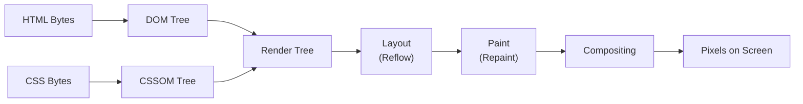

# Browser Rendering Pipeline

<details>
<summary>🇻🇳 <b>Hiển thị bản dịch Tiếng Việt</b></summary>
<br>

> **Tóm tắt**: Cái nhìn chi tiết về Critical Rendering Path (CRP), cách trình duyệt biến HTML/CSS/JS thành các điểm ảnh trên màn hình, và cách tối ưu hóa để có animation mượt mà đạt 60fps bằng cách tránh Layout Thrashing.

</details>

> **Summary**: A detailed look at the Critical Rendering Path (CRP), how browsers turn HTML/CSS/JS into pixels on the screen, and how to optimize for smooth 60fps animations by avoiding Layout Thrashing.

---

## ELI5 (Explain Like I'm 5)

<details>
<summary>🇻🇳 <b>Hiển thị bản dịch Tiếng Việt</b></summary>
<br>

Hãy tưởng tượng bạn đang xây một ngôi nhà bằng Lego theo bản vẽ:
1. **HTML**: Bạn nhận được hộp Lego và đổ hết ra sàn (DOM).
2. **CSS**: Bạn nhận được bảng hướng dẫn sơn màu: "Cục vuông thì màu đỏ, cục dài thì màu xanh" (CSSOM).
3. **Render Tree**: Bạn chọn ra những cục Lego thực sự cần dùng và gắn màu cho chúng.
4. **Layout**: Bạn tính toán xem cục nào đặt ở đâu trên sàn nhà (Toán học).
5. **Paint**: Bạn dùng cọ sơn màu lên từng cục Lego.
6. **Compositing**: Bạn ghép các khối đã sơn thành một ngôi nhà hoàn chỉnh và trưng bày.

Nếu bạn cứ liên tục vừa đo đạc (Layout) vừa sơn màu (Paint), bạn sẽ làm rất chậm. Đó là lý do trình duyệt bị giật lag!

</details>

Imagine you are building a Lego house from a blueprint:
1. **HTML**: You receive the Lego box and dump the pieces on the floor (DOM).
2. **CSS**: You receive the painting instructions: "Square blocks are red, long blocks are blue" (CSSOM).
3. **Render Tree**: You pick out the pieces you actually need and apply the color rules to them.
4. **Layout**: You calculate exactly where each piece goes on the floor (Math/Geometry).
5. **Paint**: You take a brush and paint the pixels onto each piece.
6. **Compositing**: You snap the painted chunks together to form the final house and display it.

If you constantly switch between measuring (Layout) and painting (Paint) for every single brick, you will work very slowly. This is exactly why browsers stutter (jank) during bad animations!

---

## Layer 1: What is it? (What)

<details>
<summary>🇻🇳 <b>Hiển thị bản dịch Tiếng Việt</b></summary>
<br>

**Browser Rendering Pipeline** (còn gọi là Critical Rendering Path) là chuỗi các bước mà một trình duyệt thực hiện để chuyển đổi mã nguồn HTML, CSS và JavaScript thành hình ảnh hiển thị trên màn hình.

**Phân loại:**
- **Loại**: Hệ thống con của trình duyệt / Rendering engine.
- **Các lõi phổ biến**: Blink (Chrome), Gecko (Firefox), WebKit (Safari).

</details>

The **Browser Rendering Pipeline** (also called the Critical Rendering Path) is the sequence of steps a browser executes to convert HTML, CSS, and JavaScript source code into a visual display on screen.

### Classification
- **Type**: Browser subsystem / rendering engine.
- **Key implementations**: Blink (Chrome), Gecko (Firefox), WebKit (Safari).

### Pipeline Stages



---

## Layer 2: Why does it exist? (Why)

<details>
<summary>🇻🇳 <b>Hiển thị bản dịch Tiếng Việt</b></summary>
<br>

Trình duyệt cần dịch các ngôn ngữ đánh dấu (HTML/CSS) thành hình ảnh hoàn hảo đến từng điểm ảnh. Quy trình này tồn tại vì:
- **HTML và CSS là hai ngôn ngữ tách biệt**, cần được gộp lại thành một cấu trúc thống nhất (Render Tree).
- **Tính toán Layout rất nặng nề**: Trình duyệt phải tính toán chính xác vị trí và kích thước của từng phần tử so với màn hình.
- **Compositing giúp tận dụng card đồ họa (GPU)**: Bằng cách chia nội dung thành các lớp (layers) do GPU quản lý, trình duyệt có thể tạo animation và cuộn trang mà không cần chạy lại toàn bộ quy trình.

</details>

Browsers must translate declarative markup (HTML/CSS) into a pixel-perfect visual representation. This pipeline exists because:

- **HTML and CSS are separate languages** that must be merged into a unified structure (Render Tree) before any visual output is possible.
- **Layout is computationally expensive** — the browser must calculate the exact position and size of every element relative to the viewport and its siblings.
- **Compositing enables hardware acceleration** — by separating content into GPU-managed layers, the browser can animate and scroll content without re-executing the entire pipeline.

Before modern compositing, any visual change required a full relayout and repaint, causing severe jank in animations and scrolling.

---

## Layer 3: Without vs. With Comparison (Compare)

<details>
<summary>🇻🇳 <b>Hiển thị bản dịch Tiếng Việt</b></summary>
<br>

Nếu không hiểu quy trình này, lập trình viên thường viết code JavaScript liên tục đọc và ghi DOM đan xen nhau (Layout Thrashing). Điều này ép trình duyệt phải liên tục tính toán lại giao diện, gây giật lag. Khi hiểu quy trình, bạn sẽ gộp (batch) toàn bộ lệnh ĐỌC lên trước, và lệnh GHI ra sau.

</details>

### Without understanding the rendering pipeline

```javascript
// Layout thrashing: alternating reads and writes forces synchronous reflow
const elements = document.querySelectorAll(".item");
elements.forEach((el) => {
  const height = el.offsetHeight; // READ — triggers layout calculation
  el.style.height = height * 2 + "px"; // WRITE — invalidates layout
  // Next iteration's READ forces another synchronous layout
});
```

### With understanding the rendering pipeline

```javascript
// Batch reads, then batch writes — avoids layout thrashing
const elements = document.querySelectorAll(".item");
const heights = Array.from(elements).map((el) => el.offsetHeight); // All READs

requestAnimationFrame(() => {
  elements.forEach((el, i) => {
    el.style.height = heights[i] * 2 + "px"; // All WRITEs batched
  });
});
```

| Aspect | Without knowledge | With knowledge |
|---|---|---|
| DOM read/write pattern | Interleaved (layout thrashing) | Batched (single reflow) |
| Animation properties | `top`, `left`, `width` (trigger reflow) | `transform`, `opacity` (compositor only) |
| Script loading | Synchronous `<script>` blocking parse | `defer` / `async` attributes |
| Performance | Janky, dropped frames | Smooth 60fps |

---

## Layer 4: Common Use Cases

<details>
<summary>🇻🇳 <b>Hiển thị bản dịch Tiếng Việt</b></summary>
<br>

1. **Tối ưu hóa Animation**: Chỉ sử dụng `transform` và `opacity` để GPU xử lý.
2. **Chẩn đoán giật lag**: Dùng thẻ Performance trong Chrome DevTools để tìm ra các lỗi đồng bộ Layout.
3. **Trích xuất Critical CSS**: Đưa CSS quan trọng lên đầu (inline) để không chặn quá trình hiển thị.
4. **Chiến lược nạp Script**: Chọn đúng `async` hoặc `defer`.
5. **Nạp ảnh và font chữ**: Tránh hiện tượng giật nội dung (CLS) bằng cách đặt trước kích thước ảnh.

</details>

1. **Animation optimization** — Using `transform` and `opacity` exclusively to keep animations on the compositor thread.
2. **Diagnosing layout jank** — Using Chrome DevTools Performance tab to identify forced synchronous layouts.
3. **Critical CSS extraction** — Inlining above-the-fold CSS to unblock rendering.
4. **Script loading strategy** — Choosing between `async`, `defer`, and dynamic `import()` based on dependency requirements.
5. **Image and font loading** — Preventing Cumulative Layout Shift (CLS) by reserving dimensions and using `font-display` strategies.

### When deep pipeline knowledge is less critical

- Server-rendered static content sites with minimal interactivity.
- Internal tools where performance tolerances are high.

---

## Layer 5: Deep Practice

<details>
<summary>🇻🇳 <b>Hiển thị bản dịch Tiếng Việt</b></summary>
<br>

**Reflow (Layout) vs. Repaint**:
- **Reflow**: Xảy ra khi thay đổi kích thước/vị trí (width, height, top). Rất tốn tài nguyên.
- **Repaint**: Xảy ra khi đổi màu sắc, bóng (color, box-shadow). Rẻ hơn Reflow nhưng vẫn tốn CPU.

**GPU Hardware Acceleration**: Quy tắc vàng là chỉ dùng `transform` và `opacity` cho animation vì chúng bỏ qua cả Reflow và Repaint, đi thẳng vào GPU (Compositing).

</details>

### Reflow vs. Repaint

**Reflow (Layout)**: Triggered when changes affect element geometry (width, height, margin, padding, font-size, position). A reflow on one element can cascade to ancestors, siblings, and descendants.

**Repaint**: Triggered when changes affect visual properties that do not alter geometry (color, background, box-shadow, visibility). Cheaper than reflow but still consumes GPU/CPU resources.

### GPU Hardware Acceleration and Composite Layers

The golden rule for smooth animations (60fps) is to **only animate properties that trigger compositing**, bypassing Layout and Paint entirely.

Only two CSS properties qualify:
1. `transform` (translate, scale, rotate)
2. `opacity`

When these properties change, the browser can promote the element to a dedicated **Composite Layer** handled by the GPU.

```css
/* Hint the browser to pre-create a GPU layer */
.animated-element {
  will-change: transform, opacity;
}
```

> [!CAUTION]
> Overusing `will-change` or the `translateZ(0)` GPU hack consumes significant VRAM. Only apply it to elements that genuinely require continuous animation.

### Best Practices

1. **Use `<script defer>` or `<script async>`** to prevent JavaScript from blocking DOM construction.
2. **Minify and compress CSS/JS**; inline critical CSS for above-the-fold content.
3. **Never interleave DOM reads and writes** — batch them or use `requestAnimationFrame`.
4. **Only animate `transform` and `opacity`** for jank-free animations.
5. **Set explicit `width` and `height` on ``, `<video>`, and `<iframe>`** to prevent layout shifts.

### Common Pitfalls

1. **Layout thrashing** — Alternating `offsetHeight` reads with `style.height` writes in a loop.
2. **Animating `top`/`left`** — These trigger full reflow on every frame instead of using `transform: translate()`.
3. **Unoptimized web fonts** — Missing `font-display` causes Flash of Invisible Text (FOIT).
4. **Synchronous `<script>` in `<head>`** — Blocks both DOM parsing and rendering.
5. **Excessive `will-change`** — Promoting too many elements to GPU layers exhausts VRAM.

### Production Checklist

- [ ] No synchronous render-blocking scripts in `<head>`.
- [ ] Critical CSS inlined; non-critical CSS loaded asynchronously.
- [ ] All animations use `transform`/`opacity` only.
- [ ] No layout thrashing detected in Chrome DevTools Performance tab.
- [ ] All media elements (``, `<video>`) have explicit dimensions.
- [ ] `will-change` applied only to actively animated elements.

---

## Layer 6: Code Templates and Integration

<details>
<summary>🇻🇳 <b>Hiển thị bản dịch Tiếng Việt</b></summary>
<br>

Đoạn code dưới đây cung cấp một tiện ích tạo Animation mượt mà bằng JavaScript (Web Animations API) và một hàm giúp gộp lệnh ĐỌC và GHI DOM để tránh Layout Thrashing.

</details>

### Performance-Safe Animation Utility

```typescript
/**
 * Animates an element using only compositor-friendly properties.
 * Uses the Web Animations API for optimal performance.
 */
export function animateSlideIn(element: HTMLElement, durationMs = 300): Animation {
  return element.animate(
    [
      { transform: "translateY(20px)", opacity: 0 },
      { transform: "translateY(0)", opacity: 1 },
    ],
    {
      duration: durationMs,
      easing: "cubic-bezier(0.4, 0, 0.2, 1)",
      fill: "forwards",
    }
  );
}
```

### Batched DOM Mutation Helper

```typescript
/**
 * Batches DOM reads and writes to avoid layout thrashing.
 * Reads execute immediately; writes are deferred to the next animation frame.
 */
export function batchDomUpdate(
  readFn: () => void,
  writeFn: () => void
): void {
  readFn();
  requestAnimationFrame(writeFn);
}
```

---

## Related Topics

- [JS Engine Internals](./js-engine-internals.md) — How V8 executes the JavaScript that drives rendering.
- [Web Performance & Core Web Vitals](./web-performance-vitals.md) — Measuring real-user rendering performance with LCP, INP, and CLS.
- [CSS Architecture & Performance](../04-styling/css-architecture-performance.md) — How styling choices impact the rendering pipeline.
