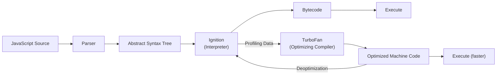

# JavaScript Engine Internals

<details>
<summary>🇻🇳 <b>Hiển thị bản dịch Tiếng Việt</b></summary>
<br>

> **Tóm tắt**: Đi sâu vào cách JavaScript thực thi bên dưới (under the hood), bao gồm kiến trúc V8, biên dịch JIT, Event Loop và Garbage Collection (Dọn rác). Việc hiểu rõ các thành phần bên trong này là rất quan trọng để viết code frontend hiệu năng cao và chẩn đoán các lỗi runtime phức tạp.

</details>

> **Summary**: A deep dive into how JavaScript executes under the hood, covering V8 architecture, JIT compilation, the Event Loop, and Garbage Collection. Understanding these internals is essential for writing high-performance frontend code and diagnosing subtle runtime bugs.

---

## ELI5 (Explain Like I'm 5)

<details>
<summary>🇻🇳 <b>Hiển thị bản dịch Tiếng Việt</b></summary>
<br>

Hãy tưởng tượng bạn đang nhờ một đầu bếp (JS Engine) nấu ăn theo công thức tiếng Anh (code JS):
- **Interpreter (Người dịch trực tiếp)**: Bếp trưởng đọc từng dòng tiếng Anh, dịch ra tiếng Việt rồi nấu. Nấu nhanh ngay lập tức, nhưng nếu món đó phải nấu 100 lần, ông ấy vẫn phải dịch lại 100 lần (Rất chậm).
- **Compiler (Người biên dịch trước)**: Bếp trưởng dành 1 tiếng đồng hồ dịch toàn bộ quyển sách sang tiếng Việt rồi mới nấu. Nấu 100 lần rất nhanh, nhưng phải đợi 1 tiếng lúc đầu mới được ăn (Chậm lúc khởi động).
- **JIT (Just-In-Time) Compiler của V8**: Kết hợp cả 2! Bếp trưởng đọc từng dòng và nấu ngay lập tức để bạn có đồ ăn nhanh nhất. Nhưng nếu thấy món "Trứng ốp la" bị gọi tới 100 lần (Hot function), ông ấy lập tức viết hẳn một tờ giấy nhớ "Cách làm Trứng ốp la siêu tốc" dán lên tường (Machine Code). Lần 101, ông ấy làm trong chớp mắt mà không cần dịch nữa.

</details>

Imagine you ask a chef (JS Engine) to cook a meal from a recipe written in a foreign language (JS code):
- **Interpreter**: The chef translates line 1, cooks it, then translates line 2, cooks it. It's fast to start, but if they cook the same dish 100 times, they have to translate it 100 times.
- **Compiler**: The chef spends an hour translating the entire book before cooking anything. Cooking is super fast, but you have to wait an hour just to get your first bite.
- **V8's JIT Compiler**: The best of both! The chef translates line-by-line and cooks immediately so you eat fast. But if they notice they are cooking "Fried Eggs" 100 times (a "Hot" function), they secretly write down a super-optimized "Fried Egg Cheat Sheet" (Machine Code) and tape it to the wall. The 101st time, they cook it instantly without translating.

---

## Layer 1: What is it? (What)

<details>
<summary>🇻🇳 <b>Hiển thị bản dịch Tiếng Việt</b></summary>
<br>

**JavaScript Engine** là một chương trình dùng để đọc và thực thi mã JavaScript. Engine phổ biến nhất là **V8** của Google (dùng trong Chrome, Node.js và Deno).

Các Engine hiện đại không chỉ dịch (interpret) từng dòng. Chúng sử dụng **Biên dịch JIT (Just-In-Time)**: một sự kết hợp giữa việc dịch trực tiếp (để khởi động nhanh) và biên dịch mã máy (để chạy tốc độ cao nhất).

**Luồng chạy của V8**:
- **Ignition (Interpreter)**: Dịch mã thành Bytecode và chạy ngay lập tức. Đồng thời thu thập dữ liệu (Profiling).
- **TurboFan (Compiler)**: Lấy dữ liệu từ Ignition, tìm ra các hàm chạy nhiều lần (hot) và biến chúng thành Mã Máy (Machine Code) siêu nhanh. Nếu dữ liệu thay đổi, nó sẽ "hủy tối ưu" (Deoptimize) và quay lại dùng Bytecode.

</details>

A **JavaScript Engine** is a program that interprets and executes JavaScript source code. The most widely used engine is Google's **V8**, which powers Chrome, Node.js, and Deno.

Modern engines do not simply interpret code line-by-line. They employ **Just-In-Time (JIT) Compilation**, a hybrid approach that combines interpretation for fast startup with optimizing compilation for peak runtime performance.

### Classification
- **Type**: Runtime execution engine.
- **Key implementations**: V8 (Chrome/Node.js), SpiderMonkey (Firefox), JavaScriptCore (Safari).

### Architecture Overview (V8)



**Ignition (Interpreter)**: Translates the AST into Bytecode and executes it immediately, enabling fast page startup. It simultaneously collects **Profiling Data** (variable types, call frequency).

**TurboFan (Optimizing Compiler)**: Identifies "hot" functions (called frequently) and compiles them into highly optimized Machine Code based on profiling data. If an assumption is violated (e.g., a function always received `number` but suddenly receives `string`), TurboFan **deoptimizes** the code back to Ignition's bytecode.

> [!TIP]
> Maintaining stable types in JavaScript (or using TypeScript) helps V8 optimize code far more effectively by preventing deoptimization cycles.

---

## Layer 2: Why does it exist? (Why)

<details>
<summary>🇻🇳 <b>Hiển thị bản dịch Tiếng Việt</b></summary>
<br>

Ban đầu, JavaScript chỉ là ngôn ngữ thông dịch thuần túy (rất chậm). Khi các trang web ngày càng phức tạp (từ những form đơn giản biến thành các ứng dụng SPA khổng lồ), tốc độ này không còn đáp ứng được.

**Biên dịch JIT** ra đời để thu hẹp khoảng cách giữa sự linh hoạt của ngôn ngữ thông dịch và sức mạnh của ngôn ngữ biên dịch (như C, Java). Kiến trúc V8 giải quyết bài toán hóc búa: vừa phải khởi động ứng dụng cực nhanh, vừa phải chạy mượt mà khi xử lý logic nặng.

</details>

JavaScript was originally a purely interpreted language, leading to poor execution speed for complex applications. The problem became critical as web applications grew from simple form validators to full-scale desktop-replacement SPAs.

**JIT compilation** was introduced to bridge the gap between the flexibility of dynamic interpretation and the performance of ahead-of-time compiled languages (C, Java). V8's architecture (Ignition + TurboFan) specifically solves the tension between **fast startup** (interpreting immediately) and **peak throughput** (compiling hot paths to machine code).

---

## Layer 3: Without vs. With Comparison (Compare)

<details>
<summary>🇻🇳 <b>Hiển thị bản dịch Tiếng Việt</b></summary>
<br>

Nếu bạn không hiểu cách V8 tối ưu (TurboFan), bạn có thể vô tình viết hàm nhận vào quá nhiều kiểu dữ liệu khác nhau (Megamorphic). Việc này ép V8 phải hủy tối ưu (Deoptimize) và chạy rất chậm. Khi viết code đồng nhất kiểu dữ liệu (Monomorphic), V8 sẽ giữ nguyên Mã Máy và chạy tốc độ tối đa.

</details>

### Without understanding engine internals

```typescript
// Monomorphic call site — V8 optimizes aggressively
function add(a: number, b: number) { return a + b; }
add(1, 2); // Optimized for number+number

// Megamorphic — triggers deoptimization, performance degrades
add("hello", "world"); // V8 must deoptimize and fall back to bytecode
```

### With understanding engine internals

```typescript
// Keep function signatures monomorphic
function addNumbers(a: number, b: number): number { return a + b; }
function concatStrings(a: string, b: string): string { return a + b; }

// V8 optimizes each function independently — no deoptimization
addNumbers(1, 2);
concatStrings("hello", "world");
```

| Aspect | Without knowledge | With knowledge |
|---|---|---|
| Type stability | Mixed types in functions | Monomorphic call sites |
| Deoptimization | Frequent, unpredictable slowdowns | Avoided by design |
| Memory leaks | Undetected until crash | Proactively prevented |

---

## Layer 4: Common Use Cases

<details>
<summary>🇻🇳 <b>Hiển thị bản dịch Tiếng Việt</b></summary>
<br>

1. **SPA hiệu năng cao**: Bảng điều khiển (Dashboards), xử lý dữ liệu lớn (data grids).
2. **Ứng dụng React lớn**: Tìm hiểu nguyên nhân gây giật lag khi render lại (reconciliation).
3. **Săn lỗi Memory Leak (Rò rỉ bộ nhớ)**: Dùng tab Memory của Chrome DevTools để bắt các biến không bị xóa.
4. **Node.js**: Tối ưu CPU, hiểu về Event Loop để tránh kẹt luồng xử lý (blocking).
5. **Viết thư viện**: Viết code nương theo cách tối ưu của V8 thay vì đi ngược lại nó.

</details>

Understanding engine internals matters most in these scenarios:

1. **Performance-critical SPAs** — Dashboards, data grids, and real-time visualizations where frame budgets are tight.
2. **Large-scale React applications** — Diagnosing why certain components cause jank during reconciliation.
3. **Memory leak investigations** — Identifying detached DOM nodes, uncollected closures, and forgotten event listeners using Chrome DevTools heap snapshots.
4. **Server-side Node.js** — Optimizing CPU-bound operations and understanding backpressure in streams.
5. **Framework and library authorship** — Writing code that cooperates with engine optimizations rather than fighting them.

### When this knowledge is less critical

- Simple static marketing pages.
- Prototypes and MVPs where developer velocity matters more than runtime performance.

---

## Layer 5: Deep Practice

<details>
<summary>🇻🇳 <b>Hiển thị bản dịch Tiếng Việt</b></summary>
<br>

**Event Loop**:
JS chạy trên 1 luồng duy nhất (Call Stack). Thứ tự chạy:
1. Chạy sạch code đồng bộ trên Call Stack.
2. Chạy sạch toàn bộ **Microtask Queue** (Promise, queueMicrotask).
3. Chạy ĐÚNG MỘT **Macrotask** (setTimeout, I/O).
4. Lặp lại.
*Lưu ý*: Microtask có độ ưu tiên cao hơn. Nếu tạo vòng lặp vô tận bằng `Promise`, trình duyệt sẽ bị treo hoàn toàn!

**Garbage Collection (Dọn rác)**:
- **Young Generation (Thế hệ trẻ)**: Lưu các biến mới tạo, dọn rác cực nhanh và thường xuyên (Scavenger).
- **Old Generation (Thế hệ già)**: Lưu các biến sống lâu. Dọn rác ít hơn nhưng tốn thời gian hơn (Mark-Sweep).

**Lỗi Rò Rỉ Bộ Nhớ thường gặp**:
- Quên xóa Event Listener khi tắt Component.
- Quên `clearInterval()`.
- Biến toàn cục (Global) vô tình.

</details>

### The Event Loop

JavaScript is single-threaded and runs on a **Call Stack**. The Event Loop enables non-blocking asynchronous behavior using Web APIs and Task Queues.

**Execution order**:
1. Execute all synchronous code on the Call Stack until it is empty.
2. Drain the **Microtask Queue** completely (Promises, `queueMicrotask`, `MutationObserver`). Microtasks spawned during this phase are also processed.
3. Pick exactly **one Macrotask** from the Macrotask Queue (`setTimeout`, `setInterval`, I/O, UI events).
4. Repeat.

> [!WARNING]
> Microtasks have higher priority than macrotasks. An infinite loop of `Promise.resolve().then(...)` will freeze the browser entirely because the microtask queue never empties. In contrast, recursive `setTimeout` allows the browser to interleave UI rendering between macrotasks.

### Memory Management and Garbage Collection

V8's heap is divided into two generational spaces:

- **Young Generation (Nursery & Intermediate)**: Small (a few MB), holds newly created objects. The "Scavenger" (Minor GC) runs frequently and is extremely fast.
- **Old Generation**: Holds objects that survived two Minor GC cycles. The "Mark-Sweep-Compact" (Major GC) runs less frequently and can cause brief "Stop-The-World" pauses, though V8's Concurrent Marking has significantly reduced this impact.

### Common Frontend Memory Leaks

1. **Accidental global variables** — Assigning to undeclared variables creates globals that are never collected.
2. **Closures retaining large objects** — A closure captures its enclosing scope; if that scope holds a large data structure, it stays alive.
3. **Forgotten event listeners** — Registering listeners without `removeEventListener` on component unmount.
4. **Uncleared timers** — Forgetting `clearInterval()` or `clearTimeout()`.
5. **Detached DOM elements** — Removing a node from the DOM but retaining a JavaScript reference to it.

### Best Practices

1. **Keep function call sites monomorphic** — Pass consistent types to the same function to enable TurboFan optimization.
2. **Avoid megamorphic property access** — Objects with many dynamically added properties trigger dictionary mode in V8, which is slower.
3. **Use `WeakMap` and `WeakRef`** for caches that should not prevent garbage collection.
4. **Profile with Chrome DevTools Performance tab** — Identify Long Tasks (>50ms) that block the main thread.
5. **Prefer `requestAnimationFrame` for visual updates** — Ensures work is batched before the next paint.

### Production Checklist

- [ ] No known memory leaks (verified via heap snapshots in DevTools).
- [ ] No Long Tasks exceeding 50ms in the critical user interaction path.
- [ ] Event listeners and timers cleaned up in component teardown logic.
- [ ] TypeScript strict mode enabled to promote monomorphic call sites.
- [ ] `WeakMap`/`WeakRef` used for any manual caching patterns.

---

## Layer 6: Code Templates and Integration

<details>
<summary>🇻🇳 <b>Hiển thị bản dịch Tiếng Việt</b></summary>
<br>

Dưới đây là một Hook React để phát hiện rò rỉ bộ nhớ (bằng cách đếm số lần render bất thường) và một Hook an toàn để tự động xóa Event Listener khi Component bị hủy, ngăn chặn rò rỉ bộ nhớ triệt để.

</details>

### Detecting Memory Leaks in React

```typescript
import { useEffect, useRef } from "react";

export function useMemoryLeakDetector(label: string): void {
  const renderCount = useRef(0);

  useEffect(() => {
    renderCount.current += 1;
    if (process.env.NODE_ENV === "development" && renderCount.current > 100) {
      console.warn(
        `[MemoryLeakDetector] "${label}" has rendered ${renderCount.current} times. ` +
        `Investigate potential missing cleanup in useEffect.`
      );
    }
  });
}
```

### Safe Event Listener Hook

```typescript
import { useEffect, useRef } from "react";

export function useEventListener<K extends keyof WindowEventMap>(
  eventName: K,
  handler: (event: WindowEventMap[K]) => void,
  element: EventTarget = window
): void {
  const savedHandler = useRef(handler);

  useEffect(() => {
    savedHandler.current = handler;
  }, [handler]);

  useEffect(() => {
    const eventListener = (event: Event) =>
      savedHandler.current(event as WindowEventMap[K]);

    element.addEventListener(eventName, eventListener);
    return () => element.removeEventListener(eventName, eventListener);
  }, [eventName, element]);
}
```

---

## Related Topics

- [Browser Rendering Pipeline](./browser-rendering-pipeline.md) — How parsed code becomes pixels on screen.
- [Web Performance & Core Web Vitals](./web-performance-vitals.md) — Measuring and optimizing user-perceived performance.
- [React Fiber & Reconciliation](../02-reactjs/react-fiber-reconciliation.md) — How React's rendering engine interacts with the browser's main thread.
