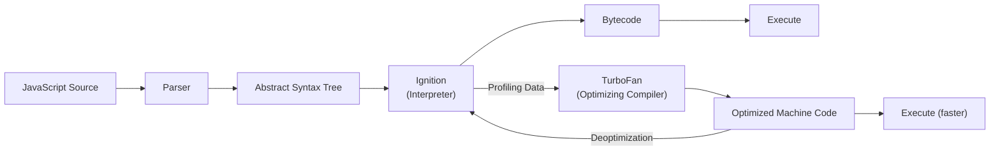

# JavaScript Engine Internals

> A deep dive into how JavaScript executes under the hood, covering V8 architecture, JIT compilation, the Event Loop, and Garbage Collection. Understanding these internals is essential for writing high-performance frontend code and diagnosing subtle runtime bugs.

---

## 1. What is it? (What)

A **JavaScript Engine** is a program that interprets and executes JavaScript source code. The most widely used engine is Google's **V8**, which powers Chrome, Node.js, and Deno.

Modern engines do not simply interpret code line-by-line. They employ **Just-In-Time (JIT) Compilation**, a hybrid approach that combines interpretation for fast startup with optimizing compilation for peak runtime performance.

### Classification
- **Type**: Runtime execution engine.
- **Key implementations**: V8 (Chrome/Node.js), SpiderMonkey (Firefox), JavaScriptCore (Safari).

### Architecture Overview (V8)



**Ignition (Interpreter)**: Translates the AST into Bytecode and executes it immediately, enabling fast page startup. It simultaneously collects **Profiling Data** (variable types, call frequency).

**TurboFan (Optimizing Compiler)**: Identifies "hot" functions (called frequently) and compiles them into highly optimized Machine Code based on profiling data. If an assumption is violated (e.g., a function always received `number` but suddenly receives `string`), TurboFan **deoptimizes** the code back to Ignition's bytecode.

> [!TIP]
> Maintaining stable types in JavaScript (or using TypeScript) helps V8 optimize code far more effectively by preventing deoptimization cycles.

---

## 2. Why does it exist? (Why)

JavaScript was originally a purely interpreted language, leading to poor execution speed for complex applications. The problem became critical as web applications grew from simple form validators to full-scale desktop-replacement SPAs.

**JIT compilation** was introduced to bridge the gap between the flexibility of dynamic interpretation and the performance of ahead-of-time compiled languages (C, Java). V8's architecture (Ignition + TurboFan) specifically solves the tension between **fast startup** (interpreting immediately) and **peak throughput** (compiling hot paths to machine code).

---

## 3. Without vs. With Comparison (Compare)

### Without understanding engine internals

```typescript
// Monomorphic call site — V8 optimizes aggressively
function add(a: number, b: number) { return a + b; }
add(1, 2); // Optimized for number+number

// Megamorphic — triggers deoptimization, performance degrades
add("hello", "world"); // V8 must deoptimize and fall back to bytecode
```

### With understanding engine internals

```typescript
// Keep function signatures monomorphic
function addNumbers(a: number, b: number): number { return a + b; }
function concatStrings(a: string, b: string): string { return a + b; }

// V8 optimizes each function independently — no deoptimization
addNumbers(1, 2);
concatStrings("hello", "world");
```

| Aspect | Without knowledge | With knowledge |
|---|---|---|
| Type stability | Mixed types in functions | Monomorphic call sites |
| Deoptimization | Frequent, unpredictable slowdowns | Avoided by design |
| Memory leaks | Undetected until crash | Proactively prevented |

---

## 4. Common Use Cases

Understanding engine internals matters most in these scenarios:

1. **Performance-critical SPAs** — Dashboards, data grids, and real-time visualizations where frame budgets are tight.
2. **Large-scale React applications** — Diagnosing why certain components cause jank during reconciliation.
3. **Memory leak investigations** — Identifying detached DOM nodes, uncollected closures, and forgotten event listeners using Chrome DevTools heap snapshots.
4. **Server-side Node.js** — Optimizing CPU-bound operations and understanding backpressure in streams.
5. **Framework and library authorship** — Writing code that cooperates with engine optimizations rather than fighting them.

### When this knowledge is less critical

- Simple static marketing pages.
- Prototypes and MVPs where developer velocity matters more than runtime performance.

---

## 5. Deep Practice

### The Event Loop

JavaScript is single-threaded and runs on a **Call Stack**. The Event Loop enables non-blocking asynchronous behavior using Web APIs and Task Queues.

**Execution order**:
1. Execute all synchronous code on the Call Stack until it is empty.
2. Drain the **Microtask Queue** completely (Promises, `queueMicrotask`, `MutationObserver`). Microtasks spawned during this phase are also processed.
3. Pick exactly **one Macrotask** from the Macrotask Queue (`setTimeout`, `setInterval`, I/O, UI events).
4. Repeat.

> [!WARNING]
> Microtasks have higher priority than macrotasks. An infinite loop of `Promise.resolve().then(...)` will freeze the browser entirely because the microtask queue never empties. In contrast, recursive `setTimeout` allows the browser to interleave UI rendering between macrotasks.

### Memory Management and Garbage Collection

V8's heap is divided into two generational spaces:

- **Young Generation (Nursery & Intermediate)**: Small (a few MB), holds newly created objects. The "Scavenger" (Minor GC) runs frequently and is extremely fast.
- **Old Generation**: Holds objects that survived two Minor GC cycles. The "Mark-Sweep-Compact" (Major GC) runs less frequently and can cause brief "Stop-The-World" pauses, though V8's Concurrent Marking has significantly reduced this impact.

### Common Frontend Memory Leaks

1. **Accidental global variables** — Assigning to undeclared variables creates globals that are never collected.
2. **Closures retaining large objects** — A closure captures its enclosing scope; if that scope holds a large data structure, it stays alive.
3. **Forgotten event listeners** — Registering listeners without `removeEventListener` on component unmount.
4. **Uncleared timers** — Forgetting `clearInterval()` or `clearTimeout()`.
5. **Detached DOM elements** — Removing a node from the DOM but retaining a JavaScript reference to it.

### Best Practices

1. **Keep function call sites monomorphic** — Pass consistent types to the same function to enable TurboFan optimization.
2. **Avoid megamorphic property access** — Objects with many dynamically added properties trigger dictionary mode in V8, which is slower.
3. **Use `WeakMap` and `WeakRef`** for caches that should not prevent garbage collection.
4. **Profile with Chrome DevTools Performance tab** — Identify Long Tasks (>50ms) that block the main thread.
5. **Prefer `requestAnimationFrame` for visual updates** — Ensures work is batched before the next paint.

### Production Checklist

- [ ] No known memory leaks (verified via heap snapshots in DevTools).
- [ ] No Long Tasks exceeding 50ms in the critical user interaction path.
- [ ] Event listeners and timers cleaned up in component teardown logic.
- [ ] TypeScript strict mode enabled to promote monomorphic call sites.
- [ ] `WeakMap`/`WeakRef` used for any manual caching patterns.

---

## 6. Code Templates and Integration

### Detecting Memory Leaks in React

```typescript
import { useEffect, useRef } from "react";

export function useMemoryLeakDetector(label: string): void {
  const renderCount = useRef(0);

  useEffect(() => {
    renderCount.current += 1;
    if (process.env.NODE_ENV === "development" && renderCount.current > 100) {
      console.warn(
        `[MemoryLeakDetector] "${label}" has rendered ${renderCount.current} times. ` +
        `Investigate potential missing cleanup in useEffect.`
      );
    }
  });
}
```

### Safe Event Listener Hook

```typescript
import { useEffect, useRef } from "react";

export function useEventListener<K extends keyof WindowEventMap>(
  eventName: K,
  handler: (event: WindowEventMap[K]) => void,
  element: EventTarget = window
): void {
  const savedHandler = useRef(handler);

  useEffect(() => {
    savedHandler.current = handler;
  }, [handler]);

  useEffect(() => {
    const eventListener = (event: Event) =>
      savedHandler.current(event as WindowEventMap[K]);

    element.addEventListener(eventName, eventListener);
    return () => element.removeEventListener(eventName, eventListener);
  }, [eventName, element]);
}
```

---

## Related Topics

- [Browser Rendering Pipeline](./browser-rendering-pipeline.md) — How parsed code becomes pixels on screen.
- [Web Performance & Core Web Vitals](./web-performance-vitals.md) — Measuring and optimizing user-perceived performance.
- [React Fiber & Reconciliation](../02-reactjs/react-fiber-reconciliation.md) — How React's rendering engine interacts with the browser's main thread.
