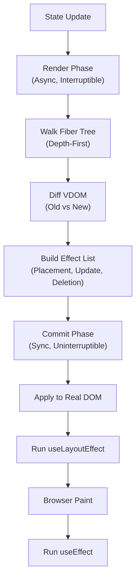

# React Fiber and Reconciliation

<details>
<summary>🇻🇳 <b>Hiển thị bản dịch Tiếng Việt</b></summary>
<br>

> **Tóm tắt**: Đi sâu vào engine render cốt lõi của React (Fiber), giải thích cách cơ chế reconciliation hoạt động bên dưới, cách quá trình render được chia thành các phase, và cách Concurrent Mode mang lại trải nghiệm người dùng mượt mà không chặn luồng chính (main thread).

</details>

> **Summary**: A deep dive into React's core rendering engine (Fiber), explaining how reconciliation works under the hood, how rendering is split into phases, and how Concurrent Mode enables smooth user experiences without blocking the main thread.

---

## ELI5 (Explain Like I'm 5)

<details>
<summary>🇻🇳 <b>Hiển thị bản dịch Tiếng Việt</b></summary>
<br>

Hãy tưởng tượng bạn đang dọn dẹp một căn nhà 10 tầng:
- **Trước đây (Không có Fiber)**: Bạn bắt đầu lau từ tầng 1 lên tầng 10, không nghỉ. Nếu có người gõ cửa (User click), bạn bỏ mặc họ đứng ngoài đến khi lau xong cả 10 tầng mới ra mở cửa. Giao diện bị đơ!
- **Hiện tại (Có Fiber)**: Bạn lau một phòng, sau đó ngừng lại ngó ra cửa sổ xem có ai bấm chuông không. Nếu có, bạn ra mở cửa ngay, phục vụ họ xong, rồi mới quay lại lau tiếp phòng thứ hai (Interruptible Rendering). Nếu việc lau dọn quá lâu, bạn chia nhỏ ra lau từng chút một (Time Slicing) để khách đến nhà luôn được tiếp đón ngay lập tức.

</details>

Imagine you are cleaning a 10-story house:
- **Before (Without Fiber)**: You start sweeping from floor 1 to floor 10 without stopping. If someone knocks on the door (a User click), you ignore them until you finish all 10 floors. The UI freezes!
- **Now (With Fiber)**: You sweep one room, then pause to check if anyone is at the door. If there is, you open the door, help them immediately, and then go back to sweep the next room (Interruptible Rendering). If the cleaning task is huge, you break it into tiny pieces (Time Slicing) so that guests are always greeted instantly.

---

## Layer 1: What is it? (What)

<details>
<summary>🇻🇳 <b>Hiển thị bản dịch Tiếng Việt</b></summary>
<br>

**React Fiber** là bộ máy tính toán (reconciliation engine) nội bộ được giới thiệu từ React 16 để thay thế Stack Reconciler cũ. Một "Fiber" thực chất chỉ là một object JavaScript đơn giản đại diện cho một **đơn vị công việc** — mỗi thẻ/component trong cây React tương ứng với một Fiber node.

**Phân loại:**
- **Loại**: Thuật toán so sánh Virtual DOM / Rendering engine.
- **Ra mắt**: React 16 (2017), hoàn thiện Concurrent Mode ở React 18 (2022).
- **Thay thế**: Stack Reconciler (React 15 trở xuống).

</details>

**React Fiber** is the internal reconciliation engine introduced in React 16 that replaced the original Stack Reconciler. A Fiber is a plain JavaScript object representing a **unit of work** — each React element in the tree corresponds to a Fiber node.

### Classification
- **Type**: Virtual DOM reconciliation algorithm / rendering engine.
- **Introduced in**: React 16 (2017), with Concurrent Mode features fully shipped in React 18 (2022).
- **Replaces**: Stack Reconciler (React 15 and earlier).

### Architecture Overview



---

## Layer 2: Why does it exist? (Why)

<details>
<summary>🇻🇳 <b>Hiển thị bản dịch Tiếng Việt</b></summary>
<br>

Trước React 16, việc tính toán render là **đồng bộ và đệ quy**. Khi cập nhật dữ liệu lớn, React khóa toàn bộ luồng chính (main thread) cho đến khi tính xong. Lúc này:
- Trình duyệt không nhận click hay gõ phím.
- Animation bị đứng hình.
- Giao diện bị đơ.

Fiber ra đời để khắc phục triệt để vấn đề này bằng cách chia nhỏ công việc và cho phép "tạm dừng".

</details>

### The Problem with Stack Reconciler (React 15)

Before React 16, the reconciliation process was **synchronous and recursive**. When a large update occurred, React locked the main thread until the entire tree was diffed and committed. During this time:

- The browser could not process user input (typing, clicking).
- Animations dropped frames.
- The UI appeared frozen and unresponsive.

### What Fiber Solves

| Problem | Fiber Solution |
|---|---|
| Synchronous, uninterruptible rendering | **Pause and resume** rendering to yield to the browser |
| All updates treated equally | **Priority-based scheduling** (user input > data fetching) |
| Single render pass | **Concurrent rendering** — prepare multiple UI states in background |
| UI freezes during large updates | **Time Slicing** — break work into 5ms chunks |

---

## Layer 3: Without vs. With Comparison (Compare)

<details>
<summary>🇻🇳 <b>Hiển thị bản dịch Tiếng Việt</b></summary>
<br>

Không có Fiber: Khi tìm kiếm trên 10.000 kết quả, trình duyệt treo luôn 200ms, bạn gõ phím không hiện chữ.
Có Fiber: Nó render kết quả ở mức ưu tiên THẤP, lâu lâu tạm dừng để trình duyệt hiện phím bạn vừa gõ, sau đó render tiếp. Trải nghiệm cực kỳ mượt mà.

</details>

### Without Fiber (Stack Reconciler)

```
User types in search box
  → React starts rendering 10,000 search results
  → Main thread BLOCKED for 200ms
  → User's keystrokes are queued, not visible
  → Animation freezes
  → After 200ms: all results appear at once, keystrokes replay
```

### With Fiber (Concurrent Rendering)

```
User types in search box
  → React starts rendering search results at LOW priority
  → After 5ms: React YIELDS to browser
  → Browser processes keystroke, updates input field
  → React resumes rendering results
  → After another 5ms: React yields again
  → Result: Input is responsive, results stream in progressively
```

| Aspect | Stack Reconciler | Fiber Reconciler |
|---|---|---|
| Rendering model | Synchronous, recursive | Asynchronous, iterative |
| Interruptibility | Cannot pause | Can pause, resume, abort |
| Priority handling | None (FIFO) | Lane-based priority system |
| Main thread blocking | Entire tree at once | 5ms time slices |
| React version | ≤ 15 | ≥ 16 (Concurrent in 18+) |

---

## Layer 4: Common Use Cases

<details>
<summary>🇻🇳 <b>Hiển thị bản dịch Tiếng Việt</b></summary>
<br>

1. **Render danh sách cực dài**: Dùng `useTransition` để hạ độ ưu tiên của việc cập nhật danh sách, giữ cho ô input gõ luôn mượt.
2. **Chuyển Tab**: Dùng `useDeferredValue` để giao diện tab đổi ngay lập tức, còn nội dung bên trong từ từ load sau.
3. **Dashboard Real-time**: Đảm bảo dữ liệu update liên tục không làm đơ giao diện điều khiển.
4. **Giao diện chặn loading (Suspense)**: Cấu trúc của Fiber cho phép render từng phần (progressive hydration).

</details>

1. **Large list rendering** — `useTransition` marks list updates as low priority, keeping the search input responsive.
2. **Tab switching** — `useDeferredValue` defers expensive tab content rendering while showing the tab header immediately.
3. **Real-time dashboards** — Concurrent rendering ensures high-frequency data updates do not block user interactions.
4. **Form-heavy applications** — Fiber's priority system ensures typing responsiveness even during complex validation rendering.
5. **Suspense boundaries** — Fiber's architecture enables streaming server-rendered content and progressive hydration.

### When Fiber internals matter less

- Simple CRUD applications with minimal component depth.
- Static content pages with little interactivity.

---

## Layer 5: Deep Practice

<details>
<summary>🇻🇳 <b>Hiển thị bản dịch Tiếng Việt</b></summary>
<br>

**Mô hình 2 Phase:**
1. **Render Phase (Có thể bị ngắt quãng)**: React đi qua từng Component, so sánh Virtual DOM cũ/mới và lên danh sách các thay đổi. Quá trình này có thể bị tạm dừng, hủy bỏ hoặc chạy lại từ đầu. *Đó là lý do TUYỆT ĐỐI không gọi API hay gọi hàm thay đổi bên ngoài trong thân component.*
2. **Commit Phase (Đồng bộ, Không thể ngắt quãng)**: React gom tất cả các thay đổi tìm được ở phase 1 và "ốp" thẳng vào Real DOM một lần. Khi đã bắt đầu phase này là không thể dừng lại. Sau khi ốp xong, trình duyệt vẽ màn hình, rồi `useEffect` mới được chạy.

</details>

### The Two-Phase Render Model

#### Phase 1: Render Phase (Asynchronous, Interruptible)

1. Starting from the root, React walks the Fiber Tree using a depth-first traversal.
2. Calls the function body of each component (or `render()` for class components).
3. Diffs the new VDOM against the old VDOM.
4. Tags changed Fiber nodes with effects (Placement, Update, Deletion) into an **Effect List**.

> [!IMPORTANT]
> The Render Phase can be **paused, aborted, or restarted**. Therefore, side effects (API calls, DOM mutations, subscriptions) must never be placed in the function body of a component. This is the fundamental reason `useEffect` exists.

#### Phase 2: Commit Phase (Synchronous, Uninterruptible)

1. Traverses the Effect List built in Phase 1.
2. Applies all DOM mutations to the Real DOM.
3. Runs `useLayoutEffect` callbacks (before browser paint).
4. Browser paints the updated screen.
5. Runs `useEffect` callbacks (after browser paint).

> [!IMPORTANT]
> The Commit Phase cannot be interrupted. Once React begins mutating the DOM, it must complete to avoid displaying an inconsistent UI state.

### Time Slicing and the Scheduler

React implements its own scheduler (similar to `requestIdleCallback`) to perform Time Slicing:

- Instead of processing 10,000 components in one pass, React processes a batch of components for approximately 5ms.
- After 5ms, React yields control to the browser for rendering, event handling, and other high-priority tasks.
- When the browser is idle, React resumes processing the next batch.

This is the mechanism behind `useTransition` and `useDeferredValue` in React 18.

### Best Practices

1. **Use `useTransition` for non-urgent state updates** — Wrap slow state updates to prevent them from blocking user input.
2. **Use `useDeferredValue` for derived expensive computations** — Defers re-rendering of expensive components while the source value updates immediately.
3. **Never perform side effects in the component body** — They will execute unpredictably due to Render Phase restarts.
4. **Understand `useLayoutEffect` vs `useEffect`** — Use `useLayoutEffect` only when you need to read layout and synchronously re-render before the browser paints.
5. **Leverage `<Suspense>` boundaries strategically** — Each boundary creates an independent loading state, enabling progressive rendering.

### Common Pitfalls

1. **Placing API calls directly in component body** — These re-execute on every Render Phase restart.
2. **Assuming render count equals commit count** — In Concurrent Mode, a component may render multiple times but commit only once.
3. **Using `useLayoutEffect` for non-layout work** — It blocks the browser paint, causing jank.
4. **Not wrapping expensive state transitions with `useTransition`** — Leaves the UI unresponsive during heavy computation.
5. **Relying on render execution order** — Fiber's interruptible rendering makes execution order non-deterministic.

### Production Checklist

- [ ] No side effects in component function bodies (only in `useEffect` or event handlers).
- [ ] `useTransition` applied to all non-urgent state updates in interactive views.
- [ ] `<Suspense>` boundaries wrapping all async data-fetching components.
- [ ] `useLayoutEffect` used only when pre-paint DOM measurement is required.
- [ ] React Profiler (DevTools) used to verify no unnecessary re-renders.

---

## Layer 6: Code Templates and Integration

<details>
<summary>🇻🇳 <b>Hiển thị bản dịch Tiếng Việt</b></summary>
<br>

Đoạn code sử dụng `useTransition` để tạo tính năng tìm kiếm phản hồi ngay tức khắc. Khi gõ phím, hàm `setQuery` chạy ở mức ưu tiên CAO giúp input thay đổi ngay lập tức. Cùng lúc, `startTransition` sẽ tính toán kết quả lọc ở mức ưu tiên THẤP, không cản trở việc gõ phím.

</details>

### useTransition for Responsive Search

```typescript
import { useState, useTransition } from "react";

interface SearchableListProps {
  items: string[];
}

export function SearchableList({ items }: SearchableListProps) {
  const [query, setQuery] = useState("");
  const [filteredItems, setFilteredItems] = useState(items);
  const [isPending, startTransition] = useTransition();

  function handleChange(e: React.ChangeEvent<HTMLInputElement>) {
    const value = e.target.value;
    setQuery(value); // HIGH priority — updates input immediately

    startTransition(() => {
      // LOW priority — deferred, interruptible
      const filtered = items.filter((item) =>
        item.toLowerCase().includes(value.toLowerCase())
      );
      setFilteredItems(filtered);
    });
  }

  return (
    <div>
      <input value={query} onChange={handleChange} placeholder="Search..." />
      {isPending && <span>Updating results...</span>}
      <ul>
        {filteredItems.map((item) => (
          <li key={item}>{item}</li>
        ))}
      </ul>
    </div>
  );
}
```

---

## Related Topics

- [Performance Tuning](./performance-tuning.md) — Practical memoization and composition strategies built on Fiber's re-render mechanics.
- [JS Engine Internals](../01-web-fundamentals/js-engine-internals.md) — How the Event Loop interacts with React's scheduler.
- [App Router & React Server Components](../03-nextjs/app-router-rsc.md) — How Fiber enables server-side streaming with Suspense.
