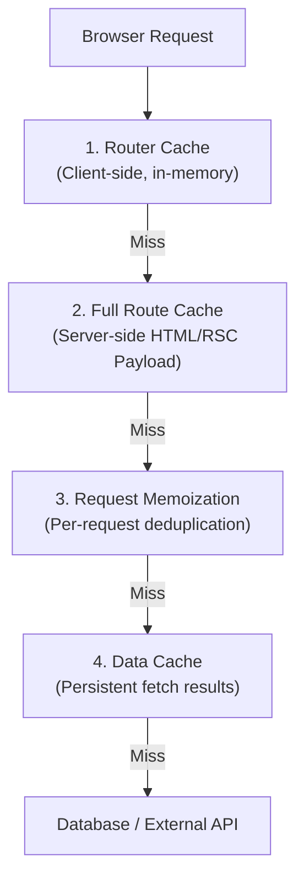

# Next.js Caching and Data Fetching

> A comprehensive guide to Next.js App Router's 4-layer caching architecture, covering Request Memoization, Data Cache, Full Route Cache, and Router Cache. Understanding these layers — and how to invalidate them — is essential for building fast, correct Next.js applications.

---

## 1. What is it? (What)

Next.js App Router implements an aggressive, multi-layered caching system that automatically caches data and rendered output at four distinct levels. This system is designed for maximum performance by default, with explicit opt-out mechanisms for dynamic content.

### Classification
- **Type**: Framework-level caching architecture.
- **Framework**: Next.js 13+ (App Router).
- **Layers**: Request Memoization, Data Cache, Full Route Cache, Router Cache.

### Architecture Overview



---

## 2. Why does it exist? (Why)

Without caching, every page request would require full server-side rendering and database queries, resulting in poor TTFB and wasted compute resources.

Next.js's 4-layer cache solves:

| Problem | Cache Layer |
|---|---|
| Same `fetch()` called in 5 components during one render | **Request Memoization** — deduplicates to 1 network call |
| Repeated API calls for the same data across requests | **Data Cache** — persists results across deployments |
| Re-rendering static pages on every request | **Full Route Cache** — serves pre-rendered HTML instantly |
| Re-fetching page data on client-side navigation | **Router Cache** — serves cached RSC payload from browser memory |

The trade-off is complexity: developers must understand which caches are active and how to invalidate them when data changes.

---

## 3. Without vs. With Comparison (Compare)

### Without understanding caching

```typescript
// Developer expects fresh data on every request
export default async function PostsPage() {
  // This fetch is cached indefinitely by default (Data Cache)
  const posts = await fetch("https://api.example.com/posts");
  // New posts added to the database do NOT appear
  // Developer is confused: "Why isn't my data updating?"
  return <PostList posts={await posts.json()} />;
}
```

### With proper cache configuration

```typescript
export default async function PostsPage() {
  // Option A: No caching — always fetch fresh (SSR behavior)
  const posts = await fetch("https://api.example.com/posts", {
    cache: "no-store",
  });

  // Option B: Time-based revalidation (ISR behavior)
  const posts2 = await fetch("https://api.example.com/posts", {
    next: { revalidate: 60 }, // Cache for 60 seconds
  });

  // Option C: Tag-based cache with on-demand invalidation
  const posts3 = await fetch("https://api.example.com/posts", {
    next: { tags: ["posts"] }, // Tagged for targeted invalidation
  });

  return <PostList posts={await posts.json()} />;
}
```

| Aspect | Without cache knowledge | With cache knowledge |
|---|---|---|
| Data freshness | Stale data served indefinitely | Controlled via revalidation strategy |
| Cache invalidation | Unknown / impossible | On-demand via `revalidatePath`/`revalidateTag` |
| Performance | Either all-cached or all-uncached | Granular per-fetch configuration |
| Debugging | "Why isn't my data updating?" | Clear mental model of 4 cache layers |

---

## 4. Common Use Cases

1. **Blog / CMS** — Static Generation with on-demand revalidation via webhook (tag-based cache invalidation).
2. **E-commerce product catalog** — ISR with 60-second revalidation; immediate invalidation on price changes via Server Actions.
3. **Dashboard** — `cache: "no-store"` for real-time data; cached static shell via Full Route Cache.
4. **User profile pages** — Dynamic rendering (uses `cookies()` for auth), bypasses Full Route Cache.
5. **Search results** — Dynamic route with `searchParams`, no Full Route Cache, but Data Cache for repeated queries.

### When to disable caching

- Pages displaying real-time data that must never be stale (e.g., live stock prices).
- Pages personalized per user via cookies or headers.
- Mutation-heavy workflows where stale reads cause data integrity issues.

---

## 5. Deep Practice

### Layer 1: Request Memoization

Automatically deduplicates identical `fetch()` calls within a **single server render**. If 5 components call `fetch("https://api.com/user")`, only one network request is made.

- **Scope**: Per-request (destroyed after render completes).
- **Benefit**: Enables co-located data fetching without worrying about redundant calls.

### Layer 2: Data Cache

Persists `fetch()` results across requests and deployments on the server.

- **Default behavior**: `cache: "force-cache"` (cached indefinitely).
- **Override**: `cache: "no-store"` (no caching) or `next: { revalidate: N }` (time-based).
- **Invalidation**: `revalidateTag("posts")` or `revalidatePath("/posts")`.

### Layer 3: Full Route Cache

Pre-renders entire routes as static HTML and RSC Payload at build time.

- **Activated when**: All data fetches in the route are cached (no dynamic functions).
- **Bypassed when**: The route uses `cookies()`, `headers()`, `searchParams`, or `cache: "no-store"`.

### Layer 4: Router Cache

Caches RSC payloads on the client during navigation.

- **Duration**: ~30 seconds for dynamic segments; ~5 minutes for static segments.
- **Benefit**: Instant back/forward navigation without network requests.
- **Invalidation**: `router.refresh()` or `revalidatePath()` from Server Actions.

### Revalidation Strategies

#### Path-based revalidation

```typescript
import { revalidatePath } from "next/cache";

export async function createPost() {
  await db.insert(/* ... */);
  revalidatePath("/blog"); // Purges Full Route Cache + Data Cache for /blog
}
```

#### Tag-based revalidation (recommended)

```typescript
// Tagging fetch calls
const posts = await fetch("https://api.com/posts", {
  next: { tags: ["posts"] },
});

// Invalidating by tag — purges ALL fetches tagged "posts" across all pages
import { revalidateTag } from "next/cache";

export async function updatePost() {
  await db.update(/* ... */);
  revalidateTag("posts");
}
```

### Best Practices

1. **Use tag-based revalidation over path-based** — Tags are more granular and cross-page.
2. **Default to caching; opt out explicitly** — Only use `cache: "no-store"` when freshness is genuinely required.
3. **Co-locate fetches** — Rely on Request Memoization to eliminate redundancy.
4. **Wrap slow components in `<Suspense>`** — Enables streaming and progressive rendering.
5. **Understand dynamic function triggers** — Using `cookies()`, `headers()`, or `searchParams` automatically makes a route dynamic.

### Common Pitfalls

1. **Not understanding default caching** — Data is cached indefinitely by default, leading to stale data confusion.
2. **Using `revalidatePath` when tags would be more precise** — Path revalidation is a blunt instrument.
3. **Forgetting Router Cache** — Even after server revalidation, the client may serve stale data for 30 seconds. Use `router.refresh()` for immediate client-side update.
4. **Mixing `cache: "no-store"` with static generation** — A single `no-store` fetch makes the entire route dynamic.
5. **Not using `<Suspense>` with async Server Components** — Without Suspense, the slowest component blocks the entire page.

### Production Checklist

- [ ] Each `fetch()` call has an explicit caching strategy (not relying on defaults).
- [ ] Tag-based revalidation set up for all mutable data sources.
- [ ] `<Suspense>` boundaries around all async Server Components.
- [ ] No accidental dynamic route triggers (check for unnecessary `cookies()`/`headers()` usage).
- [ ] Router Cache behavior understood and `router.refresh()` used where needed.

---

## 6. Code Templates and Integration

### Streaming Dashboard with Suspense

```typescript
// app/dashboard/page.tsx
import { Suspense } from "react";
import { Skeleton } from "@/components/ui/Skeleton";
import { RevenueChart } from "@/components/RevenueChart";
import { RecentOrders } from "@/components/RecentOrders";
import { TopProducts } from "@/components/TopProducts";

export default function DashboardPage() {
  return (
    <main>
      <h1>Dashboard</h1>

      {/* Each section loads independently — no waterfall */}
      <div className="grid grid-cols-2 gap-4">
        <Suspense fallback={<Skeleton className="h-64" />}>
          <RevenueChart />
        </Suspense>

        <Suspense fallback={<Skeleton className="h-64" />}>
          <TopProducts />
        </Suspense>
      </div>

      <Suspense fallback={<Skeleton className="h-96" />}>
        <RecentOrders />
      </Suspense>
    </main>
  );
}

// components/RevenueChart.tsx — Server Component
export async function RevenueChart() {
  const data = await fetch("https://api.example.com/revenue", {
    next: { tags: ["revenue"], revalidate: 300 },
  }).then((r) => r.json());

  return <Chart data={data} />;
}
```

---

## Related Topics

- [App Router & React Server Components](./app-router-rsc.md) — The component model that this caching system serves.
- [Web Performance & Core Web Vitals](../01-web-fundamentals/web-performance-vitals.md) — How caching impacts TTFB and LCP.
- [State Management Patterns](../02-reactjs/state-management-patterns.md) — Client-side caching (React Query) vs. server-side caching (Next.js).
