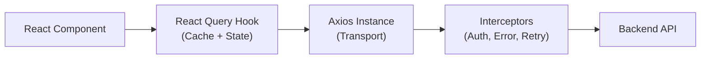

# API Layer Design

> A comprehensive guide to designing a production-grade API layer in frontend applications, covering Axios Interceptor architecture with automatic token refresh, OpenAPI code generation, and the separation of Transport (Axios) and Caching (React Query) layers.

---

## 1. What is it? (What)

The **API Layer** is the abstraction that sits between React components and backend services, handling HTTP communication, authentication, error normalization, caching, and request deduplication.

### Classification
- **Type**: Frontend architecture pattern.
- **Transport layer**: Axios / native `fetch`.
- **Caching layer**: React Query (TanStack Query) / SWR.
- **Code generation**: Orval / OpenAPI TypeScript Codegen.

### Layered Architecture



---

## 2. Why does it exist? (Why)

Without a structured API layer, each component independently handles fetching, error handling, authentication, and retry logic — leading to massive duplication and inconsistent behavior.

| Problem | API Layer Solution |
|---|---|
| Token attachment on every request | **Request Interceptor** — automatically injects `Authorization` header |
| Token expiry during a session | **Response Interceptor** — queues requests, refreshes token, retries |
| Manually typing API responses | **OpenAPI Codegen** — generates TypeScript types and hooks from Swagger spec |
| Duplicated loading/error states | **React Query** — provides `isLoading`, `error`, caching, and deduplication |
| Inconsistent error handling | **Centralized error normalizer** — transforms API errors into a uniform shape |

---

## 3. Without vs. With Comparison (Compare)

### Without API layer

```typescript
// Scattered across components — duplicated, inconsistent, error-prone
async function loadUser() {
  const token = localStorage.getItem("token");
  const res = await fetch("/api/users/me", {
    headers: { Authorization: `Bearer ${token}` },
  });
  if (res.status === 401) {
    // Manual refresh? Redirect? Each component handles differently.
  }
  return res.json();
}
```

### With API layer

```typescript
// Centralized — consistent, type-safe, handles all edge cases
const { data: user, isLoading, error } = useQuery({
  queryKey: ["user", "me"],
  queryFn: () => apiClient.get<User>("/users/me").then((r) => r.data),
});
// Token injection, refresh, and error handling are handled by interceptors.
```

| Aspect | Without API layer | With API layer |
|---|---|---|
| Token management | Manual per request | Automatic via interceptor |
| Token refresh | Duplicated or missing | Centralized with request queue |
| Error handling | Inconsistent per component | Normalized via interceptor |
| Type safety | Manual interface definitions | Auto-generated from OpenAPI |
| Caching | None (or manual) | React Query with configurable staleness |

---

## 4. Common Use Cases

1. **Authenticated SPAs** — Automatic token injection and refresh on 401 responses.
2. **Multi-API backends** — Separate Axios instances with different base URLs and interceptors.
3. **OpenAPI-first development** — Backend publishes Swagger spec; frontend auto-generates types and hooks.
4. **Optimistic updates** — React Query `onMutate` for instant UI feedback.
5. **Offline-capable apps** — React Query persistence with `@tanstack/query-persist-client`.

---

## 5. Deep Practice

### Axios Instance with Token Refresh Queue

```typescript
import axios from "axios";

export const apiClient = axios.create({
  baseURL: process.env.NEXT_PUBLIC_API_URL,
  timeout: 10_000,
});

// Request Interceptor — attach token
apiClient.interceptors.request.use((config) => {
  const token = getAccessToken();
  if (token) {
    config.headers.Authorization = `Bearer ${token}`;
  }
  return config;
});

// Response Interceptor — handle 401 with refresh queue
let isRefreshing = false;
let failedQueue: Array<{
  resolve: (token: string) => void;
  reject: (error: Error) => void;
}> = [];

function processQueue(error: Error | null, token: string | null = null) {
  failedQueue.forEach((promise) => {
    if (error) promise.reject(error);
    else if (token) promise.resolve(token);
  });
  failedQueue = [];
}

apiClient.interceptors.response.use(
  (response) => response,
  async (error) => {
    const originalRequest = error.config;

    if (error.response?.status === 401 && !originalRequest._retry) {
      if (isRefreshing) {
        return new Promise<string>((resolve, reject) => {
          failedQueue.push({ resolve, reject });
        }).then((token) => {
          originalRequest.headers.Authorization = `Bearer ${token}`;
          return apiClient(originalRequest);
        });
      }

      originalRequest._retry = true;
      isRefreshing = true;

      try {
        const newToken = await refreshAccessToken();
        saveAccessToken(newToken);
        processQueue(null, newToken);
        originalRequest.headers.Authorization = `Bearer ${newToken}`;
        return apiClient(originalRequest);
      } catch (refreshError) {
        processQueue(refreshError as Error, null);
        forceLogout();
        return Promise.reject(refreshError);
      } finally {
        isRefreshing = false;
      }
    }
    return Promise.reject(error);
  }
);
```

### OpenAPI Code Generation with Orval

```typescript
// orval.config.ts
import { defineConfig } from "orval";

export default defineConfig({
  api: {
    input: "https://backend.example.com/api-docs/openapi.json",
    output: {
      mode: "tags-split",
      target: "src/api/generated",
      client: "react-query",
      override: {
        mutator: {
          path: "./src/api/client.ts",
          name: "apiClient",
        },
      },
    },
  },
});

// Generated hook — fully type-safe, no manual type definitions
// const { data, isLoading } = useGetUserById(userId);
```

### Best Practices

1. **Separate Transport from Caching** — Axios handles HTTP; React Query handles state. They are complementary, not interchangeable.
2. **Use a request queue for token refresh** — Multiple concurrent 401s should not trigger multiple refresh calls.
3. **Always set `timeout`** on Axios instances — Prevents UI from hanging indefinitely on unresponsive backends.
4. **Generate types from OpenAPI** — Never manually maintain TypeScript interfaces for API responses.
5. **Normalize errors** — Transform backend error shapes into a consistent `{ code, message, details }` format.

### Common Pitfalls

1. **Multiple token refresh calls** — Without a queue, concurrent 401s trigger multiple refresh attempts, causing race conditions.
2. **Storing tokens in `localStorage`** — Vulnerable to XSS. Prefer `HttpOnly` cookies for access tokens.
3. **No timeout on HTTP requests** — A single unresponsive API can freeze the entire application.
4. **Manually maintaining API types** — Types drift out of sync with the backend; use code generation.
5. **Mixing fetch strategies** — Using both `useEffect` + `fetch` and React Query in the same project creates inconsistent caching behavior.

### Production Checklist

- [ ] Centralized Axios instance with `baseURL`, `timeout`, and interceptors.
- [ ] Token refresh interceptor with request queue for concurrent 401 handling.
- [ ] React Query configured with appropriate `staleTime` and `gcTime`.
- [ ] API types auto-generated from OpenAPI spec (Orval or equivalent).
- [ ] Error normalization layer produces consistent error shapes.

---

## 6. Code Templates and Integration

### React Query Configuration

```typescript
// src/lib/query-client.ts
import { QueryClient } from "@tanstack/react-query";

export const queryClient = new QueryClient({
  defaultOptions: {
    queries: {
      staleTime: 5 * 60 * 1000,    // 5 minutes
      gcTime: 10 * 60 * 1000,      // 10 minutes
      retry: 1,
      refetchOnWindowFocus: true,
    },
    mutations: {
      retry: 0,
    },
  },
});
```

---

## Related Topics

- [State Management Patterns](../02-reactjs/state-management-patterns.md) — Server State (React Query) vs. Client State (Zustand).
- [Frontend Security](./frontend-security.md) — Token storage strategies (HttpOnly Cookies vs. localStorage).
- [Caching & Data Fetching (Next.js)](../03-nextjs/caching-and-data-fetching.md) — Server-side caching that complements client-side React Query.
