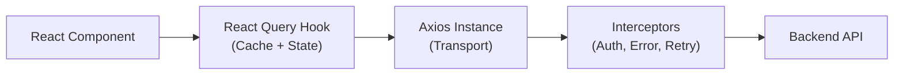

# API Layer Design

<details>
<summary>🇻🇳 <b>Hiển thị bản dịch Tiếng Việt</b></summary>
<br>

> **Tóm tắt**: Hướng dẫn toàn diện về cách thiết kế tầng API cấp production trong các ứng dụng frontend, bao gồm kiến trúc Axios Interceptor với tính năng tự động làm mới token, sinh code tự động từ OpenAPI, và việc tách biệt giữa tầng Giao tiếp (Axios) và tầng Bộ nhớ đệm (React Query).

</details>

> **Summary**: A comprehensive guide to designing a production-grade API layer in frontend applications, covering Axios Interceptor architecture with automatic token refresh, OpenAPI code generation, and the separation of Transport (Axios) and Caching (React Query) layers.

---

## ELI5 (Explain Like I'm 5)

<details>
<summary>🇻🇳 <b>Hiển thị bản dịch Tiếng Việt</b></summary>
<br>

Hãy tưởng tượng bạn là Giám đốc công ty và cần gửi thư cho các đối tác:
- **Không có API Layer**: Bạn tự tay viết thư, tự dán tem, tự đạp xe ra bưu điện gửi, và tự ngồi chờ xem thư có bị trả lại không. Quá mệt mỏi!
- **Có API Layer**: Bạn thuê một cô Thư ký (Axios). Bạn chỉ việc nói "Gửi thư này cho ông A". Thư ký sẽ tự động dán tem bản quyền (Access Token), tự đạp xe đi gửi. Nếu tem hết hạn, thư ký tự xin tem mới (Token Refresh) rồi gửi lại mà không cần hỏi bạn. Hơn nữa, thư ký còn cất sẵn các lá thư cũ vào tủ (React Query) để khi bạn hỏi lại, cô ấy lấy ra ngay lập tức.

</details>

Imagine you are the CEO of a company and need to send letters to partners:
- **Without an API Layer**: You write the letter yourself, lick the stamp yourself, ride your bike to the post office yourself, and wait to see if the letter gets returned. Exhausting!
- **With an API Layer**: You hire a Secretary (Axios). You just say, "Send this to Mr. A." The secretary automatically attaches the company seal (Access Token) and mails it. If the seal is expired, the secretary gets a new one (Token Refresh) and resends the letter without bothering you. Even better, she keeps copies of old letters in a cabinet (React Query) so if you ask for it again, she hands it to you instantly.

---

## Layer 1: What is it? (What)

<details>
<summary>🇻🇳 <b>Hiển thị bản dịch Tiếng Việt</b></summary>
<br>

**Tầng API (API Layer)** là lớp phần mềm nằm giữa giao diện React và Server Backend. Nhiệm vụ của nó là xử lý mọi thứ liên quan đến giao tiếp mạng HTTP: xác thực người dùng, xử lý lỗi, lưu bộ nhớ đệm (cache), và gộp các yêu cầu trùng lặp lại với nhau.

**Phân loại:**
- **Loại**: Mẫu kiến trúc Frontend.
- **Tầng giao tiếp (Transport)**: Axios hoặc `fetch` gốc.
- **Tầng bộ nhớ đệm (Caching)**: React Query (TanStack Query) hoặc SWR.
- **Tự động sinh code**: Orval / OpenAPI TypeScript Codegen.

</details>

The **API Layer** is the abstraction that sits between React components and backend services, handling HTTP communication, authentication, error normalization, caching, and request deduplication.

### Classification
- **Type**: Frontend architecture pattern.
- **Transport layer**: Axios / native `fetch`.
- **Caching layer**: React Query (TanStack Query) / SWR.
- **Code generation**: Orval / OpenAPI TypeScript Codegen.

### Layered Architecture



---

## Layer 2: Why does it exist? (Why)

<details>
<summary>🇻🇳 <b>Hiển thị bản dịch Tiếng Việt</b></summary>
<br>

Nếu không có Tầng API chuẩn mực, mỗi Component tự gọi API theo cách riêng của nó. Điều này tạo ra một mớ bòng bong mã nguồn lặp lại và dễ lỗi.

Tầng API giải quyết:
- **Gắn Token (chứng minh danh tính)**: Interceptor tự động gắn `Authorization` vào mọi yêu cầu.
- **Token hết hạn**: Interceptor tự động tạm dừng mọi yêu cầu, đi xin Token mới, rồi chạy tiếp.
- **Kiểu dữ liệu (TypeScript)**: Tự sinh mã từ tài liệu Swagger/OpenAPI của Backend, không phải viết tay.
- **Quản lý trạng thái (Loading/Error)**: React Query tự động theo dõi và cung cấp biến `isLoading`, `error` cho bạn vẽ UI.

</details>

Without a structured API layer, each component independently handles fetching, error handling, authentication, and retry logic — leading to massive duplication and inconsistent behavior.

| Problem | API Layer Solution |
|---|---|
| Token attachment on every request | **Request Interceptor** — automatically injects `Authorization` header |
| Token expiry during a session | **Response Interceptor** — queues requests, refreshes token, retries |
| Manually typing API responses | **OpenAPI Codegen** — generates TypeScript types and hooks from Swagger spec |
| Duplicated loading/error states | **React Query** — provides `isLoading`, `error`, caching, and deduplication |
| Inconsistent error handling | **Centralized error normalizer** — transforms API errors into a uniform shape |

---

## Layer 3: Without vs. With Comparison (Compare)

<details>
<summary>🇻🇳 <b>Hiển thị bản dịch Tiếng Việt</b></summary>
<br>

Không có API Layer: Tự viết hàm `fetch`, tự lấy token từ `localStorage`, tự bắt lỗi 401. Viết đi viết lại 100 lần ở 100 component khác nhau.
Có API Layer: Dùng React Query. Mọi logic lấy token, làm mới token, hay parse JSON đều được làm ẩn ở lớp dưới (Axios Interceptors).

</details>

### Without API layer

```typescript
// Scattered across components — duplicated, inconsistent, error-prone
async function loadUser() {
  const token = localStorage.getItem("token");
  const res = await fetch("/api/users/me", {
    headers: { Authorization: `Bearer ${token}` },
  });
  if (res.status === 401) {
    // Manual refresh? Redirect? Each component handles differently.
  }
  return res.json();
}
```

### With API layer

```typescript
// Centralized — consistent, type-safe, handles all edge cases
const { data: user, isLoading, error } = useQuery({
  queryKey: ["user", "me"],
  queryFn: () => apiClient.get<User>("/users/me").then((r) => r.data),
});
// Token injection, refresh, and error handling are handled by interceptors.
```

| Aspect | Without API layer | With API layer |
|---|---|---|
| Token management | Manual per request | Automatic via interceptor |
| Token refresh | Duplicated or missing | Centralized with request queue |
| Error handling | Inconsistent per component | Normalized via interceptor |
| Type safety | Manual interface definitions | Auto-generated from OpenAPI |
| Caching | None (or manual) | React Query with configurable staleness |

---

## Layer 4: Common Use Cases

<details>
<summary>🇻🇳 <b>Hiển thị bản dịch Tiếng Việt</b></summary>
<br>

1. **Web cần đăng nhập (SPA)**: Luôn cần cơ chế tự động gia hạn phiên đăng nhập (Token Refresh).
2. **Hệ thống gọi nhiều API backend**: Tạo ra các đối tượng Axios (Instances) khác nhau cho từng Backend (ví dụ Backend thanh toán riêng, Backend tin tức riêng).
3. **Phát triển dựa trên OpenAPI (Swagger)**: Đợi Backend viết tài liệu, Frontend chạy lệnh sinh ra toàn bộ code gọi API.
4. **Cập nhật tức thì (Optimistic updates)**: Bấm like hiện xanh luôn, ngầm gọi API sau (Dùng React Query `onMutate`).
5. **App chạy offline**: React Query tự động lưu dữ liệu xuống máy để xài khi rớt mạng.

</details>

1. **Authenticated SPAs** — Automatic token injection and refresh on 401 responses.
2. **Multi-API backends** — Separate Axios instances with different base URLs and interceptors.
3. **OpenAPI-first development** — Backend publishes Swagger spec; frontend auto-generates types and hooks.
4. **Optimistic updates** — React Query `onMutate` for instant UI feedback.
5. **Offline-capable apps** — React Query persistence with `@tanstack/query-persist-client`.

---

## Layer 5: Deep Practice

<details>
<summary>🇻🇳 <b>Hiển thị bản dịch Tiếng Việt</b></summary>
<br>

**Axios Interceptors với Hàng đợi (Queue)**: 
Điều gì xảy ra nếu bạn gọi 5 API cùng lúc, cả 5 đều bị báo 401 (Hết hạn Token)? 
Nếu code không chuẩn, bạn sẽ bắn đi 5 yêu cầu Refresh Token! 
Cách đúng là: Khi API đầu tiên bị lỗi 401, hãy bật cờ `isRefreshing = true`, đẩy 4 API còn lại vào Hàng đợi (Queue). Đi đổi Token mới, xong xuôi thì lấy ra ghép vào 5 API cũ và gửi đi lại.

**Quy tắc vàng**:
1. Axios và React Query có vai trò riêng. Axios = Đứa chạy việc giao hàng. React Query = Cái tủ lạnh lưu hàng. Đừng nhầm lẫn.
2. Luôn cài `timeout` cho Axios để app không bị treo nếu server chết.

</details>

### Axios Instance with Token Refresh Queue

```typescript
import axios from "axios";

export const apiClient = axios.create({
  baseURL: process.env.NEXT_PUBLIC_API_URL,
  timeout: 10_000,
});

// Request Interceptor — attach token
apiClient.interceptors.request.use((config) => {
  const token = getAccessToken();
  if (token) {
    config.headers.Authorization = `Bearer ${token}`;
  }
  return config;
});

// Response Interceptor — handle 401 with refresh queue
let isRefreshing = false;
let failedQueue: Array<{
  resolve: (token: string) => void;
  reject: (error: Error) => void;
}> = [];

function processQueue(error: Error | null, token: string | null = null) {
  failedQueue.forEach((promise) => {
    if (error) promise.reject(error);
    else if (token) promise.resolve(token);
  });
  failedQueue = [];
}

apiClient.interceptors.response.use(
  (response) => response,
  async (error) => {
    const originalRequest = error.config;

    if (error.response?.status === 401 && !originalRequest._retry) {
      if (isRefreshing) {
        return new Promise<string>((resolve, reject) => {
          failedQueue.push({ resolve, reject });
        }).then((token) => {
          originalRequest.headers.Authorization = `Bearer ${token}`;
          return apiClient(originalRequest);
        });
      }

      originalRequest._retry = true;
      isRefreshing = true;

      try {
        const newToken = await refreshAccessToken();
        saveAccessToken(newToken);
        processQueue(null, newToken);
        originalRequest.headers.Authorization = `Bearer ${newToken}`;
        return apiClient(originalRequest);
      } catch (refreshError) {
        processQueue(refreshError as Error, null);
        forceLogout();
        return Promise.reject(refreshError);
      } finally {
        isRefreshing = false;
      }
    }
    return Promise.reject(error);
  }
);
```

### OpenAPI Code Generation with Orval

```typescript
// orval.config.ts
import { defineConfig } from "orval";

export default defineConfig({
  api: {
    input: "https://backend.example.com/api-docs/openapi.json",
    output: {
      mode: "tags-split",
      target: "src/api/generated",
      client: "react-query",
      override: {
        mutator: {
          path: "./src/api/client.ts",
          name: "apiClient",
        },
      },
    },
  },
});

// Generated hook — fully type-safe, no manual type definitions
// const { data, isLoading } = useGetUserById(userId);
```

### Best Practices

1. **Separate Transport from Caching** — Axios handles HTTP; React Query handles state. They are complementary, not interchangeable.
2. **Use a request queue for token refresh** — Multiple concurrent 401s should not trigger multiple refresh calls.
3. **Always set `timeout`** on Axios instances — Prevents UI from hanging indefinitely on unresponsive backends.
4. **Generate types from OpenAPI** — Never manually maintain TypeScript interfaces for API responses.
5. **Normalize errors** — Transform backend error shapes into a consistent `{ code, message, details }` format.

### Common Pitfalls

1. **Multiple token refresh calls** — Without a queue, concurrent 401s trigger multiple refresh attempts, causing race conditions.
2. **Storing tokens in `localStorage`** — Vulnerable to XSS. Prefer `HttpOnly` cookies for access tokens.
3. **No timeout on HTTP requests** — A single unresponsive API can freeze the entire application.
4. **Manually maintaining API types** — Types drift out of sync with the backend; use code generation.
5. **Mixing fetch strategies** — Using both `useEffect` + `fetch` and React Query in the same project creates inconsistent caching behavior.

### Production Checklist

- [ ] Centralized Axios instance with `baseURL`, `timeout`, and interceptors.
- [ ] Token refresh interceptor with request queue for concurrent 401 handling.
- [ ] React Query configured with appropriate `staleTime` and `gcTime`.
- [ ] API types auto-generated from OpenAPI spec (Orval or equivalent).
- [ ] Error normalization layer produces consistent error shapes.

---

## Layer 6: Code Templates and Integration

<details>
<summary>🇻🇳 <b>Hiển thị bản dịch Tiếng Việt</b></summary>
<br>

Dưới đây là thiết lập cơ bản cho React Query. `staleTime: 5 phút` nghĩa là trong vòng 5 phút sau lần gọi đầu tiên, nếu có chỗ nào khác đòi gọi dữ liệu này, React Query sẽ đưa đồ cũ ra xài mà không thèm gọi mạng. `gcTime` (Garbage Collection) nghĩa là sau 10 phút không xài tới thì nó sẽ bị xóa khỏi RAM trình duyệt.

</details>

### React Query Configuration

```typescript
// src/lib/query-client.ts
import { QueryClient } from "@tanstack/react-query";

export const queryClient = new QueryClient({
  defaultOptions: {
    queries: {
      staleTime: 5 * 60 * 1000,    // 5 minutes
      gcTime: 10 * 60 * 1000,      // 10 minutes
      retry: 1,
      refetchOnWindowFocus: true,
    },
    mutations: {
      retry: 0,
    },
  },
});
```

---

## Related Topics

- [State Management Patterns](../02-reactjs/state-management-patterns.md) — Server State (React Query) vs. Client State (Zustand).
- [Frontend Security](./frontend-security.md) — Token storage strategies (HttpOnly Cookies vs. localStorage).
- [Caching & Data Fetching (Next.js)](../03-nextjs/caching-and-data-fetching.md) — Server-side caching that complements client-side React Query.
