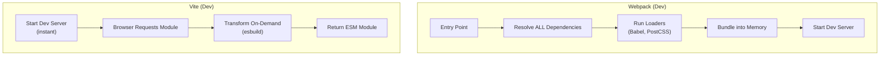

# Vite vs Webpack Internals

> A technical comparison of the two dominant JavaScript build tools — Webpack (bundle-based) and Vite (native ESM-based) — covering their internal architectures, development server strategies, production build pipelines, and bundle optimization techniques.

---

## 1. What is it? (What)

**Build tools** (bundlers) are programs that transform modern JavaScript/TypeScript source code into optimized assets that browsers can execute. They resolve module dependencies, transpile syntax, split code, and optimize output for production.

### Classification
- **Type**: Frontend build tool / module bundler.
- **Webpack**: Bundle-based, highly configurable, mature ecosystem.
- **Vite**: Native ESM-based development, Rollup-based production builds, optimized for speed.

### Architecture Comparison



---

## 2. Why does it exist? (Why)

Browsers cannot natively execute TypeScript, JSX, or import from `node_modules`. Build tools solve this by:

| Problem | Solution |
|---|---|
| Browsers do not understand TypeScript/JSX | Transpilation (esbuild, Babel, SWC) |
| Thousands of modules cause waterfall requests | Bundling into fewer optimized files |
| Dead code increases bundle size | Tree Shaking (removing unused exports) |
| Large bundles delay page load | Code Splitting (lazy loading chunks) |

**Vite** was created by Evan You (Vue.js creator) because Webpack's bundle-everything-first approach becomes intolerably slow for large projects. Vite's key insight: modern browsers support native ESM, so development servers do not need to bundle at all.

---

## 3. Without vs. With Comparison (Compare)

### Webpack Development (Bundle-first)

```
1. Developer runs `webpack serve`
2. Webpack reads entry → resolves ALL dependencies → runs Babel on every file
3. Bundles EVERYTHING into memory (main.js: ~10MB)
4. Starts dev server after 20-120 seconds
5. Developer edits a file → HMR recompiles affected module chain → 2-5 seconds
```

### Vite Development (On-demand transform)

```
1. Developer runs `vite`
2. Vite starts HTTP server instantly (~100ms)
3. Vite pre-bundles node_modules once (esbuild, ~500ms, cached)
4. Browser loads page → requests modules via native ESM imports
5. Vite transforms each requested file on-demand (esbuild: <50ms per file)
6. Developer edits a file → HMR updates only that module → <100ms
```

| Aspect | Webpack | Vite |
|---|---|---|
| Dev server startup | 20-120 seconds (scales with project size) | <500ms (constant, regardless of project size) |
| HMR speed | 2-5 seconds | <100ms |
| Dev bundling | Bundles everything upfront | No bundling; on-demand transforms |
| Transpiler | Babel (JavaScript, slow) | esbuild (Go, 10-100x faster) |
| Production bundler | Webpack itself | Rollup |
| Plugin ecosystem | Massive (10+ years) | Growing rapidly; Rollup-compatible |
| Configuration | Complex, verbose | Minimal, convention-based |
| Module Federation | Native support | Plugin (`vite-plugin-federation`) |

---

## 4. Common Use Cases

| Scenario | Recommended Tool | Reasoning |
|---|---|---|
| New React/Next.js project | Vite (or Next.js built-in) | Fastest DX, minimal configuration |
| Micro-frontend with Module Federation | Webpack 5 or Rspack | Mature MFE support |
| Legacy enterprise migration | Webpack | Existing config, loader ecosystem |
| Library development | Vite (library mode) or Rollup | Clean ESM output |
| Monorepo with Turborepo | Either | Both integrate with Turborepo |

### When Webpack is still the better choice

- Projects requiring Module Federation for micro-frontend architecture.
- Existing large codebases with extensive custom Webpack configuration (loaders, plugins).
- Edge cases requiring Webpack-specific loaders that have no Vite equivalent.

---

## 5. Deep Practice

### Vite Pre-bundling

Third-party libraries in `node_modules` typically use CommonJS (`require()`), which browsers cannot execute. Vite solves this on first startup:

1. Scans all `import` statements to identify dependencies.
2. Uses `esbuild` to convert CommonJS modules to ESM format.
3. Caches the result in `.vite/deps/` — subsequent starts are instant.

### Production Build Comparison

Vite does **not** use esbuild for production builds. It uses **Rollup**, which provides superior:
- Tree Shaking (dead code elimination)
- Code Splitting (granular chunk generation)
- Plugin flexibility

Webpack handles production builds with its own bundling engine and supports:
- Advanced chunk splitting strategies (`splitChunks`)
- Module Federation for runtime code sharing
- A larger ecosystem of optimization plugins

### Bundle Size Optimization (Both Tools)

1. **Tree Shaking**: Build tools automatically remove unused exports. Ensure code uses ESM (`import { x }` not `require()`).
2. **Code Splitting**: Use dynamic `import()` or React `lazy()` to split code at route or component boundaries.
3. **Bundle analysis**: Use `rollup-plugin-visualizer` (Vite) or `webpack-bundle-analyzer` (Webpack) to identify oversized dependencies.
4. **Replace heavy libraries**: Swap `moment.js` (72KB) for `date-fns` (tree-shakeable) or `dayjs` (2KB).
5. **Externalize large dependencies**: For CDN-hosted libraries, mark them as `external` to exclude from the bundle.

### Best Practices

1. **Use Vite for new projects** — The DX improvement is transformative for developer productivity.
2. **Always analyze bundle output** — Schedule regular bundle analysis in the development workflow.
3. **Set bundle size budgets** — Use `size-limit` or `bundlesize` in CI to prevent regressions.
4. **Prefer `import()` over `require()`** — ESM enables tree shaking; CommonJS does not.
5. **Keep dependencies updated** — Newer versions of libraries are often smaller and more tree-shakeable.

### Common Pitfalls

1. **Assuming Vite uses esbuild in production** — It uses Rollup; esbuild is development-only.
2. **CommonJS imports preventing tree shaking** — `require("lodash")` imports the entire library; `import { debounce } from "lodash-es"` enables tree shaking.
3. **Over-configuring Webpack** — Many features that required plugins 5 years ago are now built-in.
4. **Ignoring bundle analysis** — A single accidental import can add hundreds of KB to the bundle.
5. **Not caching pre-bundled dependencies in CI** — Missing `.vite/deps` cache causes repeated pre-bundling.

### Production Checklist

- [ ] Bundle analyzer integrated and reviewed before major releases.
- [ ] Bundle size budget enforced in CI pipeline.
- [ ] No CommonJS `require()` in application code.
- [ ] Dynamic `import()` applied for route-level code splitting.
- [ ] Oversized dependencies identified and replaced or externalized.
- [ ] Source maps configured for production error tracking (not publicly accessible).

---

## 6. Code Templates and Integration

### Minimal Vite Configuration

```typescript
// vite.config.ts
import { defineConfig } from "vite";
import react from "@vitejs/plugin-react";

export default defineConfig({
  plugins: [react()],
  build: {
    rollupOptions: {
      output: {
        manualChunks: {
          vendor: ["react", "react-dom"],
          router: ["react-router-dom"],
        },
      },
    },
    sourcemap: true,
  },
  server: {
    port: 3000,
    proxy: {
      "/api": {
        target: "http://localhost:8080",
        changeOrigin: true,
      },
    },
  },
});
```

---

## Related Topics

- [Frontend CI/CD & Deployment](./frontend-ci-cd.md) — Build pipelines that consume bundler output.
- [Micro-frontends & Monorepos](../05-frontend-architecture/microfrontends-monorepos.md) — Module Federation with Webpack.
- [Web Performance & Core Web Vitals](../01-web-fundamentals/web-performance-vitals.md) — Bundle size impact on LCP and INP.
