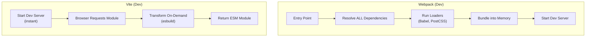

# Vite vs Webpack Internals

<details>
<summary>🇻🇳 <b>Hiển thị bản dịch Tiếng Việt</b></summary>
<br>

> **Tóm tắt**: So sánh kỹ thuật giữa hai công cụ build JavaScript thống trị hiện nay — Webpack (dựa trên bundle) và Vite (dựa trên native ESM). Phân tích kiến trúc bên trong, chiến lược dev server, luồng build cho production, và các kỹ thuật tối ưu hóa bundle.

</details>

> **Summary**: A technical comparison of the two dominant JavaScript build tools — Webpack (bundle-based) and Vite (native ESM-based) — covering their internal architectures, development server strategies, production build pipelines, and bundle optimization techniques.

---

## ELI5 (Explain Like I'm 5)

<details>
<summary>🇻🇳 <b>Hiển thị bản dịch Tiếng Việt</b></summary>
<br>

Hãy tưởng tượng bạn gọi món tại một nhà hàng:
- **Webpack (Kiểu cũ)**: Bạn gọi 10 món. Bếp trưởng (Webpack) bắt đầu nấu cả 10 món. Bạn phải ngồi đợi 20 phút cho đến khi tất cả nấu xong, đóng gói vào 1 cái mâm khổng lồ (Bundle) rồi mới bê ra cho bạn ăn. Nếu bạn đổi ý món số 1, bếp trưởng lại phải nấu và đóng gói lại nguyên cái mâm đó (Rất chậm lúc dev).
- **Vite (Kiểu mới)**: Nhà hàng có sẵn quầy buffet. Bạn gọi món nào (Native ESM import), bếp trưởng nướng món đó bằng lò vi sóng siêu tốc (esbuild) và đưa ra ngay lập tức trong 50 mili-giây. Bạn sửa món nào, chỉ món đó được làm lại. Vì thế Vite chạy gần như ngay lập tức, bất kể dự án có lớn đến đâu.

</details>

Imagine ordering food at a restaurant:
- **Webpack (Old way)**: You order 10 dishes. The chef (Webpack) starts cooking all 10 dishes. You have to wait 20 minutes until everything is cooked, packed onto one giant tray (a Bundle), and finally served to you. If you change your mind about dish #1, the chef has to repackage the entire tray (Very slow during dev).
- **Vite (New way)**: The restaurant has a buffet counter. Whichever dish you ask for (Native ESM import), the chef zaps it in a super-fast microwave (esbuild) and hands it to you instantly in 50 milliseconds. If you change a dish, only that specific dish is remade. That's why Vite starts up almost instantly, regardless of how massive the project gets.

---

## Layer 1: What is it? (What)

<details>
<summary>🇻🇳 <b>Hiển thị bản dịch Tiếng Việt</b></summary>
<br>

**Build tools** (Công cụ đóng gói) là các chương trình biến mã nguồn JavaScript/TypeScript hiện đại thành các file tĩnh được tối ưu hóa để trình duyệt có thể đọc hiểu. Chúng đảm nhận việc tìm kiếm các file liên quan (dependencies), dịch cú pháp (transpile), chia nhỏ code (code splitting), và tối ưu dung lượng.

**Phân loại:**
- **Loại**: Công cụ Build Frontend.
- **Webpack**: Phải đóng gói mọi thứ (Bundle-based), cấu hình cực kỳ chi tiết, hệ sinh thái lâu đời nhất.
- **Vite**: Chạy dev dựa trên chuẩn module gốc của trình duyệt (Native ESM), chạy production dựa trên Rollup, tối ưu tối đa cho tốc độ.

</details>

**Build tools** (bundlers) are programs that transform modern JavaScript/TypeScript source code into optimized assets that browsers can execute. They resolve module dependencies, transpile syntax, split code, and optimize output for production.

### Classification
- **Type**: Frontend build tool / module bundler.
- **Webpack**: Bundle-based, highly configurable, mature ecosystem.
- **Vite**: Native ESM-based development, Rollup-based production builds, optimized for speed.

### Architecture Comparison



---

## Layer 2: Why does it exist? (Why)

<details>
<summary>🇻🇳 <b>Hiển thị bản dịch Tiếng Việt</b></summary>
<br>

Trình duyệt không hiểu được TypeScript, không hiểu JSX, và cũng không tự động chui vào thư mục `node_modules` để tìm thư viện như Node.js được. Build tools sinh ra để giải quyết:

| Vấn đề | Giải pháp của Build Tool |
|---|---|
| Trình duyệt không hiểu TS/JSX | Dịch ngược về JS thuần (Transpilation - esbuild, Babel) |
| Web tải 1000 file JS quá chậm | Gom lại thành vài file lớn (Bundling) |
| Code rác làm web nặng | Rung cây (Tree Shaking) rũ bỏ code không xài |
| Gói JS quá to làm web đơ | Chia nhỏ (Code Splitting) chỉ tải những trang đang xem |

**Vite** được sinh ra vì cách gom tất cả của Webpack dần trở nên quá chậm chạp (có dự án khởi động dev server mất 2-3 phút). Khám phá của Vite: Trình duyệt hiện đại đã tự hiểu lệnh `import`, vậy tại sao lúc code (Dev) chúng ta phải Bundle làm gì?

</details>

Browsers cannot natively execute TypeScript, JSX, or import from `node_modules`. Build tools solve this by:

| Problem | Solution |
|---|---|
| Browsers do not understand TypeScript/JSX | Transpilation (esbuild, Babel, SWC) |
| Thousands of modules cause waterfall requests | Bundling into fewer optimized files |
| Dead code increases bundle size | Tree Shaking (removing unused exports) |
| Large bundles delay page load | Code Splitting (lazy loading chunks) |

**Vite** was created by Evan You (Vue.js creator) because Webpack's bundle-everything-first approach becomes intolerably slow for large projects. Vite's key insight: modern browsers support native ESM, so development servers do not need to bundle at all.

---

## Layer 3: Without vs. With Comparison (Compare)

<details>
<summary>🇻🇳 <b>Hiển thị bản dịch Tiếng Việt</b></summary>
<br>

**Webpack**: Đọc toàn bộ source code -> Dịch bằng Babel (chậm) -> Đóng gói vào 1 file khổng lồ trên RAM -> Xong mới mở Dev Server.
**Vite**: Mở Dev Server ngay lập tức (100ms) -> Trình duyệt yêu cầu file nào -> Vite dùng esbuild dịch đúng file đó trong 50ms rồi ném ra. Bạn sửa file nào, nó cập nhật đúng file đó (HMR - Hot Module Replacement) chỉ trong nháy mắt.

</details>

### Webpack Development (Bundle-first)

```
1. Developer runs `webpack serve`
2. Webpack reads entry → resolves ALL dependencies → runs Babel on every file
3. Bundles EVERYTHING into memory (main.js: ~10MB)
4. Starts dev server after 20-120 seconds
5. Developer edits a file → HMR recompiles affected module chain → 2-5 seconds
```

### Vite Development (On-demand transform)

```
1. Developer runs `vite`
2. Vite starts HTTP server instantly (~100ms)
3. Vite pre-bundles node_modules once (esbuild, ~500ms, cached)
4. Browser loads page → requests modules via native ESM imports
5. Vite transforms each requested file on-demand (esbuild: <50ms per file)
6. Developer edits a file → HMR updates only that module → <100ms
```

| Aspect | Webpack | Vite |
|---|---|---|
| Dev server startup | 20-120 seconds (scales with project size) | <500ms (constant, regardless of project size) |
| HMR speed | 2-5 seconds | <100ms |
| Dev bundling | Bundles everything upfront | No bundling; on-demand transforms |
| Transpiler | Babel (JavaScript, slow) | esbuild (Go, 10-100x faster) |
| Production bundler | Webpack itself | Rollup |
| Plugin ecosystem | Massive (10+ years) | Growing rapidly; Rollup-compatible |
| Configuration | Complex, verbose | Minimal, convention-based |
| Module Federation | Native support | Plugin (`vite-plugin-federation`) |

---

## Layer 4: Common Use Cases

<details>
<summary>🇻🇳 <b>Hiển thị bản dịch Tiếng Việt</b></summary>
<br>

| Kịch bản | Khuyên dùng | Lý do |
|---|---|---|
| Dự án React/Next.js MỚI | Vite (hoặc tool có sẵn của Next.js) | Tốc độ code nhanh nhất, cấu hình tối thiểu |
| Micro-frontend | Webpack 5 | Module Federation là của Webpack, hỗ trợ trưởng thành nhất |
| Dự án cũ khổng lồ | Giữ Webpack | Đổi sang Vite tốn quá nhiều công sức fix cấu hình |

**Lưu ý**: Đối với dự án dùng Vite, lúc chạy Production nó sẽ không dùng esbuild siêu tốc nữa, mà chuyển sang dùng **Rollup** để đóng gói. Rollup tuy chậm hơn esbuild nhưng bù lại có khả năng rũ bỏ code thừa (Tree Shaking) tốt nhất thế giới.

</details>

| Scenario | Recommended Tool | Reasoning |
|---|---|---|
| New React/Next.js project | Vite (or Next.js built-in) | Fastest DX, minimal configuration |
| Micro-frontend with Module Federation | Webpack 5 or Rspack | Mature MFE support |
| Legacy enterprise migration | Webpack | Existing config, loader ecosystem |
| Library development | Vite (library mode) or Rollup | Clean ESM output |
| Monorepo with Turborepo | Either | Both integrate with Turborepo |

### When Webpack is still the better choice

- Projects requiring Module Federation for micro-frontend architecture.
- Existing large codebases with extensive custom Webpack configuration (loaders, plugins).
- Edge cases requiring Webpack-specific loaders that have no Vite equivalent.

---

## Layer 5: Deep Practice

<details>
<summary>🇻🇳 <b>Hiển thị bản dịch Tiếng Việt</b></summary>
<br>

**1. Tối ưu hóa dung lượng (Cả Vite và Webpack)**:
- Dùng `import { x }` thay vì `require()`. Chỉ có hàm `import` chuẩn ESM mới cho phép tool lọc bỏ code thừa (Tree Shaking).
- Dùng chức năng phân tích dung lượng (Bundle Analyzer) để phát hiện thư viện rác. Rất nhiều team không biết website họ đang phải gánh cái thư viện `moment.js` nặng tới 72KB, trong khi có thể thay bằng `dayjs` chỉ 2KB.

**2. Phân chia code (Code Splitting)**:
Đừng tải toàn bộ trang Admin khi user đang ở trang Home. Hãy dùng lệnh `React.lazy(() => import('./AdminPage'))`. Lúc này, Build tool sẽ tự động bẻ code thành 1 file riêng và chỉ tải khi bấm sang trang Admin.

</details>

### Vite Pre-bundling

Third-party libraries in `node_modules` typically use CommonJS (`require()`), which browsers cannot execute. Vite solves this on first startup:

1. Scans all `import` statements to identify dependencies.
2. Uses `esbuild` to convert CommonJS modules to ESM format.
3. Caches the result in `.vite/deps/` — subsequent starts are instant.

### Production Build Comparison

Vite does **not** use esbuild for production builds. It uses **Rollup**, which provides superior:
- Tree Shaking (dead code elimination)
- Code Splitting (granular chunk generation)
- Plugin flexibility

Webpack handles production builds with its own bundling engine and supports:
- Advanced chunk splitting strategies (`splitChunks`)
- Module Federation for runtime code sharing
- A larger ecosystem of optimization plugins

### Bundle Size Optimization (Both Tools)

1. **Tree Shaking**: Build tools automatically remove unused exports. Ensure code uses ESM (`import { x }` not `require()`).
2. **Code Splitting**: Use dynamic `import()` or React `lazy()` to split code at route or component boundaries.
3. **Bundle analysis**: Use `rollup-plugin-visualizer` (Vite) or `webpack-bundle-analyzer` (Webpack) to identify oversized dependencies.
4. **Replace heavy libraries**: Swap `moment.js` (72KB) for `date-fns` (tree-shakeable) or `dayjs` (2KB).
5. **Externalize large dependencies**: For CDN-hosted libraries, mark them as `external` to exclude from the bundle.

### Best Practices

1. **Use Vite for new projects** — The DX improvement is transformative for developer productivity.
2. **Always analyze bundle output** — Schedule regular bundle analysis in the development workflow.
3. **Set bundle size budgets** — Use `size-limit` or `bundlesize` in CI to prevent regressions.
4. **Prefer `import()` over `require()`** — ESM enables tree shaking; CommonJS does not.
5. **Keep dependencies updated** — Newer versions of libraries are often smaller and more tree-shakeable.

### Common Pitfalls

1. **Assuming Vite uses esbuild in production** — It uses Rollup; esbuild is development-only.
2. **CommonJS imports preventing tree shaking** — `require("lodash")` imports the entire library; `import { debounce } from "lodash-es"` enables tree shaking.
3. **Over-configuring Webpack** — Many features that required plugins 5 years ago are now built-in.
4. **Ignoring bundle analysis** — A single accidental import can add hundreds of KB to the bundle.
5. **Not caching pre-bundled dependencies in CI** — Missing `.vite/deps` cache causes repeated pre-bundling.

### Production Checklist

- [ ] Bundle analyzer integrated and reviewed before major releases.
- [ ] Bundle size budget enforced in CI pipeline.
- [ ] No CommonJS `require()` in application code.
- [ ] Dynamic `import()` applied for route-level code splitting.
- [ ] Oversized dependencies identified and replaced or externalized.
- [ ] Source maps configured for production error tracking (not publicly accessible).

---

## Layer 6: Code Templates and Integration

<details>
<summary>🇻🇳 <b>Hiển thị bản dịch Tiếng Việt</b></summary>
<br>

Đây là file thiết lập `vite.config.ts` tối thiểu. Ở mục `manualChunks`, chúng ta chủ động nói với Vite: "Hãy tách React và React-Router ra thành một file `vendor.js` riêng". Vì React hiếm khi thay đổi, người dùng tải 1 lần sẽ cache được trên máy họ rất lâu.

</details>

### Minimal Vite Configuration

```typescript
// vite.config.ts
import { defineConfig } from "vite";
import react from "@vitejs/plugin-react";

export default defineConfig({
  plugins: [react()],
  build: {
    rollupOptions: {
      output: {
        manualChunks: {
          vendor: ["react", "react-dom"],
          router: ["react-router-dom"],
        },
      },
    },
    sourcemap: true,
  },
  server: {
    port: 3000,
    proxy: {
      "/api": {
        target: "http://localhost:8080",
        changeOrigin: true,
      },
    },
  },
});
```

---

## Related Topics

- [Frontend CI/CD & Deployment](./frontend-ci-cd.md) — Build pipelines that consume bundler output.
- [Micro-frontends & Monorepos](../05-frontend-architecture/microfrontends-monorepos.md) — Module Federation with Webpack.
- [Web Performance & Core Web Vitals](../01-web-fundamentals/web-performance-vitals.md) — Bundle size impact on LCP and INP.
