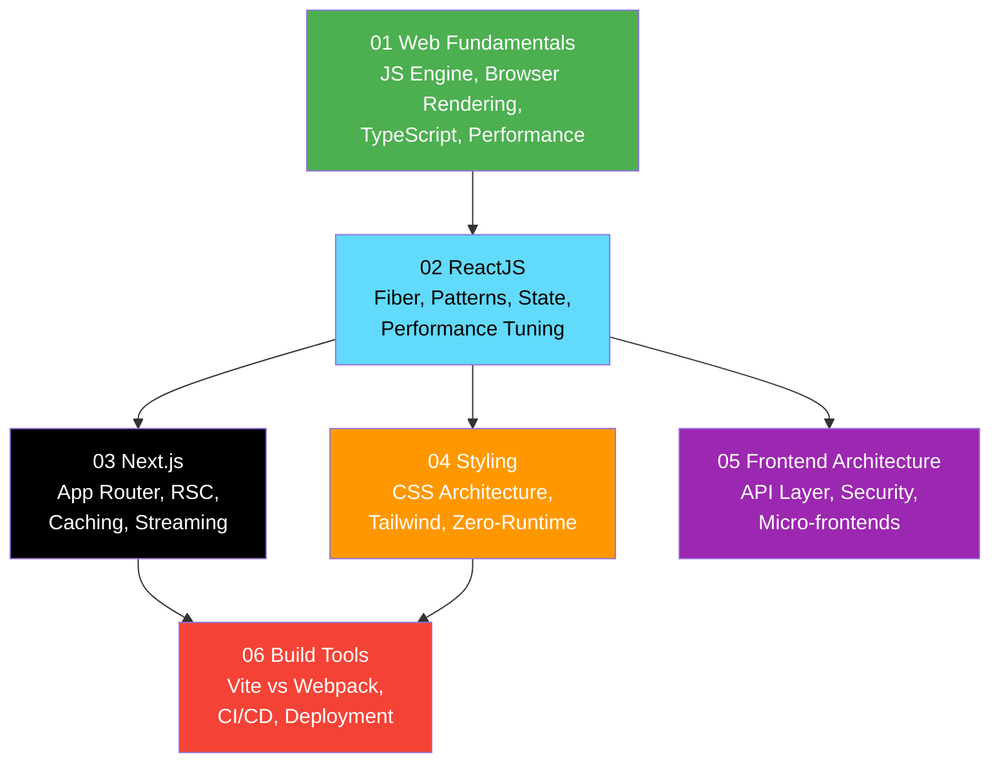

# 04 — Frontend Engineering

> A comprehensive learning path for **Frontend Engineers**, progressing from core web platform knowledge through React mastery to production-grade deployment strategies.

---

## Roadmap

---

## Prerequisites

- [01 — Fundamentals](../01-fundamentals/) — Programming basics, Git, HTTP/HTTPS, and networking protocols.

---

## Content

### 01 Web Fundamentals

| File | Description |
|---|---|
| [JS Engine Internals](./01-web-fundamentals/js-engine-internals.md) | V8 architecture, JIT compilation, Event Loop, Memory Management and GC |
| [Browser Rendering Pipeline](./01-web-fundamentals/browser-rendering-pipeline.md) | Critical Rendering Path, Reflow/Repaint, GPU Compositing |
| [Advanced TypeScript](./01-web-fundamentals/advanced-typescript.md) | Type Narrowing, Utility Types, Conditional Types, `infer`, Branded Types |
| [Web Performance & Core Web Vitals](./01-web-fundamentals/web-performance-vitals.md) | LCP, INP, CLS optimization, Resource Hints, Caching strategies |

### 02 ReactJS

| File | Description |
|---|---|
| [React Fiber & Reconciliation](./02-reactjs/react-fiber-reconciliation.md) | Fiber architecture, 2-Phase Render, Time Slicing, Concurrent Rendering |
| [Advanced Component Patterns](./02-reactjs/advanced-component-patterns.md) | Compound Components, Render Props, Headless UI, Polymorphic Components |
| [State Management Patterns](./02-reactjs/state-management-patterns.md) | Server vs Client State, Zustand, Jotai, Signals pattern |
| [Performance Tuning](./02-reactjs/performance-tuning.md) | Re-render mechanics, Memoization, Composition, Code Splitting |

### 03 Next.js

| File | Description |
|---|---|
| [App Router & React Server Components](./03-nextjs/app-router-rsc.md) | RSC vs Client Components, Network Boundary, Server Actions |
| [Caching & Data Fetching](./03-nextjs/caching-and-data-fetching.md) | 4-layer cache system, Revalidation, Streaming with Suspense |

### 04 Styling

| File | Description |
|---|---|
| [CSS Architecture & Performance](./04-styling/css-architecture-performance.md) | Runtime vs Zero-Runtime CSS-in-JS, CSS Modules, architecture trade-offs |
| [Tailwind Mastery](./04-styling/tailwind-mastery.md) | Deep config, `tailwind-merge`, CVA variants, custom plugins |

### 05 Frontend Architecture

| File | Description |
|---|---|
| [API Layer Design](./05-frontend-architecture/api-layer-design.md) | Axios Interceptors, Token Refresh Queue, OpenAPI codegen, React Query |
| [Frontend Security](./05-frontend-architecture/frontend-security.md) | XSS, CSRF, Token Storage (HttpOnly Cookies), CSP |
| [Micro-frontends & Monorepos](./05-frontend-architecture/microfrontends-monorepos.md) | Turborepo, Nx, Module Federation, MFE integration patterns |

### 06 Build Tools

| File | Description |
|---|---|
| [Vite vs Webpack Internals](./06-build-tools/vite-vs-webpack-internals.md) | Bundle-based vs Native ESM, esbuild, Rollup, Tree Shaking |
| [Frontend CI/CD & Deployment](./06-build-tools/frontend-ci-cd.md) | CI Pipeline stages, CDN vs Docker hosting, Blue/Green, Canary, Feature Flags |

---

## Learning Objectives

After completing this section, you should be able to:

- Explain V8 internals, the Event Loop, and browser rendering optimizations.
- Design advanced React component architectures using Compound, Headless, and Polymorphic patterns.
- Architect a Next.js application leveraging Server Components and the 4-layer caching model.
- Select and justify a CSS strategy (Tailwind, Zero-Runtime, CSS Modules) for an enterprise project.
- Build a production-grade API layer with automatic token refresh and OpenAPI code generation.
- Implement a complete CI/CD pipeline with automated testing, bundle analysis, and safe deployment strategies.

---

## Related Sections

- [05 — Backend Engineering](../05-backend-engineering/) — Backend APIs for frontend integration.
- [02 — Concepts / Realtime](../02-concepts/realtime/) — WebSocket and real-time communication concepts.
- [11 — Projects](../11-projects/) — Full-stack integration projects.
