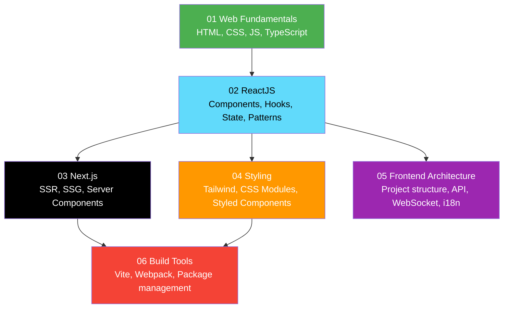

# 04 — Frontend Engineering

> Learning path cho **Frontend Engineer** — từ web fundamentals đến React mastery và production deployment.

---

##  Roadmap

---

##  Prerequisites

- [01 — Fundamentals](../01-fundamentals/) — Programming basics, Git, HTTP

---

##  Nội dung

| Subsection | Files | Mô tả |
|---|---|---|
| [01 Web Fundamentals](./01-web-fundamentals/) | HTML, CSS, JavaScript, TypeScript | Nền tảng web technologies |
| [02 ReactJS](./02-reactjs/) | Fundamentals, Hooks, State, Router, Query, Forms, Performance, Testing, Patterns | React deep dive — 9 files |
| [03 Next.js](./03-nextjs/) | Fundamentals, Data fetching, Auth, Deployment | Full-stack React framework |
| [04 Styling](./04-styling/) | Tailwind CSS, CSS Modules, Styled Components | CSS approaches comparison |
| [05 Frontend Architecture](./05-frontend-architecture/) | Project structure, API integration, WebSocket, Error handling, i18n | Kiến trúc frontend apps |
| [06 Build Tools](./06-build-tools/) | Vite, Webpack, Package management | Build & bundling tools |

---

##  Sections liên quan

- [05 — Backend Engineering](../05-backend-engineering/) — Backend APIs cho frontend integration
- [02 — Concepts / Realtime](../02-concepts/realtime/) — WebSocket concepts
- [11 — Projects](../11-projects/) — Full-stack integration projects
