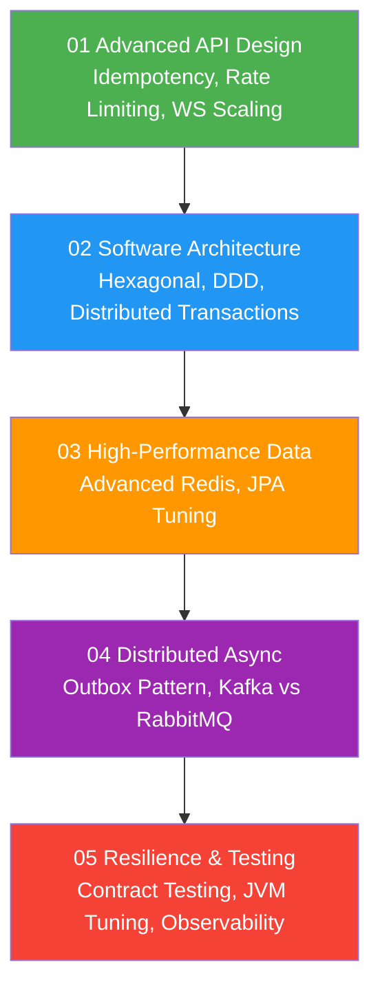

# 05 — Backend Engineering (Advanced)

> Advanced learning path for Backend Engineers, focusing on deep technical skills, complex production architectures, and real-world system resilience.

🇻🇳 <b>Hiển thị bản dịch Tiếng Việt</b>

 

Lộ trình học nâng cao dành cho Backend Engineer, tập trung vào các kỹ năng kỹ thuật chuyên sâu, kiến trúc hệ thống phức tạp trên môi trường production, và khả năng chịu lỗi (resilience) của hệ thống thực tế. Phần này bỏ qua các khái niệm cơ bản (đã có ở phần `01-fundamentals` hoặc `03-technologies`) để tập trung vào giải quyết các bài toán khó.

---

## Roadmap

---

## Prerequisites

- [01 — Fundamentals](../01-fundamentals/) — OOP, SOLID, SQL, HTTP, REST, Network.
- [02 — Concepts](../02-concepts/) — Caching, Messaging, Resilience basics.
- [03 — Technologies](../03-technologies/) — Spring Boot, PostgreSQL, Redis, Kafka (Foundational knowledge).

---

## Content

| Subsection | Description | Focus Areas |
|---|---|---|
| [01 Advanced API Design](./01-advanced-api-design/) | Designing robust APIs at scale | Idempotency keys, Rate Limiting algorithms, WebSocket horizontal scaling with Pub/Sub. |
| [02 Software Architecture](./02-software-architecture/) | Designing decoupled, scalable systems | Hexagonal Architecture, Domain-Driven Design (DDD), Saga Pattern, Outbox Pattern. |
| [03 High-Performance Data](./03-high-performance-data/) | Advanced data access patterns | Cache Stampede mitigation, Distributed Locks, JPA N+1, JDBC Batching. |
| [04 Distributed Async](./04-distributed-async/) | Asynchronous communication at scale | Transactional Outbox pattern, CDC (Debezium), Kafka vs RabbitMQ deep dive. |
| [05 Resilience & Testing](./05-resilience-and-testing/) | Ensuring system stability in production | Consumer-Driven Contract Testing, OpenTelemetry, JVM tuning, Graceful shutdown. |

---

## Related Sections

- [10 — System Design](../10-system-design/) — System design case studies applying these advanced patterns.
- [12 — Code Templates](../12-code-templates/spring-boot/) — Production-ready Spring Boot templates utilizing these concepts.
