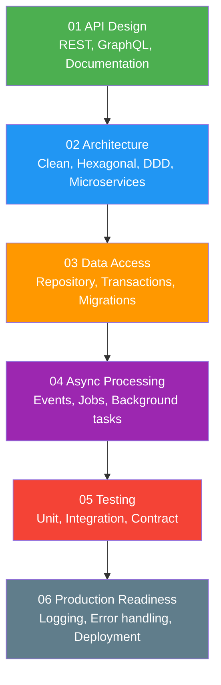

# 05 — Backend Engineering

> Learning path cho **Backend Engineer** — từ API design đến production-ready systems.

---

##  Roadmap

---

##  Prerequisites

- [01 — Fundamentals](../01-fundamentals/) — OOP, SOLID, SQL, HTTP, REST
- [02 — Concepts](../02-concepts/) — Caching, Messaging, Resilience (recommended)
- [03 — Technologies](../03-technologies/) — Spring Boot, PostgreSQL basics

---

##  Nội dung

| Subsection | Files | Mô tả |
|---|---|---|
| [01 API Design](./01-api-design/) | REST, GraphQL, API documentation | Thiết kế APIs chuẩn, versioning, pagination |
| [02 Architecture](./02-architecture/) | Clean, Hexagonal, Microservices, Monolith, DDD | Kiến trúc phần mềm backend |
| [03 Data Access](./03-data-access/) | Repository, Transactions, Migrations | Patterns truy cập dữ liệu |
| [04 Async Processing](./04-async-processing/) | Async patterns, Job scheduling, Background tasks | Xử lý bất đồng bộ |
| [05 Testing](./05-testing/) | Strategy, Unit, Integration, Contract | Testing chiến lược & implementation |
| [06 Production Readiness](./06-production-readiness/) | Logging, Error handling, Config, Deployment | Sẵn sàng cho production |

---

##  Sections liên quan

- [03 — Spring Boot](../03-technologies/spring/) — Framework implementation
- [10 — System Design](../10-system-design/) — Thiết kế hệ thống scale lớn
- [12 — Code Templates](../12-code-templates/spring-boot/) — Spring Boot templates
