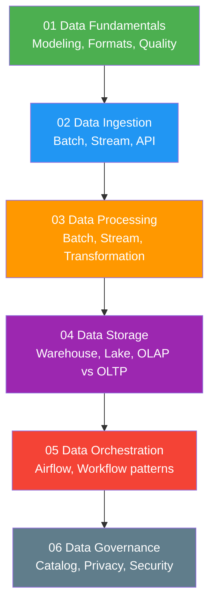

# 06 — Data Engineering

> Learning path cho **Data Engineer** — từ data fundamentals đến production data pipelines.

---

##  Roadmap

---

##  Prerequisites

- [01 — Fundamentals](../01-fundamentals/) — SQL, Python, Linux basics
- [03 — Technologies](../03-technologies/) — Kafka, Spark, Airflow, PostgreSQL

---

##  Nội dung

| Subsection | Files | Mô tả |
|---|---|---|
| [01 Data Fundamentals](./01-data-fundamentals/) | Data modeling, Formats, Quality | Star schema, Parquet, data validation |
| [02 Data Ingestion](./02-data-ingestion/) | Batch, Stream, API ingestion | ETL vs ELT, CDC, Kafka Connect |
| [03 Data Processing](./03-data-processing/) | Batch, Stream, Transformation | Spark, Kafka Streams, dbt |
| [04 Data Storage](./04-data-storage/) | Warehouse, Data Lake, OLAP/OLTP | Redshift, Delta Lake, Iceberg |
| [05 Data Orchestration](./05-data-orchestration/) | Airflow deep dive, Workflow patterns, Observability | DAG design, monitoring |
| [06 Data Governance](./06-data-governance/) | Catalog, Privacy, Security | GDPR, data lineage, access control |

---

##  Sections liên quan

- [03 — Kafka](../03-technologies/kafka/) — Streaming platform
- [03 — Spark](../03-technologies/spark/) — Processing engine
- [03 — Airflow](../03-technologies/airflow/) — Orchestration tool
