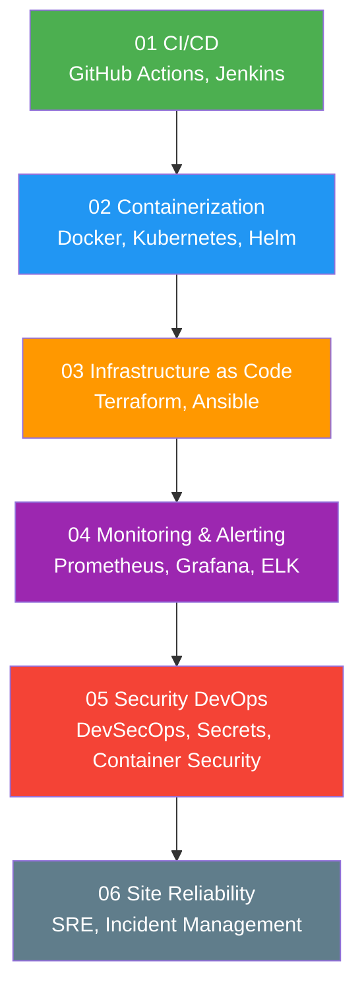

# 07 — DevOps Engineering

> Learning path cho **DevOps Engineer** — CI/CD, containerization, IaC, monitoring, và SRE.

---

##  Roadmap

---

##  Prerequisites

- [01 — Fundamentals](../01-fundamentals/) — Linux, Git, Networking
- [03 — Technologies](../03-technologies/) — Docker basics

---

##  Nội dung

| Subsection | Files | Mô tả |
|---|---|---|
| [01 CI/CD](./01-ci-cd/) | Fundamentals, GitHub Actions, Jenkins, GitLab CI | Build, test, deploy automation |
| [02 Containerization](./02-containerization/) | Docker advanced, K8s fundamentals/advanced, Helm, Service Mesh | Container orchestration |
| [03 Infrastructure as Code](./03-infrastructure-as-code/) | Terraform, Ansible, Pulumi | Automated infrastructure provisioning |
| [04 Monitoring & Alerting](./04-monitoring-alerting/) | Prometheus/Grafana, ELK Stack, Alerting strategy | System observability |
| [05 Security DevOps](./05-security-devops/) | DevSecOps, Secrets management, Container security | Security automation |
| [06 Site Reliability](./06-site-reliability/) | SRE fundamentals, Incident management, Capacity planning | Reliability engineering |

---

##  Sections liên quan

- [03 — Docker](../03-technologies/docker/) — Container fundamentals
- [08 — Cloud Engineering](../08-cloud-engineering/) — Cloud platform deployment
- [02 — Observability](../02-concepts/observability/) — Monitoring concepts
