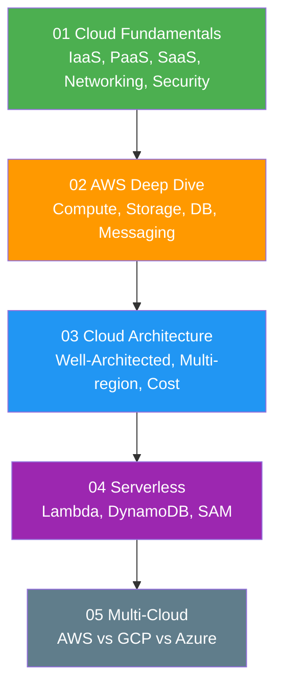

# 07 — Cloud Engineering

> Learning path cho **Cloud Engineer** — AWS deep dive, cloud architecture, serverless, và multi-cloud.

---

##  Roadmap

---

##  Prerequisites

- [01 — Fundamentals](../01-fundamentals/) — Networking, Linux, Security
- [06 — DevOps](../06-devops-engineering/) — Docker, Kubernetes, IaC (recommended)

---

##  Nội dung

| Subsection | Files | Mô tả |
|---|---|---|
| [01 Cloud Fundamentals](./01-cloud-fundamentals/) | Concepts, Networking, Security | IaaS/PaaS/SaaS, VPC, IAM |
| [02 AWS Deep Dive](./02-aws-deep-dive/) | Compute, Storage, Database, Networking, Messaging, Serverless | AWS services mastery |
| [03 Cloud Architecture](./03-cloud-architecture/) | Well-Architected, Multi-region, Cost optimization, Migration | Enterprise cloud design |
| [04 Serverless](./04-serverless/) | Architecture, Lambda, Serverless DB | Event-driven serverless |
| [05 Multi-Cloud](./05-multi-cloud/) | Comparison, Cloud-agnostic patterns | Cross-cloud strategies |

---

##  Sections liên quan

- [03 — AWS](../03-technologies/aws/) — AWS services details
- [06 — DevOps](../06-devops-engineering/) — Deployment & infrastructure
