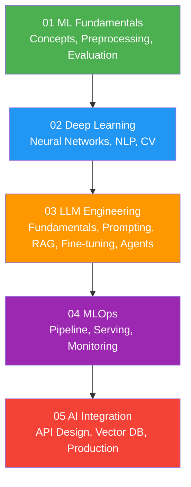

# 08 — AI Engineering

> Learning path cho **AI Engineer** — từ ML fundamentals đến LLM, RAG, và MLOps.

---

##  Roadmap

---

##  Prerequisites

- [01 — Fundamentals](../01-fundamentals/) — Python, Math basics
- [03 — Technologies / Python](../03-technologies/python/) — Python data libraries

---

##  Nội dung

| Subsection | Files | Mô tả |
|---|---|---|
| [01 ML Fundamentals](./01-ml-fundamentals/) | Concepts, Preprocessing, Evaluation | Supervised/Unsupervised/RL, Feature engineering |
| [02 Deep Learning](./02-deep-learning/) | Neural Networks, NLP, Computer Vision | Architectures, Transformer, BERT, GPT |
| [03 LLM Engineering](./03-llm-engineering/) | Fundamentals, Prompting, RAG, Fine-tuning, Agents | Large Language Model mastery |
| [04 MLOps](./04-mlops/) | Pipeline, Serving, Monitoring, Experiment tracking | ML operations & deployment |
| [05 AI Integration](./05-ai-integration/) | API design, Vector databases, Production | AI in production systems |

---

##  Sections liên quan

- [03 — Python](../03-technologies/python/) — Python ecosystem
- [05 — Data Engineering](../05-data-engineering/) — Data pipelines for ML
