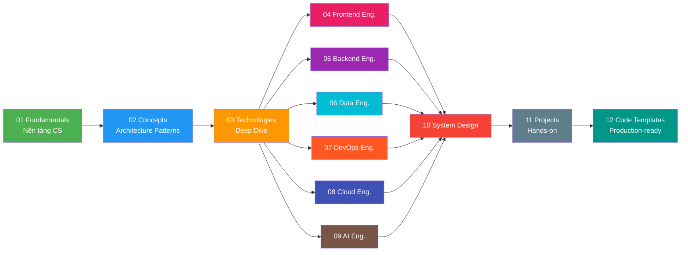

#  Engineering Knowledge Base

> Kho kiến thức toàn diện về **Software Engineering** — từ lý thuyết nền tảng đến best practices nâng cao, phục vụ cho Backend, Frontend, Data, DevOps, Cloud, và AI Engineering.

---

##  Mục tiêu

Knowledge base này được xây dựng để trả lời **6 câu hỏi cốt lõi** cho mỗi công nghệ/concept:

| Layer | Câu hỏi | Mục đích |
|---|---|---|
|  What | Nó là gì? | Hiểu bản chất, kiến trúc tổng quan |
|  Why | Tại sao nó tồn tại? | Hiểu vấn đề được giải quyết |
|  Compare | Không dùng vs Có dùng? | Thấy rõ giá trị thực tế |
|  Use Cases | Thường dùng để làm gì? | Biết khi nào áp dụng |
|  Deep Practice | Kinh nghiệm thực tế? | Thuần thục sử dụng |
|  Templates | Code template nào? | Áp dụng ngay vào project |

---

##  Learning Paths

---

##  Cấu trúc

### Nền tảng

| # | Section | Mô tả | Status |
|---|---|---|---|
| 01 | [Fundamentals](./01-fundamentals/) | CS foundations: OOP, SOLID, Data Structures, Networking, OS, Git, Security |  In Progress |
| 02 | [Concepts](./02-concepts/) | Architecture patterns: Caching, Messaging, Resilience, Event-driven, Scalability |  Planned |
| 03 | [Technologies](./03-technologies/) | Deep dive: Spring Boot, Redis, Kafka, PostgreSQL, Docker, AWS... |  Planned |

###  Learning Paths

| # | Section | Mô tả | Status |
|---|---|---|---|
| 04 | [Frontend Engineering](./04-frontend-engineering/) | ReactJS, Next.js, TypeScript, State Management, Styling |  Planned |
| 05 | [Backend Engineering](./05-backend-engineering/) | API Design, Architecture, Testing, Production Readiness |  Planned |
| 06 | [Data Engineering](./06-data-engineering/) | ETL/ELT, Data Pipelines, Spark, Airflow, Data Governance |  Planned |
| 07 | [DevOps Engineering](./07-devops-engineering/) | CI/CD, Kubernetes, Terraform, Monitoring, SRE |  Planned |
| 08 | [Cloud Engineering](./08-cloud-engineering/) | AWS Deep Dive, Serverless, Multi-region, Cost Optimization |  Planned |
| 09 | [AI Engineering](./09-ai-engineering/) | ML, Deep Learning, LLM, RAG, MLOps |  Planned |

###  Thực hành

| # | Section | Mô tả | Status |
|---|---|---|---|
| 10 | [System Design](./10-system-design/) | Case studies: Chat system, Payment, E-commerce... |  Planned |
| 11 | [Projects](./11-projects/) | Hands-on integration projects kết hợp nhiều công nghệ |  Planned |
| 12 | [Code Templates](./12-code-templates/) | Production-ready boilerplate code + hướng dẫn |  Planned |

---

##  Tech Stack chính

| Category | Technologies |
|---|---|
| **Backend** | Java 17+, Spring Boot 3.x, Spring Cloud |
| **Frontend** | React 18+, Next.js, TypeScript 5.x |
| **Database** | PostgreSQL, MongoDB, Redis |
| **Messaging** | Apache Kafka, RabbitMQ |
| **Data** | Apache Spark, Apache Airflow, dbt |
| **DevOps** | Docker, Kubernetes, Terraform, GitHub Actions |
| **Cloud** | AWS (primary), GCP, Azure (comparison) |
| **AI/ML** | Python, PyTorch, LangChain, OpenAI API |
| **Monitoring** | Prometheus, Grafana, ELK Stack, OpenTelemetry |

---

##  Quy tắc viết

- **Ngôn ngữ**: Tiếng Việt + thuật ngữ tiếng Anh (giữ nguyên tên công nghệ, patterns, concepts)
- **Format**: Template 6 layers cho mỗi chủ đề
- **Code**: Production-grade, compilable/runnable, có error handling
- **Templates**: Actual runnable code + markdown hướng dẫn

<!-- > Chi tiết quy tắc xem tại [.agents/](./.agents/) -->
