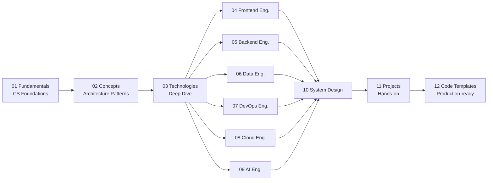

# Engineering Knowledge Base

> A comprehensive knowledge base covering Software Engineering — from foundational theory to advanced best practices, catering to Backend, Frontend, Data, DevOps, Cloud, and AI Engineering.

---

## Objectives

This knowledge base is designed to address **6 core questions** for every technology or concept:

| Layer | Question | Purpose |
|---|---|---|
| What | What is it? | To understand the nature and high-level architecture. |
| Why | Why does it exist? | To understand the specific problems it solves. |
| Compare | Without vs. With? | To clearly observe its practical value and improvements. |
| Use Cases | When is it used? | To identify appropriate application scenarios. |
| Deep Practice | What are the real-world experiences? | To attain proficiency through best practices and pitfalls. |
| Templates | What are the code templates? | To immediately apply the technology into a project. |

---

## Learning Paths

---

## Structure

### Foundations

| # | Section | Description | Status |
|---|---|---|---|
| 01 | [Fundamentals](./01-fundamentals/) | Computer Science foundations: OOP, SOLID, Data Structures, Networking, OS, Git, Security. | In Progress |
| 02 | [Concepts](./02-concepts/) | Architecture patterns: Caching, Messaging, Resilience, Event-driven, Scalability. | Planned |
| 03 | [Technologies](./03-technologies/) | Deep dives: Spring Boot, Redis, Kafka, PostgreSQL, Docker, AWS, etc. | Planned |

### Learning Paths

| # | Section | Description | Status |
|---|---|---|---|
| 04 | [Frontend Engineering](./04-frontend-engineering/) | ReactJS, Next.js, TypeScript, State Management, Styling. | Planned |
| 05 | [Backend Engineering](./05-backend-engineering/) | API Design, Architecture, Testing, Production Readiness. | Planned |
| 06 | [Data Engineering](./06-data-engineering/) | ETL/ELT, Data Pipelines, Spark, Airflow, Data Governance. | Planned |
| 07 | [DevOps Engineering](./07-devops-engineering/) | CI/CD, Kubernetes, Terraform, Monitoring, Site Reliability Engineering. | Planned |
| 08 | [Cloud Engineering](./08-cloud-engineering/) | AWS Deep Dive, Serverless architecture, Multi-region strategies, Cost Optimization. | Planned |
| 09 | [AI Engineering](./09-ai-engineering/) | Machine Learning, Deep Learning, LLM, RAG, MLOps. | Planned |

### Practical Application

| # | Section | Description | Status |
|---|---|---|---|
| 10 | [System Design](./10-system-design/) | Case studies: Chat systems, Payment gateways, E-commerce platforms. | Planned |
| 11 | [Projects](./11-projects/) | Hands-on integration projects combining multiple technologies. | Planned |
| 12 | [Code Templates](./12-code-templates/) | Production-ready boilerplate code accompanied by usage guides. | Planned |

---

## Primary Technology Stack

| Category | Technologies |
|---|---|
| **Backend** | Java 17+, Spring Boot 3.x, Spring Cloud |
| **Frontend** | React 18+, Next.js, TypeScript 5.x |
| **Database** | PostgreSQL, MongoDB, Redis |
| **Messaging** | Apache Kafka, RabbitMQ |
| **Data** | Apache Spark, Apache Airflow, dbt |
| **DevOps** | Docker, Kubernetes, Terraform, GitHub Actions |
| **Cloud** | AWS (Primary), GCP, Azure (For comparison) |
| **AI/ML** | Python, PyTorch, LangChain, OpenAI API |
| **Monitoring** | Prometheus, Grafana, ELK Stack, OpenTelemetry |

---

## Writing Rules

- **Language**: Formal English.
- **Format**: The 6-layer template must be utilized for each topic.
- **Code**: Must be production-grade, compilable/runnable, and include error handling.
- **Templates**: Provide actual runnable code alongside markdown instruction guides.

<!-- Detailed rules can be found in the [.agents/](./.agents/) directory. -->
